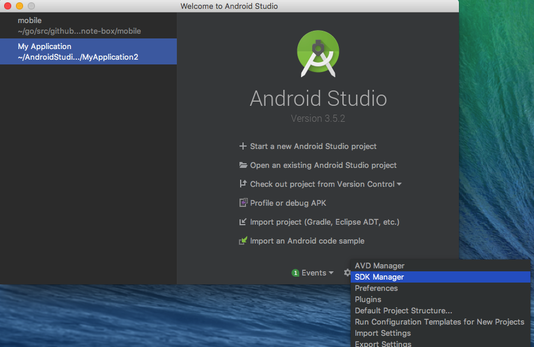
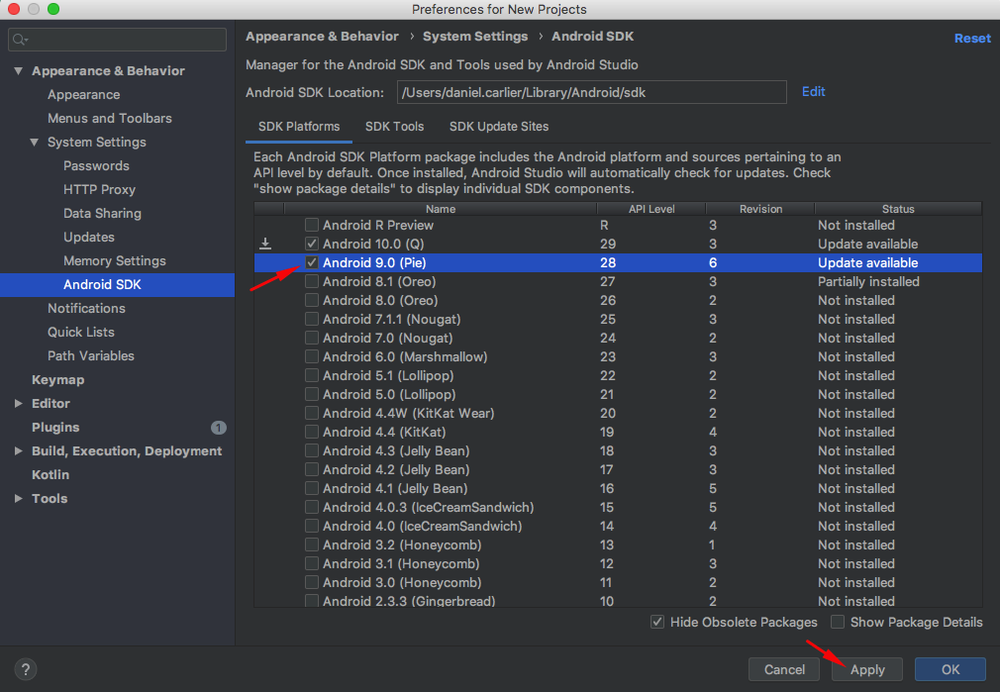

# Android API Version

In order to properly run the application, it is recommended that the API version 29 is installed and ready to be utilized. The goal of this guide is to help users to install other API versions.

## Installation 🔧

The first thing we need to do is to open Android Studio, select `Configure` then choose `SDK Manager`, as shown by the image below:

    

After that, in the `Android SDK` preferences menu, be sure to check the box with your desired API version to be downloaded. To confirm, click `Apply` then `OK`, as shown by the following image:

    

When it finishes downloading, you should be ready to try and run the app again! There's no need to change any of the commands, just keep on following the tutorial.
