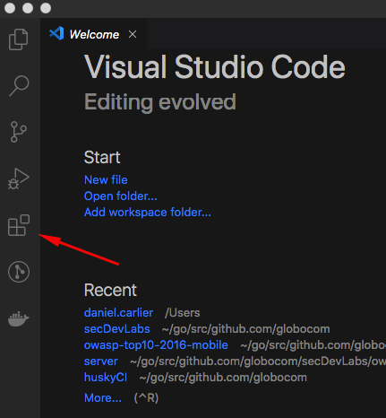
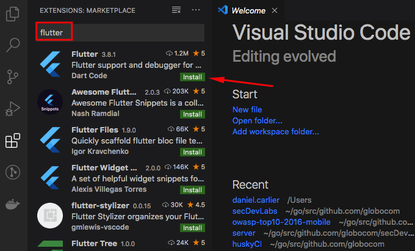

# How to install and use Flutter with VS Code

The goal of this guide is to instruct users on how to set up a local mobile development environment to be used by secDevLabs using the Visual Studio Code editor.

## Installation 🔧

### Install VS Code

To begin with, we should install VS Code, which is a lightweight editor with Flutter app execution and debug support. You can download it here:

* [VS Code](https://code.visualstudio.com/)

### Install the Flutter and Dart plugins

1. Start Visual Studio Code.
2. On the window's left side, you will find the VS Code extensions tab, as shown by the image below. Click it.

    

3. Now, search for `Flutter` in the search bar, then click the `install` button. This also installs the required `Dart` plugin.

    

## All done! Flutter should now be installed and ready to go! 🚀

If you had any kind of trouble during this installation or intend on using another code editor, you can find more info in the official installation guide [here](https://flutter.dev/docs/get-started/editor?tab=vscode).
