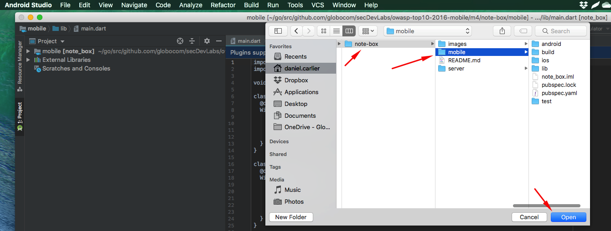
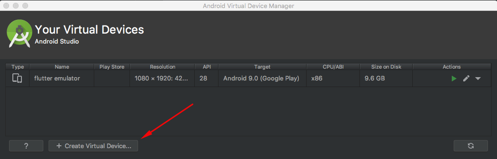
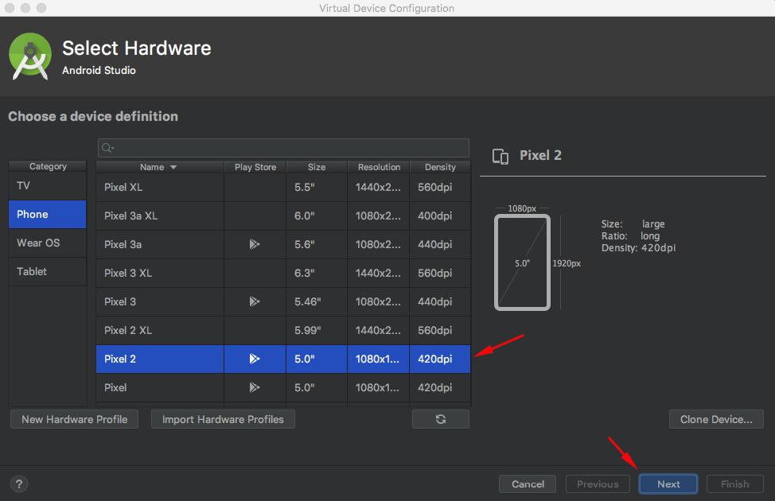
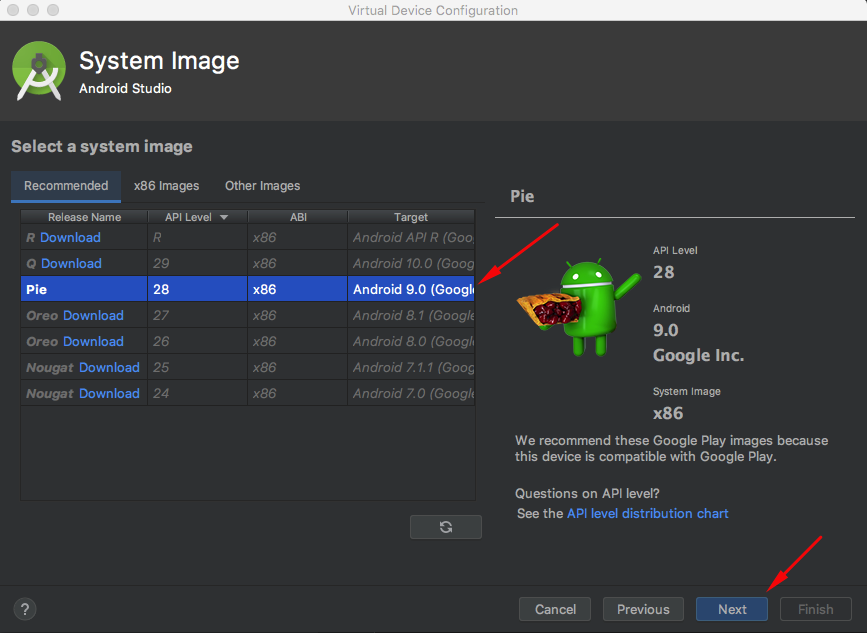

# How to install and use Flutter with VS Code on Android

The goal of this guide is to instruct users on how to set up a local mobile development environment to be used by secDevLabs using the Visual Studio Code editor.

## Installation 🔧

### Flutter SDK

To start developing with Flutter, you must first download the Flutter SDK, which can be found [here](https://flutter.dev/docs/get-started/install).

### Setting up the Android emulator

In order to create an Android Emulator, we'll need to first download [Android Studio](https://developer.android.com/studio), and then follow the steps:

* Open Android Studio for the first time and select a `Custom` setup to make sure to check `Android Virtual Device` in the installation options. With this, Android Studio will go ahead and download the Android SDK and all the other things needed for development, which will be used behind the scenes by Flutter.

* Open Android Studio and open one of secDevLab's mobile Flutter app, as shown below:

    

* Select `Tools` in the upper Android Studio menu bar, then `AVD Manager` and select `Create Virtual Device`, as shown below:

    

* Choose a device definition and select `Next`, as depicted in the image below:

    

* Select one or more system images for the Android versions you want to emulate, and select Next. An x86 or x86_64 image is recommended.

    

* Verify the AVD configuration is correct, and select `Finish`.

If you're feeling a bit lost and need more information, you can find the official documentation [here](https://flutter.dev/docs/get-started/install/macos#set-up-the-android-emulator).

### VS Code

After installing Flutter SDK and Android Studio, we should install VS Code, which is a lightweight editor with Flutter app execution and debug support. You can download it [here](https://code.visualstudio.com/).

### Flutter and Dart plugins

1. Start Visual Studio Code.
2. On the window's left side, you will find the VS Code extensions tab, as shown by the image below. Click it.

    

3. Now, search for `Flutter` in the search bar, then click the `install` button. This also installs the required `Dart` plugin.

    

### Android SDK

## All done! Flutter should now be installed and ready to go! 🚀

If you had any kind of trouble during this installation or intend on using another code editor, you can find more info in the official installation guide [here](https://flutter.dev/docs/get-started/editor?tab=vscode).
