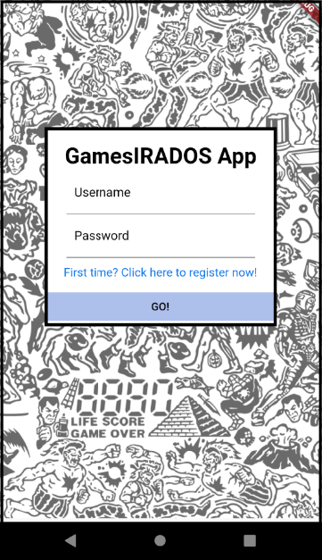
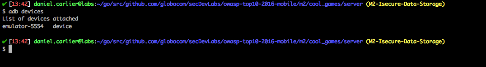
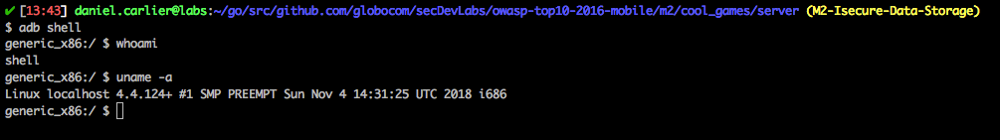
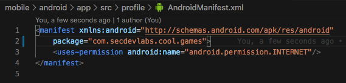
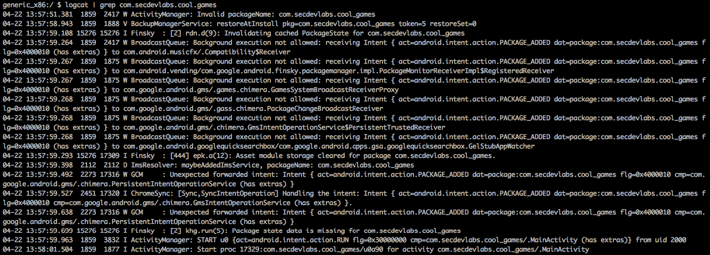
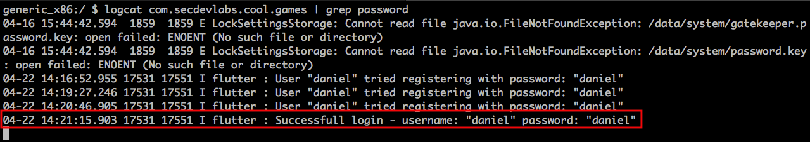
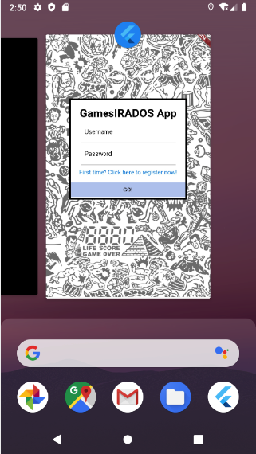
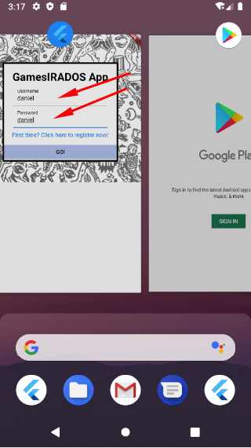

# Cool Games

<p align="center">
    
</p>

Cool Games is a Flutter powered mobile app that serves as the mobile version of [GamesIRADOS.com][GamesIRADOScom]. It is built with a mobile front-end and a Golang powered back-end.

## Index

- [Definition](#what-is-insecure-authentication)
- [Setup](#setup)
- [Attack narrative](#attack-narrative)
- [Objectives](#secure-this-app)
- [Solutions](#pr-solutions)
- [Contributing](#contributing)

## What is Insecure Data Storage?

Insecure data storage vulnerabilities occur when development teams assume that users or malware will not have access to a mobile device’s filesystem and subsequent sensitive information in data-stores on the device. Filesystems are easily accessible. Organizations should expect a malicious user or malware to inspect sensitive data stores.

The main goal of this app is to discuss how **Insecure Data Storage** vulnerabilities can be exploited and to encourage developers to send secDevLabs Pull Requests on how they would mitigate these flaws.

## Setup

Before we start, it's important to mention that this app's code is divided into two parts: a back-end server, which can be found in the `server` folder, and the mobile app's code itself in the `mobile` folder. In order for the app to run as intended, the back-end server must be up and running, but no need to worry, we'll walk you through it! 😁

To start this intentionally **insecure application**, you will need [Flutter][VS-Code-Flutter], [Docker][Docker Install] and [Docker Compose][Docker Compose Install]. After forking [secDevLabs][secDevLabs], you'll need to start the server, which can be done through the commands:

### Start server commands:

```sh
cd secDevLabs/owasp-top10-2016-mobile/m2/cool_games/server
```

```sh
make install
```

### Start app commands:

**Note**: It is important to mention, that you should have an emulator up and running or an available device to run the app in. For instructions on how to set up an emulator, click [here][VS-Code-Flutter].

After properly setting up your editor and emulator/device to run Flutter apps, open the `main.dart` file with VS Code. You can find it's path here:

```
secDevLabs/owasp-top10-2016-mobile/m2/cool_games/mobile/lib/main.dart
```

Now, all you need to do is to click `Run > Run Without Debugging` on VS Code top menu bar and it should begin building the app to launch it in no time!

Then, you should see Cool Games' app launch successfully in the emulator/device you're using! 📲

**Note**: In case an Android licenses errors shows up, you may need to run the following command on your terminal and accept them:

```sh
flutter doctor --android-licenses
```

**Note 2**: If you're experiencing Android API version issues, we suggest you to download the recommended API version for this app, which is 29. We've put together a tutorial to help with that, just click [here][API-Version-Issue]!

## Get to know the app 📝

To properly understand how this application works, you can follow these simple steps:

- Register a new user. 👩‍💻
- Get yourself up to date with the latest gaming trends! 🎮

## Attack narrative

Now that you know the purpose of this app, what could go wrong? The following section describes how an attacker could identify and eventually exploit some of the app's flaws to compromise it's users. We encourage you to follow these steps and try to reproduce them on your own to better understand the attack vector! 😜

### 👀

#### Logs generated on log in with user credentials allows for possible leak of sensitive information

When first accessing the application, an user is required to authenticate to access the gaming content, as we can see from the image below:

<p align="center">
    
</p>

At first hand, the login flow seemed to have run flawlessly, as the user can now access the gaming news, as shown below:

<p align="center">
    
</p>

### 🔥

If an attacker came into posession of the device and used the [Android Debug Bridge](https://developer.android.com/studio/command-line/adb) tool to communicate with it through a Unix shell, he could inspect how the app behaves and what it logs.

To begin, it is possible to list connected devices with the following command:

```sh
adb devices
```

<p align="center">
    
</p>

**Note**: If `adb` is not showing up on your `PATH`, you can add it through the following commands in OSX:

```sh
echo 'export ANDROID_HOME=/Users/$USER/Library/Android/sdk' >> ~/.bash_profile

echo 'export PATH=${PATH}:$ANDROID_HOME/tools:$ANDROID_HOME/platform-tools' >> ~/.bash_profile

source ~/.bash_profile
```

**Note 2**: This attack narrative is being written using an emulator as example, thus the `emulator` showing up as a device.

Now that we can see the device, we can start a shell instance inside it through the command:

```sh
adb shell
```

<p align="center">
    
</p>

In order to verify the app's log, we need to first know it's `package name`, which can be found in the `AndroidManifest.xml` file located at:

```sh
secDevLabs/owasp-top10-2016-mobile/m2/cool_games/mobile/android/app/src/profile/AndroidManifest.xml
```

<p align="center">
    
</p>

Now that we know `com.secdevlabs.cool.games` is the app's package name, we can use it to filter logs through the `logcat` command, available through the `adb shell`, as shown below:

```sh
logcat com.secdevlabs.cool.games
```

<p align="center">
    
</p>

Having access to the app's log, it's now a matter of searching through it. Through a quick hint of filtering for `"password"`, we can see log in attempts logging passwords, as shown by the following image:

<p align="center">
    
</p>

### 👀

#### Lack of view filling when switching apps allows for possible sensitive information leakage

Both on Android and iOS there's an option to switch between recently opened apps by clicking on the app's screen and getting right back into the action. But in order for the system to show the screen of a recent used app, a screenshot is taken on the exact moment you click to switch and send it to the background, as shown by the following images:

<p align="center">
    
</p>

### 🔥

If an attacker were to obtain the device and could manage to either root it or jump to the app's process, it would be possible to visualize the screenshot taken in the app's sandbox directory.

In another scenario, if the device was obtained shortly after the user was using it, there's a possibility that an attacker could find sensitive information through the recent app's view, as shown by the image below:

<p align="center">
    
</p>

## Secure this app

How would you mitigate this vulnerability? After your changes, an attacker should not be able to:

* View sensitive data being logged, as the app no longer logs them.
* View Cool Game's screen when switching between recent apps.
* Clear text passwords when typing during log in and register screens.

## PR solutions

[Spoiler alert 🚨] To understand how this vulnerability can be mitigated, check out [these pull requests][these pull requests]!

## Contributing

We encourage you to contribute to SecDevLabs! Please check out the [Contributing to SecDevLabs](../../../docs/CONTRIBUTING.md) section for guidelines on how to proceed! 🎉


[GamesIRADOS.com]: https://github.com/globocom/secDevLabs/tree/master/owasp-top10-2021-apps/a9/games-irados
[secDevLabs]: https://github.com/globocom/secDevLabs
[API-Version-Issue]: https://github.com/globocom/secDevLabs/blob/master/docs/api-version-issue.md
[Flutter]: https://flutter.dev/docs/get-started/install
[VS-Code-Flutter]: https://github.com/globocom/secDevLabs/blob/master/docs/installing-flutter.md
[Docker Install]:  https://docs.docker.com/install/
[Docker Compose Install]: https://docs.docker.com/compose/install/
[these pull requests]:https://github.com/globocom/secDevLabs/pulls?q=is%3Apr+is%3Aclosed+label%3AM2-OWASP-2016+label%3A%22Cool+Games%22