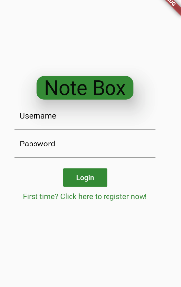
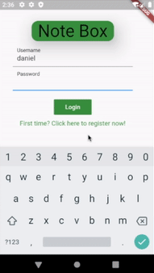
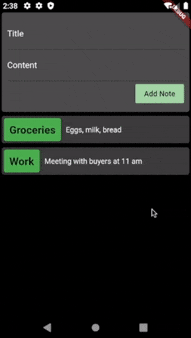
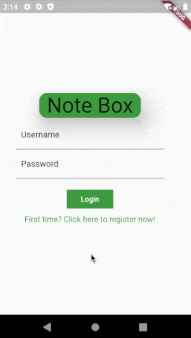

# Note Box

<p align="center">
    
</p>

Note Box is a Flutter powered mobile app that makes use of remote storage to keep safe users' notes. It is built with a mobile front-end a Golang powered back-end.

## Index

- [Definition](#what-is-insecure-authentication)
- [Setup](#setup)
- [Attack narrative](#attack-narrative)
- [Objectives](#secure-this-app)
- [Solutions](#pr-solutions)
- [Contributing](#contributing)

## What is Insecure Authentication?

Insecure Authentication exploits vulnerable authentication schemes by faking or bypassing authentication. They do so by submitting service requests to the mobile app’s backend server, in order to bypass any direct interaction with the mobile app.

The main goal of this app is to discuss how **Insecure Authentication** vulnerabilities can be exploited and to encourage developers to send secDevLabs Pull Requests on how they would mitigate these flaws.

## Setup

Before we start, it's important to mention that this app's code is divided into two parts: a back-end server, which can be found in the `server` folder, and the mobile app's code itself in the `mobile` folder. In order for the app to run as intended, the back-end server must be up and running, but no need to worry, we'll walk you through it! 😁

To start this intentionally **insecure application**, you will need [Flutter][VS-Code-Flutter], [Docker][Docker Install] and [Docker Compose][Docker Compose Install]. After forking [secDevLabs](https://github.com/globocom/secDevLabs), you'll need to start the server, which can be done through the commands:

### Start server commands:

```sh
cd secDevLabs/owasp-top10-2016-mobile/m4/note-box/server
```

```sh
make install
```

### Start app commands:

**Note**: It is important to mention, that you should have an emulator up and running or an available device to run the app in. For instructions on how to set up an emulator, click [here][VS-Code-Flutter].

After properly setting up your editor and emulator/device to run Flutter apps, open the `main.dart` file with VS Code. You can find it's path here:

```
secDevLabs/owasp-top10-2016-mobile/m4/note-box/mobile/lib/main.dart
```

Now, in order to be sure all packages were successfully downloaded, run the following command inside the `lib` folder:

```sh
flutter packages get
```

After that, all you need to do is to click `Run > Run Without Debugging` on VS Code top menu bar and it should begin building the app to launch it in no time!

Then, you should see Note Box's app launch successfully in the emulator/device you're using! 📲

**Note**: In case an Android licenses errors shows up, you may need to run the following command on your terminal and accept them:

``` sh
flutter doctor --android-licenses
```

## Get to know the app 📝

To properly understand how this application works, you can follow these simple steps:

- Register a new user. 👩‍💻
- Try writing down some notes so you don't forget them, maybe a groceries list? 🍫

## Attack narrative

Now that you know the purpose of this app, what could go wrong? The following section describes how an attacker could identify and eventually exploit some of the app's flaws to compromise it's users. We encourage you to follow these steps and try to reproduce them on your own to better understand the attack vector! 😜

### 👀

#### Lack of validation of login requests allows for brute force attacks

When in the app's login screen, after inputting wrong credentials many times, no warning or extra validation is required to perform another request, as shown by the image below:

<p align="center">
    
</p>

This lack of validation allows for an attacker to try and brute force his way into another user's account, which can be seen in the following image:

<p align="center">
    
</p>

### 👀

#### Lack of logout mechanism makes it not possible for users to end their session

After successfully login in and using the app, when trying to terminate their session by clicking the `back` button in the system's UI, the app returns to the log in screen without any messages. This behavior indicates that, maybe, no validation is being made whether or not the user tried to log out.

When trying to perform another log in, the following message is shown:

<p align="center">
    
</p>

Without a way to properly end their session, aside being stuck outside, if an attacker came to possession of the user's session token it could be used until it's expiration date.

### 👀

#### Absence of password validation allows for users to be registered with blank passwords

When registering a new user, it is possible to click the `Register` button withouth having input anything in the `password` field, as we can see from the image below:

<p align="center">
    
</p>

Without passwords, an attacker could simply type in the username of the user and log in to the account.

## Secure this app

How would you mitigate this vulnerability? After your changes, an attacker should not be able to:

* Perform a brute force attack through the app's interface.
* Use user tokens indefinitely, as the logout mechanism should be working.
* Register an user with blank password.

## PR solutions

[Spoiler alert 🚨] To understand how this vulnerability can be mitigated, check out [these pull requests](https://github.com/globocom/secDevLabs/pulls?q=is%3Apr+is%3Aclosed+label%3AM4-OWASP-2016+label%3A%22mitigation+solution+%F0%9F%94%92%22)!

## Contributing

We encourage you to contribute to SecDevLabs! Please check out the [Contributing to SecDevLabs](../../../docs/CONTRIBUTING.md) section for guidelines on how to proceed! 🎉

[Flutter]: https://flutter.dev/docs/get-started/install
[VS-Code-Flutter]: ../../../docs/installing-flutter.md
[Docker Install]:  https://docs.docker.com/install/
[Docker Compose Install]: https://docs.docker.com/compose/install/
