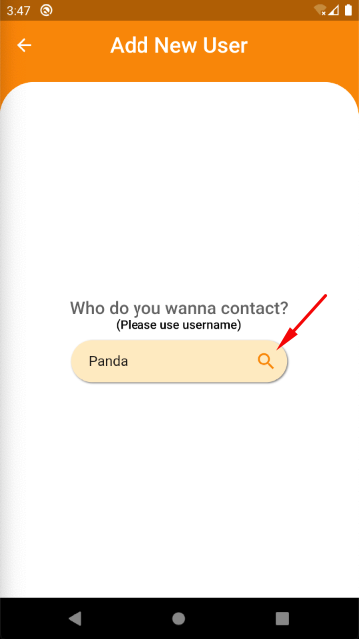
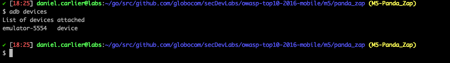
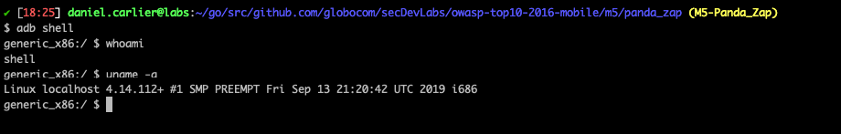
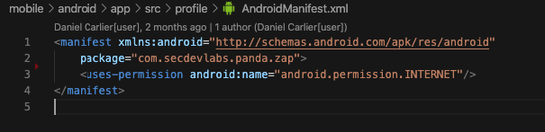
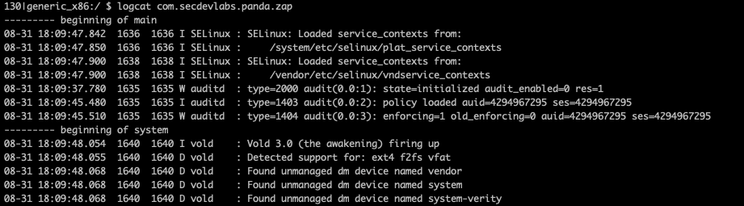
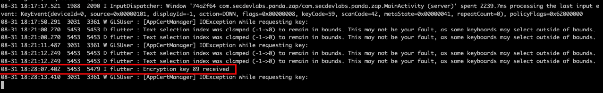
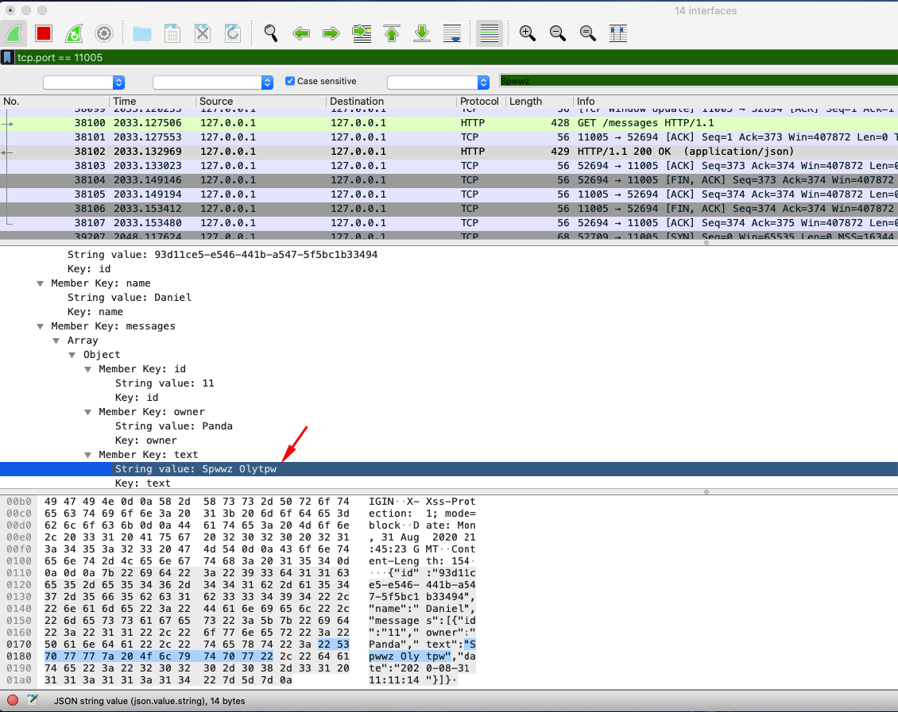
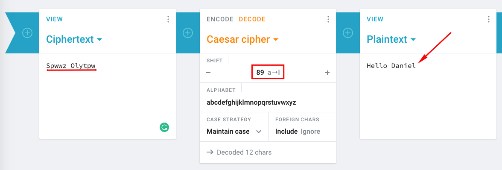

# Panda Zap

<p align="center">
    
</p>

Panda Zap is an intentionally vulnerable Flutter powered mobile chat app in which users can connect and exchange text messages. It's built with a mobile front-end and a Golang powered back-end.

## Index

- [Definition](#what-is-insufficient-cryptography)
- [Setup](#setup)
- [Attack narrative](#attack-narrative)
- [Objectives](#secure-this-app)
- [Solutions](#pr-solutions)
- [Contributing](#contributing)

## What is Insufficient Cryptography?

Insecure use of cryptography is common in most mobile apps that leverage encryption. There are two fundamental ways that broken cryptography is manifested within mobile apps. First, the mobile app may use a process behind the encryption / decryption that is fundamentally flawed and can be exploited by the adversary to decrypt sensitive data. Second, the mobile app may implement or leverage an encryption / decryption algorithm that is weak in nature and can be directly decrypted by the adversary.

The main goal of this app is to discuss how **Insufficient Cryptography** vulnerabilities can be exploited and to encourage developers to send secDevLabs Pull Requests on how they would mitigate these flaws.

## Setup

Before we start, it's important to mention that this app's code is divided into two parts: a back-end server, which can be found in the `server` folder, and the mobile app's code itself in the `mobile` folder. In order for the app to run as intended, the back-end server must be up and running, but no need to worry, we'll walk you through it! 😁

To start this intentionally **insecure application**, you will need [Flutter][VS-Code-Flutter], [Docker][Docker Install] and [Docker Compose][Docker Compose Install]. After forking [secDevLabs][secDevLabs], you'll need to start the server, which can be done through the commands:

### Start server commands:

```sh
cd secDevLabs/owasp-top10-2016-mobile/m5/panda_zap/server
```

```sh
make install
```

### Start app commands:

**Note**: It is important to mention, that you should have an emulator up and running or an available device to run the app in. For instructions on how to set up an emulator, click [here][VS-Code-Flutter].

After properly setting up your editor and emulator/device to run Flutter apps, open the `main.dart` file with VS Code. You can find it's path here:

```
secDevLabs/owasp-top10-2016-mobile/m5/panda_zap/mobile/lib/main.dart
```

Now, all you need to do is to click `Run > Run Without Debugging` on VS Code top menu bar and it should begin building the app to launch it in no time!

Then, you should see the Panda Zap app launch successfully in the emulator/device you're using! 📲

**Note**: In case an Android licenses errors shows up, you may need to run the following command on your terminal and accept them:

```sh
flutter doctor --android-licenses
```

**Note 2**: If you're experiencing Android API version issues, we suggest you to download the recommended API version for this app, which is 29. We've put together a tutorial to help with that, just click [here][API-Version-Issue]!

## Get to know the app 📝

To properly understand how this application works, you can follow these simple steps:

- Register a new user. 👩‍💻
- Try finding a friend using the app's user search. 🔍
- Send some messages! 💬

## Attack narrative

Now that you know the purpose of this app, what could go wrong? The following section describes how an attacker could identify and eventually exploit some of the app's flaws to compromise it's users. We encourage you to follow these steps and try to reproduce them on your own to better understand the attack vector! 😜

### 👀

#### Use of weak cryptographic algorithm allows for unauthorized retrieval of potentially sensitive information

When first accessing the application, an user is required to enter his desired username, as we can see from the image below:

<p align="center">
    
</p>

After creating an account in the local device, an user can search for his friends by clicking the ➕ sign in the upper right corner, as shown by the image below:

<p align="center">
    
</p>

To start a new conversation we need to add a new contact first, simply search for his name by clicking the 🔍, as we can see by the following image:

<p align="center">
    
</p>

With our new contact added and going back to the main `Messages` screen, we can see a new message bubble has appeared, as we can see from the next image:

<p align="center">
    
</p>

To enter the conversation, click the message bubble. After that, it's possible to send a new message just like the following image:

<p align="center">
    
</p>

### 🔥

If an attacker came into possession of the device and used the [Android Debug Bridge][Android Debug Bridge] tool to communicate with it through a Unix shell, he could inspect how the app behaves and what it logs.

To begin, it is possible to list connected devices with the following command:

```sh
adb devices
```

<p align="center">
    
</p>

**Note**: If `adb` is not showing up on your `PATH`, you can add it through the following commands in OSX:

```sh
echo 'export ANDROID_HOME=/Users/$USER/Library/Android/sdk' >> ~/.bash_profile

echo 'export PATH=${PATH}:$ANDROID_HOME/tools:$ANDROID_HOME/platform-tools' >> ~/.bash_profile

source ~/.bash_profile
```

**Note 2**: This attack narrative is being written using an emulator as example, thus the `emulator` showing up as a device.

Now that we can see the device, we can start a shell instance inside it through the command:

```sh
adb shell
```

<p align="center">
    
</p>

In order to verify the app's log, we need to first know it's `package name`, which can be found in the `AndroidManifest.xml` file located at:

```sh
secDevLabs/owasp-top10-2016-mobile/m5/panda_zap/mobile/android/app/src/profile/AndroidManifest.xml
```

<p align="center">
    
</p>

Now that we know `com.secdevlabs.panda.zap` is the app's package name, we can use it to filter logs through the `logcat` command, available through the `adb shell`, as shown below:

```sh
logcat com.secdevlabs.panda.zap
```

<p align="center">
    
</p>

Having access to the app's log, it's possible to see that a certain key seems to be have been logged, as we can see in the following image:

<p align="center">
    
</p>

Now in possession of the key and by having a look at the app's code, it's possible to see that a [Caesar Cipher][Caesar Cipher] encryption mechanism is being used.

In cryptography, a Caesar cipher is an encryption technique in which each letter is shifted by a fixed number of positions down the alphabet. Even though we appear to have what seems to be the shift value, logged as being the `key`, due to the fact of limited letters in the alphabet (25 in English), the cipher can easily be broken in a brute force attack.

If an attacker were connected to the same network as someone using the app, it would be possible to capture and inspect the packets being transmitted using [Wireshark][Wireshark]. To better narrow our search, we can filter for the port the app seems to be using, `11005`, as shown by the image below:

<p align="center">
    
</p>

Analyzing the packets, it was possible to find one containing a message being transmitted. At first, the message appears to be encrypted with the Caesar Cipher method, as we can see in the following picture:

<p align="center">
    
</p>

Using an online Caesar Cipher decoder service and setting the shift value to the `key` value found, we're able to decrypt the message successfully into plain text, as shown in the following image:

<p align="center">
    
</p>

## Secure this app

How would you mitigate this vulnerability? After your changes, the app should not:

* Display sensitive data being logged, as the app no longer logs them.
* Use your own encryption mechanism. The app should Apply cryptographic standards that will withstand the test of time for at least 10 years into the future.

## PR solutions

[Spoiler alert 🚨] To understand how this vulnerability can be mitigated, check out [these pull requests][these pull requests]!

## Contributing

We encourage you to contribute to SecDevLabs! Please check out the [Contributing to SecDevLabs](../../../docs/CONTRIBUTING.md) section for guidelines on how to proceed! 🎉

[API-Version-Issue]: https://github.com/globocom/secDevLabs/blob/master/docs/api-version-issue.md
[Flutter]: https://flutter.dev/docs/get-started/install
[VS-Code-Flutter]: https://github.com/globocom/secDevLabs/blob/master/docs/installing-flutter.md
[Docker Install]:  https://docs.docker.com/install/
[Docker Compose Install]: https://docs.docker.com/compose/install/
[these pull requests]:https://github.com/globocom/secDevLabs/pulls?q=is%3Apr+is%3Aclosed+label%3AM2-OWASP-2016+label%3A%22Cool+Games%22
[secDevLabs]: (https://github.com/globocom/secDevLabs)
[Android Debug Bridge]: https://developer.android.com/studio/command-line/adb
[Caesar Cipher]: https://en.wikipedia.org/wiki/Caesar_cipher
[Wireshark]: https://www.wireshark.org/)