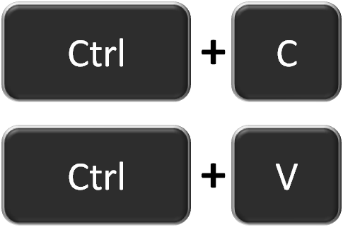

# CopyNPaste API
> Copiei, Colei, Compilou e Rodou.

#### Requirements:

* Golang
* Docker
* Docker Compose

#### Installing: 

```sh
make install
```


#### Running: 

```sh
. .env
```

```sh
go run server.go
```

##### Registering a new user:

```sh
curl -s -H "Content-Type: application/json" -d '{"user":"Roberto", "pass":"oi", "passcheck":"oi"}' http://127.0.0.1:3000/register
```

#### Result:

```
Usuario Roberto criado com sucesso!
```

#### Login: 

```sh
curl -s -H "Content-Type: application/json" -d '{"user":"Roberto", "pass":"oi"}' http://127.0.0.1:3000/login
```

#### Result:

```
Bem vindo(a), Roberto!
```
