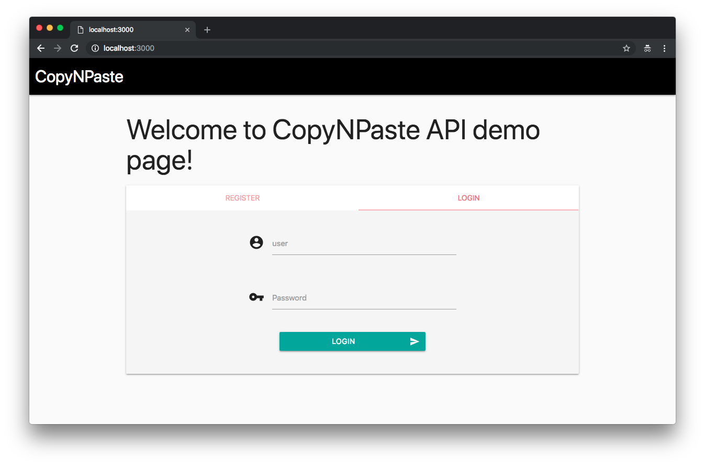

# CopyNPaste API
> Copy, Paste, Compile, Run.



## What is Injection?

Definition from [OWASP](https://www.owasp.org/images/7/72/OWASP_Top_10-2017_%28en%29.pdf.pdf):

Injection flaws, such as SQL, NoSQL, OS, and LDAP injection, occur when untrusted data is sent to an interpreter as part of a command or query. The attacker’s hostile data can trick the interpreter into executing unintended commands or accessing data without proper authorization.

## Requirements

To build this lab you will need [Docker][Docker Install] and [Docker Compose][Docker Compose Install].

## Deploy and Run

After cloning this repository, you can type the following command to start the vulnerable application:

```sh
$ make install
```

Then you can send the following requests:

##### Registering a new user:

```sh
curl -s -H "Content-Type: application/json" -d '{"user":"Roberto", "pass":"oi", "passcheck":"oi"}' http://127.0.0.1:3000/register
```

#### Result:

```
Usuario Roberto criado com sucesso!
```

#### Login: 

```sh
curl -s -H "Content-Type: application/json" -d '{"user":"Roberto", "pass":"oi"}' http://127.0.0.1:3000/login
```

#### Result:

```
Bem vindo(a), Roberto!
```

## Attack Narrative

To understand how this vulnerability can be exploited, check this other section!

## Mitigating the vulnerability

To understand how this vulnerability can be mitigated, check this other section!

[Docker Install]:  https://docs.docker.com/install/
[Docker Compose Install]: https://docs.docker.com/compose/install/

## Contributing

Yes, please. :zap:
