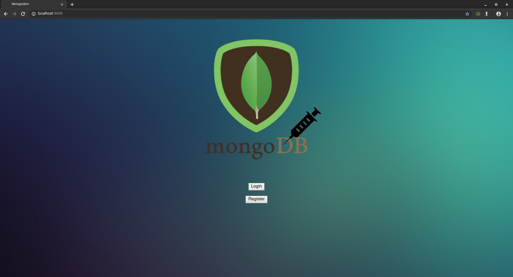
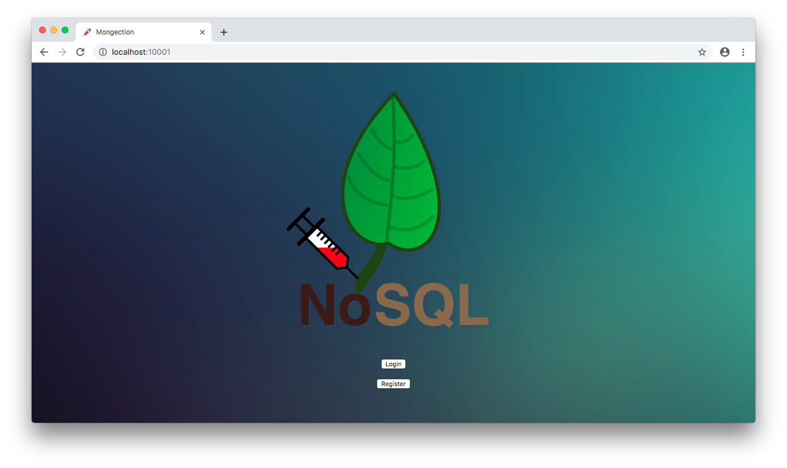
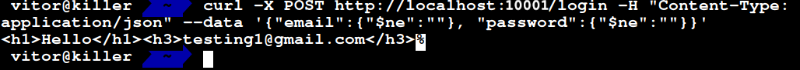
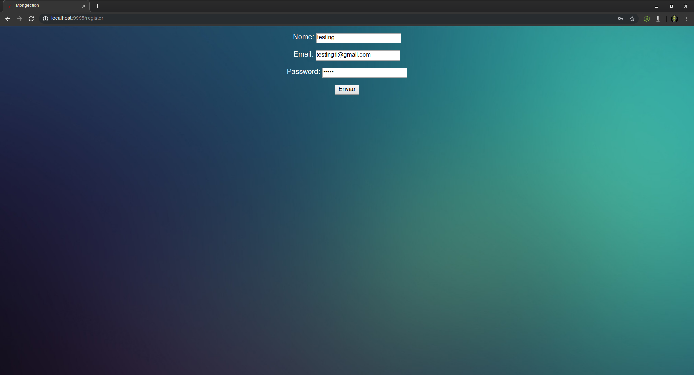
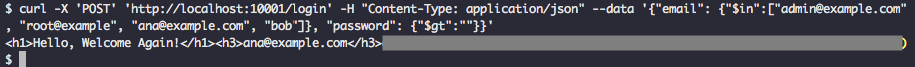
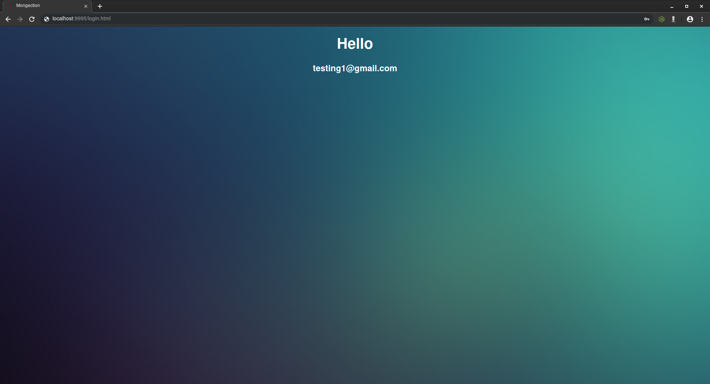
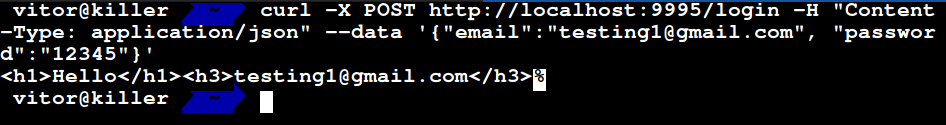
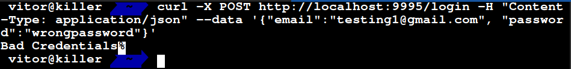
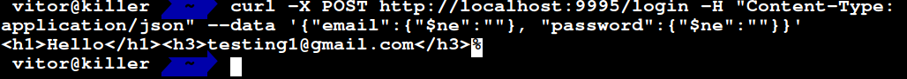

# Mongection

<p align="center"></p>

Mongection is a simple Nodejs web application that contains an example of a Injection vulnerability. On this example, a specific subcategory os Injection will be showed: NoSQL Injection with MongoDB.

## Index

- [Definition](#what-is-broken-authentication?)
- [Setup](#setup)
- [Attack narrative](#attack-narrative)
- [Objectives](#secure-this-app)
- [Solutions](#pr-solutions)
- [Contributing](#contributing)

## What is NoSQL Injection?

NoSQL Injection it's a vulnerability that occurs when codes / queries are injected on application's logic via unsanitized input.

You can find more about this vulnerability here: https://www.owasp.org/index.php/Testing_for_NoSQL_injection

## Setup

To execute this application, you need of 2 tools on your machine:
1. Docker
2. docker-compose

And to up the application, simply run these commands:

```sh

cd secDevLabs/owasp-top10-2017-apps/a1/mongection

```

```sh

make install

```

Then simply visit http://localhost:9995😆

## Get to know the app

The application simulate a simple Register/Login page. When you can register a account and when you do a successful login, you email will be showed on page.

Accessing the application (http://localhost:9995), the homepage have 2 buttons: 1 to do Login (http://localhost:9995/login.html) and 1 to Register a new account (http://localhost:9995/register.html).😜

#### Homepage
<p  align="center"></p>

#### Login Page
<p  align="center"></p>

#### Register Page
<p  align="center"></p>


When you create a account, you will see a message containing Hello and your email. This occurs too when you do a successful login.

#### Register Message
<p  align="center"></p>

#### Login Message
<p  align="center"></p>

## Attack Narrative

So, to exploit this application, you must to send a NoSQL query on email and password fields, such as: {"$ne":""}. This query tells to MongoDB that must return all results that are different of " " (null, empty).

You can do this via curl and only can be exploited with this tool, simply make a request containing the NoSQL query on email and passwords fields to login endpoint:

```sh
curl -X 'POST' 'http://localhost:9995/login' -H "Content-Type: application/json" --data '{"email": {"$ne":""}, "password": {"$ne":""}}'
```

The application will return the first user that MongoDB find, and you'll see a message containing "Hello user".

#### Successful Login via curl
<p  align="center"></p>

#### Unsuccessful Login via curl
<p  align="center"></p>

#### NoSQL Injection via curl
<p  align="center"></p>

## Contributing

We encourage you to contribute to SecDevLabs! Please check out the [Contributing to SecDevLabs](../../../docs/CONTRIBUTING.md) section for guidelines on how to proceed! 🎉

[Docker Install]:  https://docs.docker.com/install/
[Docker Compose Install]: https://docs.docker.com/compose/install/
[App]: http://localhost:10082
[Dirb]: https://tools.kali.org/web-applications/dirb