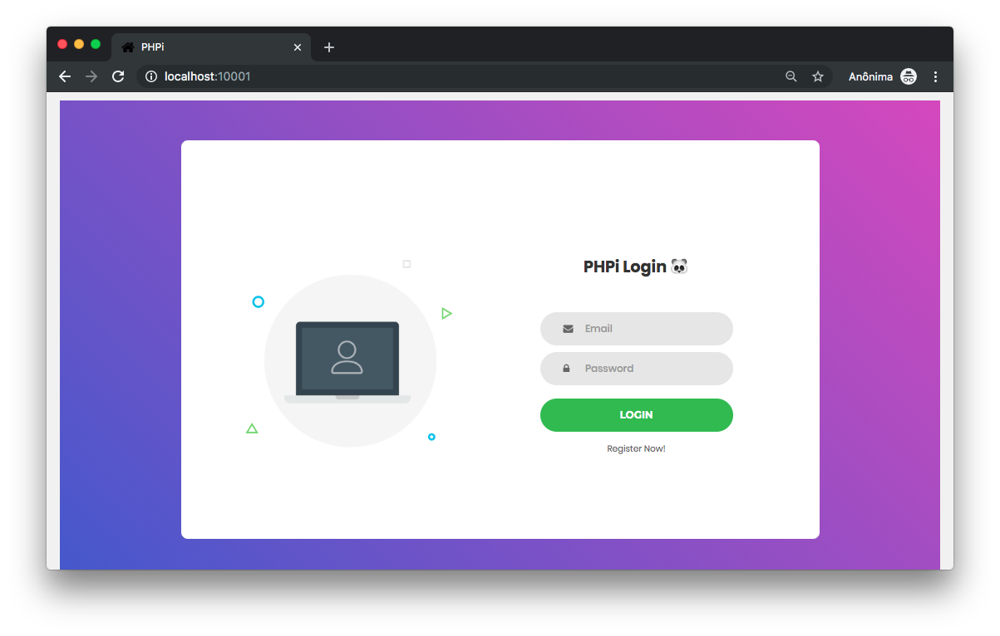

# PHPi

<p align="center">
    
</p>

PHPi is a PHP web application that simulates a login page. It has both /register and /login routes that, by communicating with a MySQL database, enable users to register and enter into a generic system.

## Index

- [Definition](#what-is-injection)
- [Setup](#setup)
- [Attack narrative](#attack-narrative)
- [Objectives](#secure-this-app)
- [Solutions](#pr-solutions)
- [Contributing](#contributing)

## What is Injection?

Injection flaws, such as SQL, NoSQL, OS, and LDAP injection, occur when untrusted data is sent to an interpreter as part of a command or query. The attacker’s hostile data can trick the interpreter into executing unintended commands or accessing data without proper authorization.

The main goal of this project is to discuss how **SQL Injection** vulnerabilities can be exploited and to encourage developers to send Pull Requests to secDevLabs on how they would mitigate these flaws.

## Setup

To start this intentionally **insecure application**, you will need [Docker][Docker Install] and [Docker Compose][Docker Compose Install]. After forking [secDevLabs](https://github.com/globocom/secDevLabs), you must type the following commands to start:

```sh
cd secDevLabs/owasp-top10-2017-apps/a1/phpi
```

```sh
make install
```

Then simply visit [localhost:10001][App], as exemplified below:



## Get to know the app 💉

To properly understand how this application works, you can follow these simple steps:

- Register a new user via front-end.
- Login as this user via front-end.

## Attack narrative

Now that you know the purpose of this app, what could possibly go wrong? The following section describes how an attacker could identify and eventually find sensitive information about the app or it's users. We encourage you to follow these steps and try to reproduce them on your own to better understand the attack vector! 😜

### 👀

(to do) After reviewing

#### 🔥

(to do) An attacker could create a malicious query

## Secure this app

How could you now mitigate this vulnerability? After your code modification, an attacker should not be able to run SQL queries in the database.

## PR Solutions

[Spoiler alert] To understand how this vulnerability can be mitigated, check [these pull requests](https://github.com/globocom/secDevLabs/pulls?q=is%3Apr+is%3Aclosed+label%3A%22mitigation+solution+%F0%9F%94%92%22+label%3APHPi)!

## Contributing

We encourage you to contribute to SecDevLabs! Please check out the [Contributing to SecDevLabs](../../../docs/CONTRIBUTING.md) section for guidelines on how to proceed! 🎉

[Docker Install]:  https://docs.docker.com/install/
[Docker Compose Install]: https://docs.docker.com/compose/install/
[App]: http://localhost:10001
