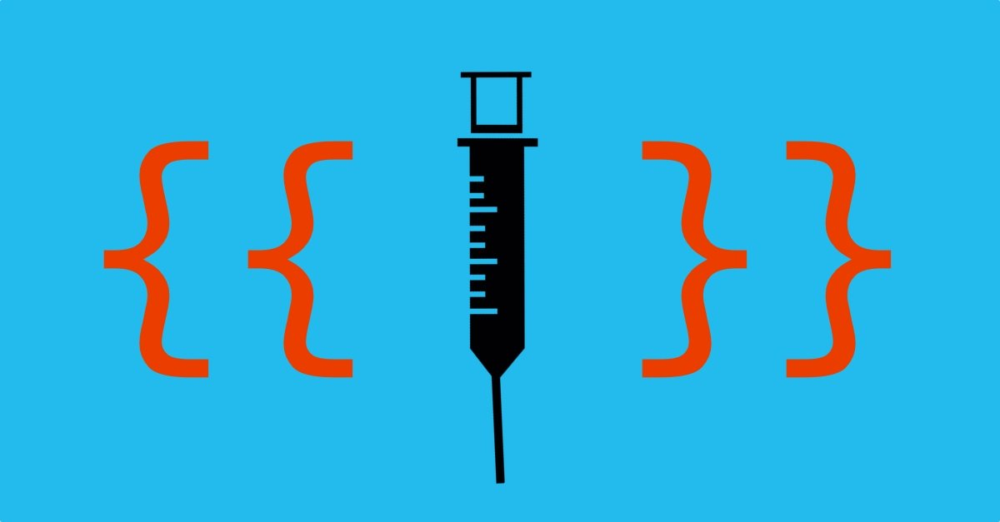
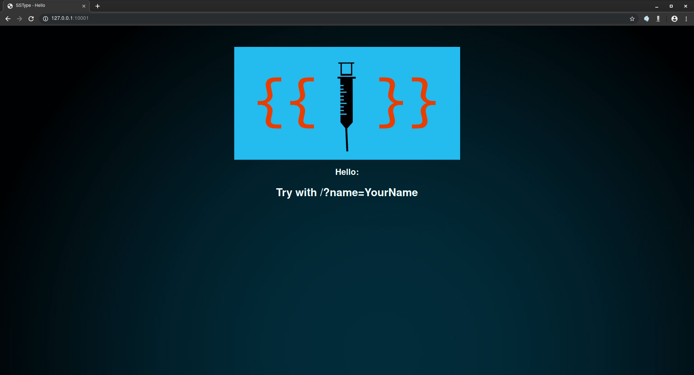
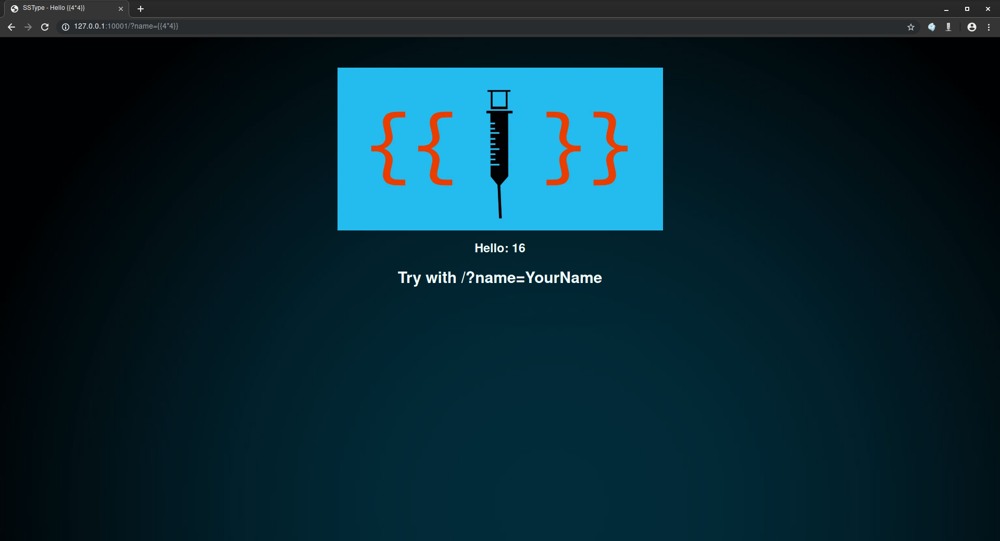
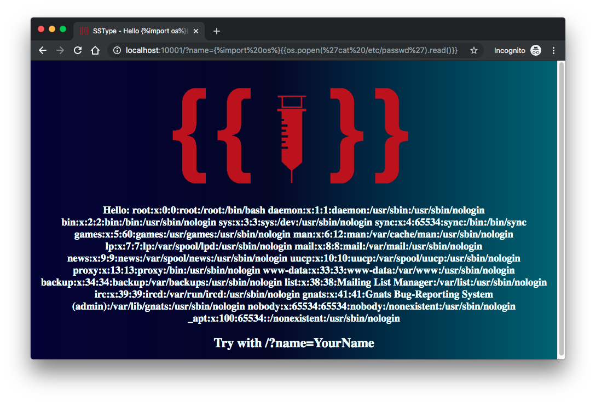
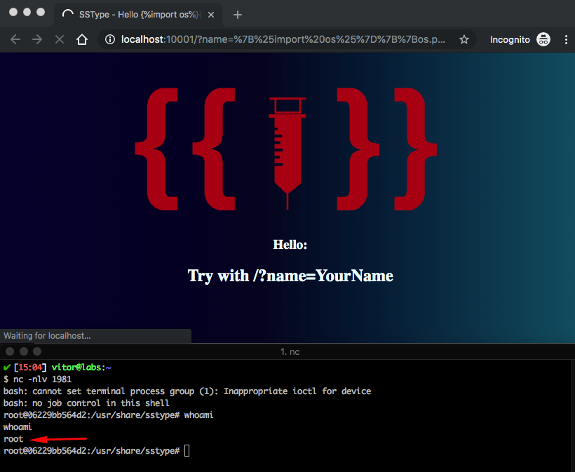

# SSType

<p align="center"></p>

SSType is a simple Python web application that contains an example of a Server Side Template Injection vulnerability in Tornado. On this example, a specific subcategory os Injection will be showed: Server Side Injection or SSTI.

## Index

- [Definition](#what-is-ssti?)
- [Setup](#setup)
- [Attack narrative](#attack-narrative)
- [Objectives](#secure-this-app)
- [Solutions](#pr-solutions)
- [Contributing](#contributing)

## What is SSTI?

Server Side Template Injection it's a vulnerability that occurs when some data or evaluate expressions are injected into certain points in a file that will be loaded and rendered dinamically.

You can find more about this vulnerability here: https://ajinabraham.com/blog/server-side-template-injection-in-tornado and here: https://portswigger.net/research/server-side-template-injection

## Setup

To execute this application, you need of 2 tools on your machine:
1. Docker
2. docker-compose

And to up the application, simply run these commands:

```sh

cd secDevLabs/owasp-top10-2017-apps/a1/sstype

```

```sh

make install

```

Then simply visit http://localhost:10001

## Get to know the app

The application simulate a simple page that will show you name when you pass it via GET parameter ```name```.

Accessing the application (http://localhost:10001), the homepage have a message that says: Try with /?name=YourName, so where you will visit the location (http://localhost:10001/?name=YourName) and insert data.😜

#### Homepage
<p  align="center"></p>

#### Insert a Name
<p  align="center"></p>

#### Insert a Expression
<p  align="center"></p>

## Attack Narrative

So, to exploit this application, you must to send a expression on parameter name that will be rendered by the application and returned back to the user on page.

In this example, a expression that will return the current shell is passed on GET parameter name: {{os.popen('echo $SHELL').read()}}

<p  align="center"></p>

The payload will import os lib on python, and will execute a command on system (echo $SHELL) that will return the current shell of application.

## PR Solutions

To fix this vulnerability it's necessary to sanitize all data that will be send to back-end before the engine render the page.

## Contributing

We encourage you to contribute to SecDevLabs! Please check out the [Contributing to SecDevLabs](../../../docs/CONTRIBUTING.md) section for guidelines on how to proceed! 🎉

[Docker Install]:  https://docs.docker.com/install/
[Docker Compose Install]: https://docs.docker.com/compose/install/
[App]: http://localhost:10082
[Dirb]: https://tools.kali.org/web-applications/dirb
