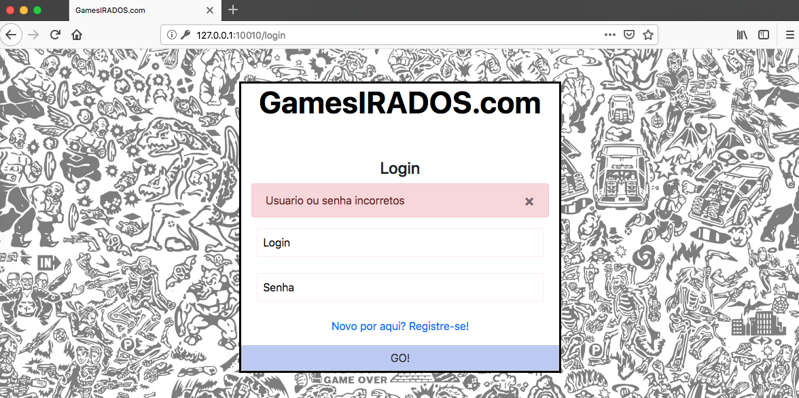
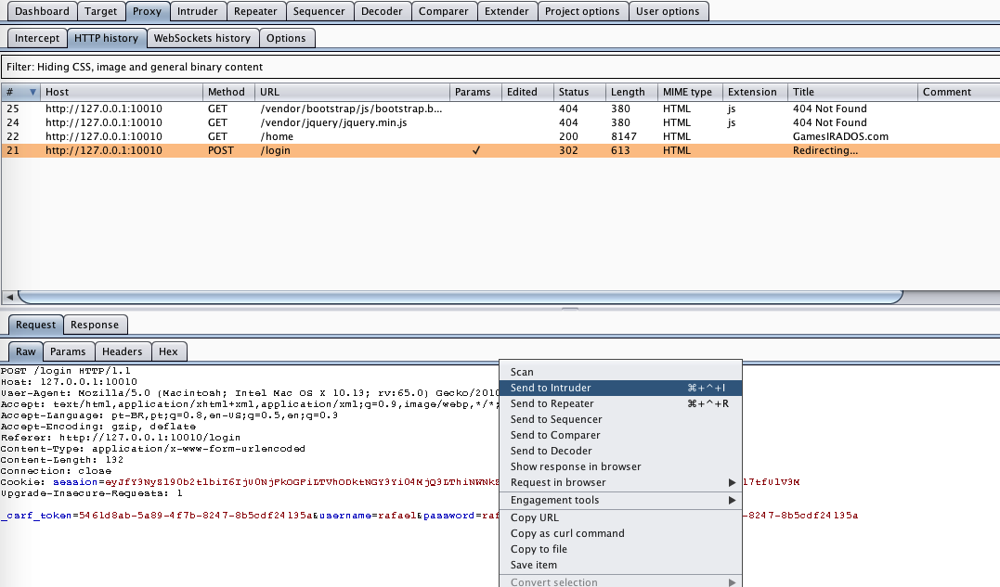
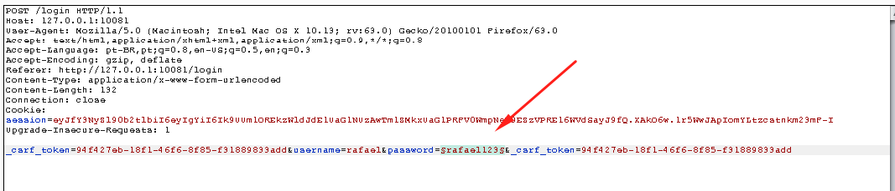
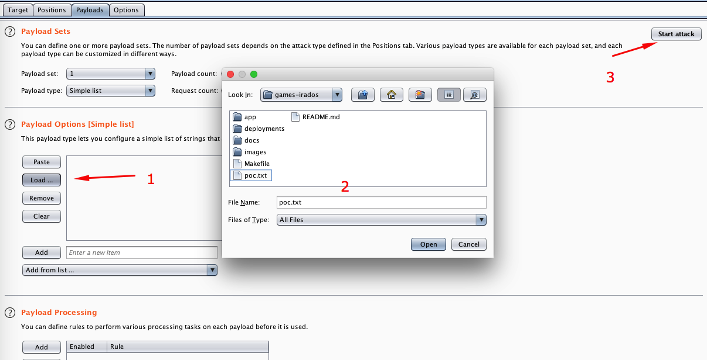
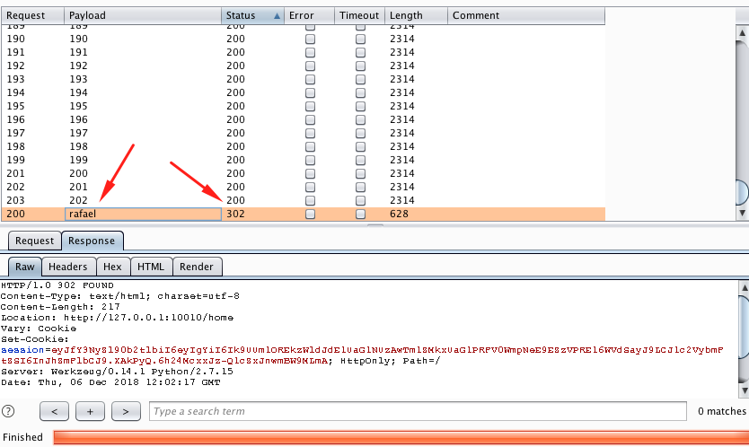
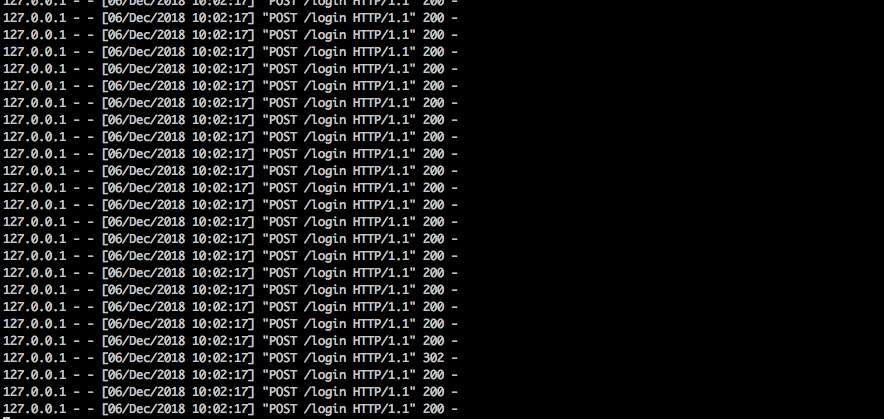
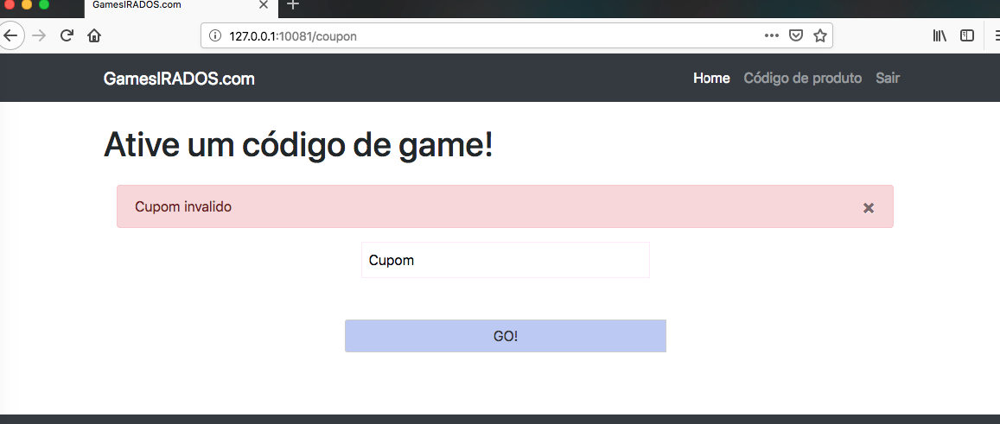
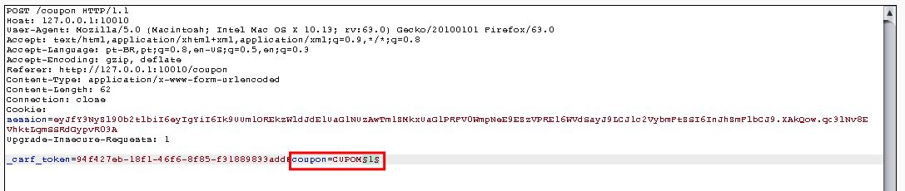
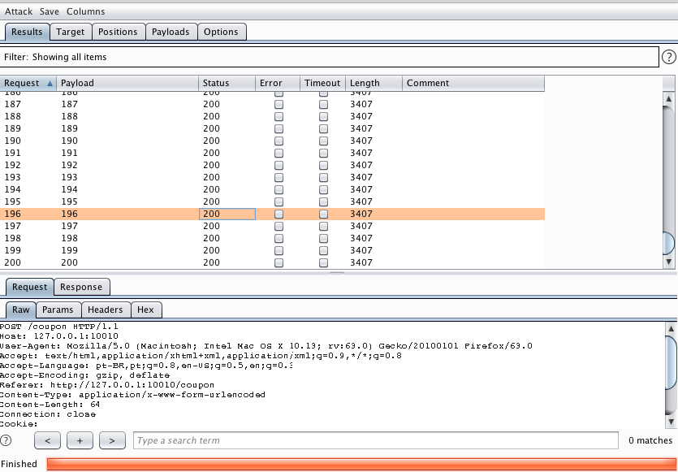
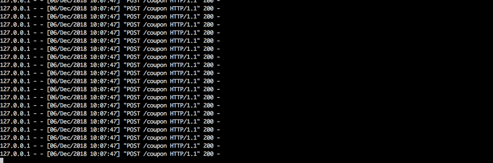

# Games Irados

<p align="center">
    
</p>

Games Irados is a simple Python web application that contains an example of an Insufficient Logging & Monitoring vulnerability and, it's main goal, is to demonstrate how important it is to properly log all requests made to the application and how easily malicious requests could go unnoticed.

## Index

- [Definition](#what-is-insufficient-logging-&-monitoring)
- [Setup](#setup)
- [Attack narrative](#attack-narrative)
- [Objectives](#secure-this-app)
- [Solutions](#pr-solutions)
- [Contributing](#contributing)

## What is Insufficient Logging & Monitoring?

Insufficient logging and monitoring, coupled with missing or ineffective integration with incident response, allows attackers to further attack systems, maintain persistence, pivot to more systems, and tamper, extract, or destroy data. Most breach studies show time to detect a breach is over 200 days, typically detected by external parties rather than internal processes or monitoring.

The main goal of this app is to discuss how **Insufficient Logging & Monitoring** can be exploited and to encourage developers to send secDevLabs Pull Requests on how they would mitigate these flaws.

## Setup

To start this intentionally **insecure application**, you will need [Docker][Docker Install] and [Docker Compose][Docker Compose Install]. After forking [secDevLabs](https://github.com/globocom/secDevLabs), you must type the following commands to start:

```sh
cd secDevLabs/owasp-top10-2017-apps/a10/games-irados
```

```sh
make install
```

Then simply visit [localhost:3001][App] ! 😆

## Get to know the app 🎮

To properly understand how this application works, you can follow these simple steps:

- Hide a message into an image.
- Decrypt the message from this image.
- Try using a password to better protect your image!

## Attack narrative

Now that you know the purpose of this app, what could possibly go wrong? The following section describes how an attacker could identify and eventually find sensitive information about the app or it's users. We encourage you to follow these steps and try to reproduce them on your own to better understand the attack vector! 😜

### 👀

#### Poor application log might mask malicious requests made to the server

With the goal of verifying how an application handles events that are considered malicious, two attacks will be done to test it:
* Brute forcing the login screen
* Brute forcing the coupon validation screen

Initially, we begin the first attack by sending an intentionally wrong login attempt, as shown by the image below:

<p align="center">
    
</p>

## 🔥

After that, an attacker could use [Burp Suite] as a proxy to send as many requests as needed until a valid password is found (if you need any help setting up your proxy, you should check this [guide](https://support.portswigger.net/customer/portal/articles/1783066-configuring-firefox-to-work-with-burp)). To do so, after finding the login POST request, right click and send to `Intruder`, as shown below:

<p align="center">
    
</p>

In Positions tab, all fields must be cleared first via `Clear §` button. To set `password` to change acording to each password from our dictionary wordlist, simply click on `Add §` button after selecting it:

<p align="center">
    
</p>

If a valid password is found, the application may process new cookies and eventually redirect the flow to other pages. To guarantee that the brute force attack follows this behavior, set `Always` into `Follow Redirections` options in `Options` tab, as shown below:

<p align="center">
    
</p>

You can use the following wordlist (`poc.txt`) just for POC purposes:

```
admin
password
123
qweasd
1qaz
123456789
flamengo
zxc
asd123qwe
YOURVALIDPASSWORD
```

Before executing the attack, you can open a new tab in your terminal and type the following command to observe how the malicious requests will come to the app:

```sh
docker logs app-a10 -f
```

In `Payloads` tab, simply choose the wordlist from `Load...` option and then the attack may be performed via `Start attack` button. 

<p align="center">
    
</p>

As we can see from the results of the requests, the application handles successfull and unsuccessfull requests differently by responding different status codes. As shown below, when the payload is correct the application responds a status code `302 FOUND`, otherwise it responds with a `200 OK`.

<p align="center">
    
</p>

By having a look at the application on the server side, it's possible to see that the logs provide little information regarding the attack, as shown below:

<p align="center">
    
</p>

Further more, if we try the `/coupon` route, instead of the `/login`, we can see similar results. The coupon page is shown below:

<p align="center">
    
</p>

Using Burp Suite again, we could send multiple requests to the application to simulate the second brute force attack, changing only `coupon` field:

<p align="center">
    
</p>

If you need to generate a simple number wordlist, you can use the following command:

```sh
seq 100 200 > coupons.txt
```

As we can see from the image below, the requests seem to have been handled properly by the server.

<p align="center">
    
</p>

However, we can also confirm that little information is being logged at the server side, as shown by the image below:

<p align="center">
    
</p>

## Secure this app

How would you mitigate this vulnerability? After your changes, an attacker should not be able to:

* Receive a `200 OK` to every and any request done

The server should also have a more informative log system

## PR solutions

[Spoiler alert 🚨] To understand how this vulnerability can be mitigated, check out [these pull requests](https://github.com/globocom/secDevLabs/pulls?q=is%3Apr+label%3A%22mitigation+solution+%F0%9F%94%92%22+label%3AGamesIrados.com)!

## Contributing

We encourage you to contribute to SecDevLabs! Please check out the [Contributing to SecDevLabs](../../../docs/CONTRIBUTING.md) section for guidelines on how to proceed! 🎉

[Docker Install]:  https://docs.docker.com/install/
[Docker Compose Install]: https://docs.docker.com/compose/install/
[App]: http://localhost:3001
[secDevLabs]: https://github.com/globocom/secDevLabs
[2]:https://github.com/globocom/secDevLabs/tree/master/owasp-top10-2017-apps/a10/games-irados
[Burp Suite]: https://portswigger.net/burp
