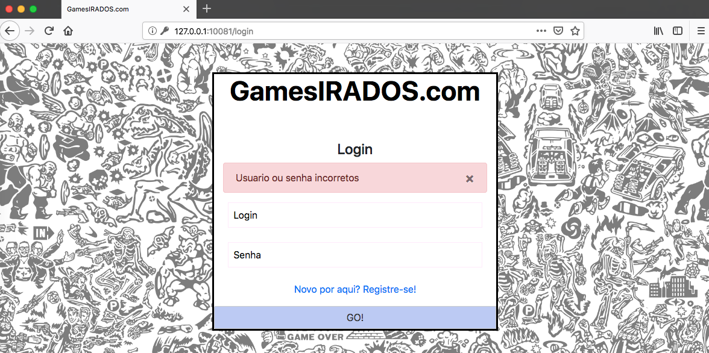
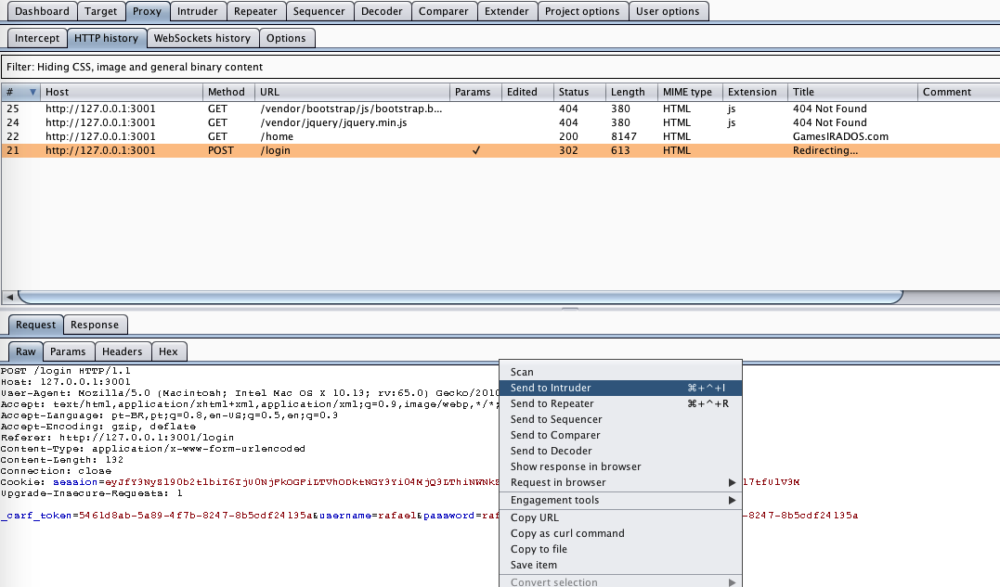
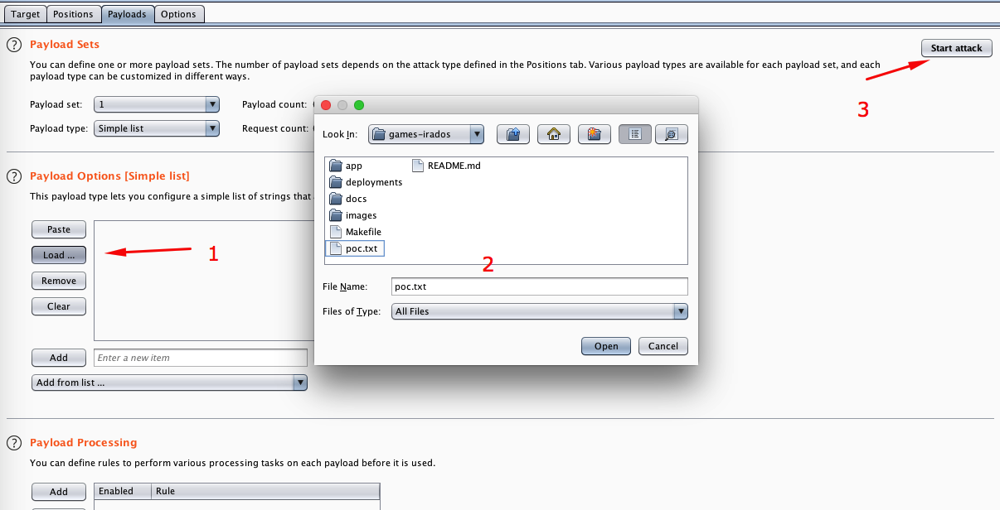
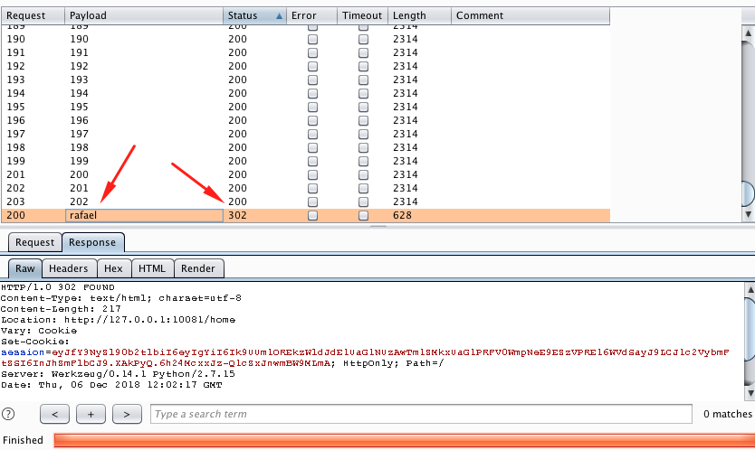
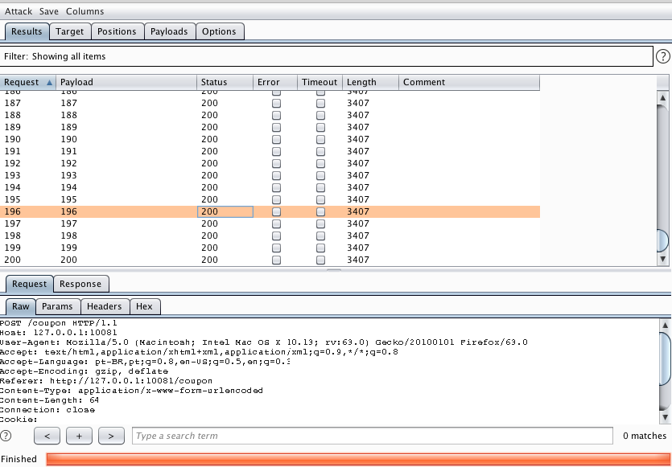

# Attack Narrative - GamesIRADOS
The main goal of this document is to describe how important it is to properly log all requests made to the application and how easily malicious requests could go unnoticed.

If you don't know [secDevLabs] or this [intended vulnerable web application][2] yet, you should check them out before reading this narrative.

---
## 👀

With the goal of verifying how an application handles events that are considered malicious, two attacks will be done to test it:
* Brute forcing the login screen
* Brute forcing the coupon validation screen

Initially, we begin the first attack by sending an intentionally wrong login attempt, as shown by the image below:

<p align="center">
    
</p>

## 🔥

After that, an attacker could use [Burp Suite] as a proxy to send as many requests as needed until a valid password is found (if you need any help setting up your proxy, you should check this [guide](https://support.portswigger.net/customer/portal/articles/1783066-configuring-firefox-to-work-with-burp)). To do so, after finding the login POST request, right click and send to `Intruder`, as shown bellow:

<p align="center">
    
</p>

In Positions tab, all fields must be cleared first via `Clear §` button. To set `password` to change acording to each password from our dictionary wordlist, simply click on `Add §` button after selecting it:

<p align="center">
    
</p>

If a valid password is found, the application may process new cookies and eventually redirect the flow to other pages. To guarantee that the brute force attack follows this behavior, set `Always` into `Follow Redirections` options in `Options` tab, as shown bellow:

<p align="center">
    
</p>

You can use the following wordlist (`poc.txt`) just for POC purposes:

```
admin
password
123
qweasd
1qaz
123456789
flamengo
zxc
asd123qwe
YOURVALIDPASSWORD
```

Before executing the attack, you can open a new tab in your terminal and type the following command to observe how the malicious requests will come to the app:

```sh
docker logs app-a10 -f
```

In `Payloads` tab, simply choose the wordlist from `Load...` option and then the attack may be performed via `Start attack` button. 

<p align="center">
    
</p>

As we can see from the results of the requests, the application handles successfull and unsuccessfull requests differently by responding different status codes. As shown below, when the payload is correct the application responds a status code `302 FOUND`, otherwise it responds with a `200 OK`.

<p align="center">
    
</p>

By having a look at the application on the server side, it's possible to see that the logs provide little information regarding the attack, as shown below:

<p align="center">
    
</p>

Further more, if we try the `/coupon` route, instead of the `/login`, we can see similar results. The coupon page is shown below:

<p align="center">
    
</p>

Using Burp Suite again, we could send multiple requests to the application to simulate the second brute force attack, changing only `coupon` field:

<p align="center">
    
</p>

If you need to generate a simple number wordlist, you can use the following command:

```sh
seq 100 200 > coupons.txt
```

As we can see from the image below, the requests seem to have been handled properly by the server.

<p align="center">
    
</p>

However, we can also confirm that liltte information is being logged at the server side, as shown by the image below:

<p align="center">
    
</p>

[secDevLabs]: https://github.com/globocom/secDevLabs
[2]:https://github.com/globocom/secDevLabs/tree/master/owasp-top10-2017-apps/a10/games-irados
[Burp Suite]: https://portswigger.net/burp