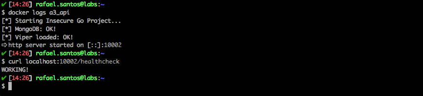
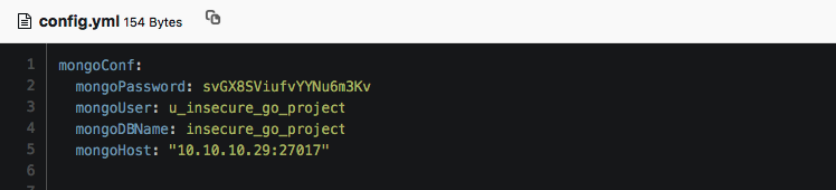
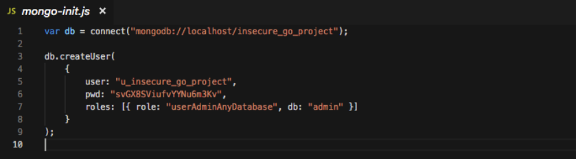
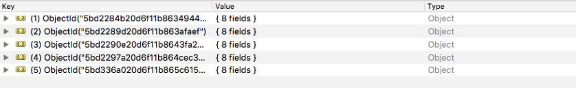

# Insecure Go Project

<p align="center">
    
</p>

Insecure Go Project is a simple Golang API that contains an example of a Broken Authentication vulnerabilty.

## Index

- [Definition](#what-is-broken-authentication)
- [Setup](#setup)
- [Attack narrative](#attack-narrative)
- [Objectives](#secure-this-app)
- [Solutions](#pr-solutions)
- [Contributing](#contributing)

## What is Broken Authentication?

Application functions related to authentication and session management are often implemented incorrectly, allowing attackers to compromise passwords, keys, or session tokens, or to exploit other implementation flaws to assume other users’ identities temporarily or permanently.

The main goal of this app is to discuss how **Broken Authentication** vulnerabilities can be exploited and to encourage developers to send secDevLabs Pull Requests on how they would mitigate these flaws.

## Setup

To start this intentionally **insecure application**, you will need [Docker][Docker Install] and [Docker Compose][Docker Compose Install]. After forking [secDevLabs](https://github.com/globocom/secDevLabs), you must type the following commands to start:

```sh
cd secDevLabs/owasp-top10-2017-apps/a2/insecure-go-project
```

```sh
make install
```

Then simply visit [localhost:9999][App] ! 😆

## Get to know the app 🐼

To properly understand how this application works, you can try:

- To take a moment to read the app's source code, and see how it works.

## Attack narrative

Now that you know the purpose of this app, what could possibly go wrong? The following section describes how an attacker could identify and eventually find sensitive information about the app or it's users. We encourage you to follow these steps and try to reproduce them on your own to better understand the attack vector! 😜

### 👀

#### Sensitive hardcoded credentials allows an attacker access to the database

After inspecting the application source code, it is possible to identify that some sensitive data from MongoDB are hardcoded on the [`config.yml`](../app/config.yml), as shown on the picture bellow:



This issue can also be found on [`mongo-init.js`](../deployments/mongo-init.js) file, as shown bellow:



### 🔥

Using this credentials to access local MongoDB, it was possible to check that they are indeed valid:



## Secure this app

How would you mitigate this vulnerability? After your changes, an attacker should not be able to:

* Find sensitive information (such as passwords or usernames) hardcoded.

## PR solutions

[Spoiler alert 🚨 ] To understand how this vulnerability can be mitigated, check out [these pull requests](https://github.com/globocom/secDevLabs/pulls?q=is%3Apr+label%3A%22mitigation+solution+%F0%9F%94%92%22+label%3A%22Insecure+Go+project%22)!

## Contributing

We encourage you to contribute to SecDevLabs! Please check out the [Contributing to SecDevLabs](../../../docs/CONTRIBUTING.md) section for guidelines on how to proceed! 🎉

[Docker Install]:  https://docs.docker.com/install/
[Docker Compose Install]: https://docs.docker.com/compose/install/
[App]: http://localhost:9999
[Dirb]: https://tools.kali.org/web-applications/dirb
