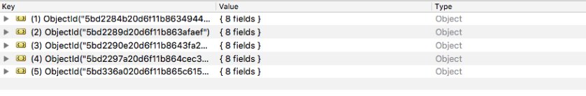

# Attack Narrative - Insecure Go Project

The main goal of this documentation is to describe how a malicious user could exploit a Broken Authentication vulnerability intentionally installed on Insecure Go Project from secDevLabs.

If you don't know [secDevLabs](https://github.com/globocom/secDevLabs) or this [intended vulnerable web application](https://github.com/globocom/secDevLabs/tree/master/owasp-top10-2017-apps/a2/insecure-go-project) yet, you should check them before reading this narrative.

----

## 👀

After inspecting the application source code, it is possible to identify that some sensitive data from MongoDB are hardcoded on the [`config.yml`](../app/config.yml), as shown on the picture bellow:

This issue can also be found on [`mongo-init.js`](../deployments/mongo-init.js) file, as shown bellow:

## 🔥

Using this credentials to access local MongoDB, it was possible to check that they are indeed valid:

