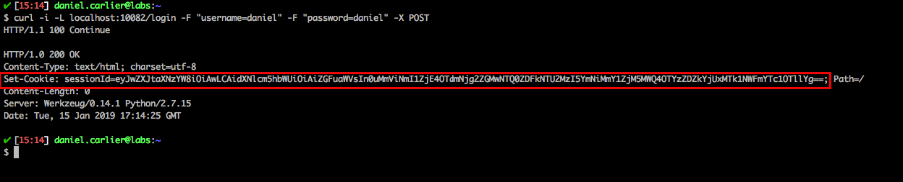

# Attack Narrative - Saidajaula Monster Fit

The main goal of this documentation is to describe how a malicious user could exploit a Broken Authentication vulnerability intentionally installed on Saidajaula Monster Fit from secDevLabs.

If you don't know [secDevLabs](https://github.com/globocom/secDevLabs) or this [intended vulnerable web application](https://github.com/globocom/secDevLabs/tree/master/owasp-top10-2017-apps/a2/saidajaula-monster) yet, you should check them before reading this narrative.

----

## 👀

It's possible to reach the server's web application through the HTTP port 10082, as we can see from the image below:

<p align="center">
    
</p>

We can sign-up for a new account by clicking the `SIGN UP` button on the top right corner. Then, we are redirected to the `/register` page. As shown by the image below:

<p align="center">
    
</p>

After creating an account, we are redirected to the `/login` page and, to better understand how the application is handling the requests, we will perform a login using the following `curl` command. As shown by the image:

```sh
$ curl -i -L localhost:10082/login -F "username=daniel" -F "password=daniel" -X POST
```

<p align="center">
    
</p>

As we can see from the image above, the application sets a cookie for the user, `sessionId`. By having a better look at this cookie, we find out that it is actually base64 encoded, and it's content are as following:

<p align="center">
    
</p>

Now, by having a look at the app's code, it's possible to see that all the information to generate this cookie is known to any user, as shown by the following image:

<p align="center">
    
</p>

## 🔥

Knowing how the cookie is being generated, a malicious user could create his own to gain access to pages he shouldn't have. An attacker could obtain admin privileges by changing the cookie's `permission` field, as depicted by the image below:

<p align="center">
    
</p>

After that, the attacker needs to concatenate the cookie's fields and the hash, separated by a dot. As shown by the following image:

<p align="center">
    
</p>

The server expects the cookie to be in base64 format, so the attacker needs to encode his cookie. As we can see from the image below using the command:

```sh
$ echo -n '{"permissao": 1, "username": "daniel"}.35771d6998cf216aa3297d1fb54462e04d85443be6092a02961b52b24c2d3250' | base64
```

<p align="center">
    
</p>

Now, all an attacker needs to do is try to access the `/admin` only page. As shown by the image below:

```sh
curl -v --cookie "sessionId=eyJwZXJtaXNzYW8iOiAxLCAidXNlcm5hbWUiOiAiZGFuaWVsIn0uMzU3NzFkNjk5OGNmMjE2YWEzMjk3ZDFmYjU0NDYyZTA0ZDg1NDQzYmU2MDkyYTAyOTYxYjUyYjI0YzJkMzI1MA==" http://localhost:10082/admin
```

<p align="center">
    
</p>
