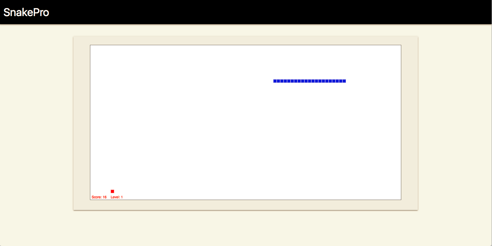

# Snake Pro
 > This is a simple Golang Web App that contains an example of a Sensitive Data Exposure vulnerability.



## What is Sensitive Data Exposure?

Definition from [OWASP](https://www.owasp.org/images/7/72/OWASP_Top_10-2017_%28en%29.pdf.pdf):

Many web applications and APIs do not properly protect sensitive data, such as financial, healthcare, and PII. Attackers may steal or modify such weakly protected data to conduct credit card fraud, identity theft, or other crimes. Sensitive data may be compromised without extra protection, such as encryption at rest or in transit, and requires special precautions when exchanged with the browser.

## Requirements

To build this lab you will need [Docker][Docker Install] and [Docker Compose][Docker Compose Install].

## Deploy and Run

After cloning this repository, you can type the following command to start the vulnerable application:

```sh
$ make install
```

Then simply visit [localhost:10033][App] !

## Attack Narrative

To understand how this vulnerability can be exploited, check [this section]!

## Mitigating the vulnerability

(Spoiler alert 🧐) To understand how this vulnerability can be mitigated, check [this other section](https://github.com/globocom/secDevLabs/pulls?q=is%3Apr+label%3A%22mitigation+solution+%F0%9F%94%92%22+label%3ASnakePro)!
## Contributing

Yes, please. :zap:

[Docker Install]:  https://docs.docker.com/install/
[Docker Compose Install]: https://docs.docker.com/compose/install/
[App]: http://127.0.0.1:10033
[this section]: docs/ATTACK.md
