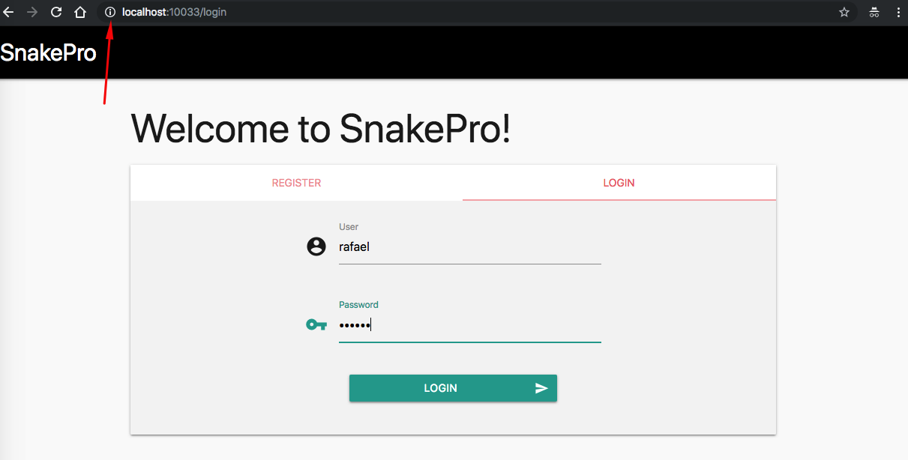

# Attack Narrative - Snake Pro

The main goal of this documentation is to describe how a malicious user could exploit a Sensitive Data Exposure vulnerability intentionally installed on Snake Pro from secDevLabs.

If you don't know [secDevLabs](https://github.com/globocom/secDevLabs) or this intended vulnerable web application yet, you should check them before reading this narrative.

----

## 👀

After reviewing how application stores users' passwords in MongoDB, it was possibile to see that sensitive data is being stored in clear text, as can be seen in `Register()` (routes.go) function and in `UserData` (types.go) struct:

<p align="center">
    
</p>

<p align="center">
    
</p>

Additionally, the channel being used to users send their sensitive data is unsafe (HTTP), as shown bellow:

<p align="center">
    
</p>

## 🔥

If database is somehow exposed, all users' passwords  will be leaked, as shown on these MongoDB documents examples bellow:

<p align="center">
    
</p>

Also, as login pages uses HTTP to transmit users' credentials, an attacker on the same network as the victim (same wifi, for example) can use `tcpdump` to perform a man-in-the-middle attack.

To install tcpdump on Mac, use the following command:

```sh
brew install tcpdump
```

To start sniffing grepgin for passwords from SnakePro, an attacker can use the following command: 

```sh
sudo tcpdump -i lo0 -X host localhost | grep pass --color
```

<p align="center">
    
</p>
