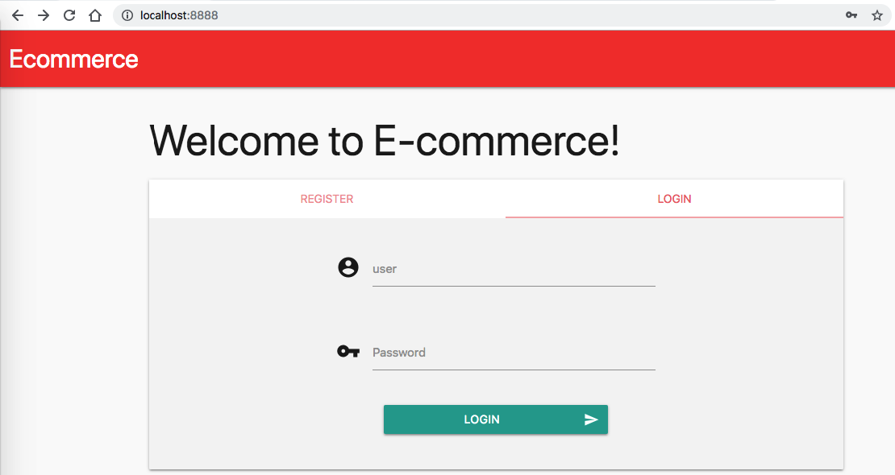

# Vulnerable Ecommerce API
> This is a simple Golang web application that contains an example of a Broken Access Control vulnerability.



## What is Broken Access Control?

Definition from [OWASP](https://www.owasp.org/images/7/72/OWASP_Top_10-2017_%28en%29.pdf.pdf):

Restrictions on what authenticated users are allowed to do are often not properly enforced. Attackers can exploit these flaws to access unauthorized functionality and/or data, such as access other users' accounts, view sensitive files, modify other users’ data, change access rights, etc.

## Requirements

To build this lab you will need [Docker][Docker Install] and [Docker Compose][Docker Compose Install].

## Deploy and Run

After cloning this repository, you can type the following command to start the vulnerable application:

```sh
$ make install
```

Then simply visit [localhost:8888][App] !

## Attack Narrative

To understand how this vulnerability can be exploited, check [this section]!

## Mitigating the vulnerability

(Spoiler alert 🧐) To understand how this vulnerability can be mitigated, check [this other section](https://github.com/globocom/secDevLabs/pulls?q=is%3Apr+label%3A%22mitigation+solution+%F0%9F%94%92%22+label%3A%22Vulnerable+Ecommerce+API%22)!

## Contributing

Yes, please. :zap:

[this section]: https://github.com/globocom/secDevLabs/blob/master/owasp-top10-2017-apps/a5/ecommerce-api/docs/ATTACK.md
[Docker Install]:  https://docs.docker.com/install/
[Docker Compose Install]: https://docs.docker.com/compose/install/
[App]: http://127.0.0.1:8888
