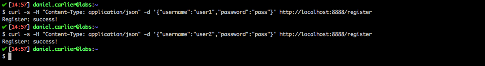

# Attack Narrative - Vulnerable Ecommerce API
The main goal of this documentation is to describe how a malicious user could exploit a Broken Access Control vulnerability intentionally installed on Vulnerable Ecommerce API from secDevLabs.

If you don't know [secDevLabs] or this [intended vulnerable web application][2] yet, you should check them before reading this narrative.

---
## 👀

In order to better understand how this API works, two users, `user1` and `user2`, were created as shown below: 

```sh
$ curl -s -H "Content-Type: application/json" -d '{"username":"user1","password":"pass"}' http://localhost:8888/register  
```
```sh
$ curl -s -H "Content-Type: application/json" -d '{"username":"user2","password":"pass"}' http://localhost:8888/register
```

<p align="center">
    
</p>


Or using web interface:

<p align="center">
    
</p>


The users created above are registered on MongoDB and we can get their `userID` through the following curl commands:

```sh
$ curl -s -H "Content-Type: application/json" -d '{"username":"user1","password":"pass"}' http://localhost:8888/login
```
```sh
$ curl -s -H "Content-Type: application/json" -d '{"username":"user2","password":"pass"}' http://localhost:8888/login
```

<p align="center">
    
</p>

This can also be observed via the web interface. In the web interface it is possible to verify that after completing the login form, two requests are made to the API.

<p align="center">
    
</p>

## 🔥

Having both `userID`, we can verify that the route "`GET /ticket/:userID`" does not validade if the request was made by the same user or someone else without the proper permission, as shown by the image:

<p align="center">
    
</p>

[secDevLabs]: https://github.com/globocom/secDevLabs
[2]:https://github.com/globocom/secDevLabs/tree/master/owasp-top10-2017-apps/a5/ecommerce-api