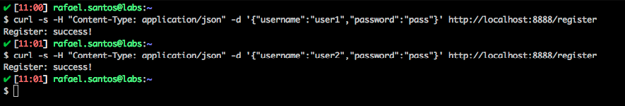
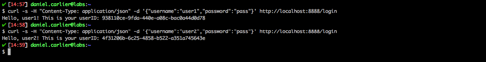
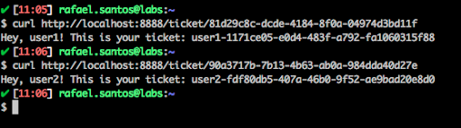

# Attack Narrative - Ecommerce API
The main goal of this document is to describe how a malicious user could exploit a lack of access control to obtain tokens that he should not have access to.

If you don't know [secDevLabs] or this [intended vulnerable web application][2] yet, you should check them before reading this narrative.

---
## 👀

In order to better understand how this API works, two users were created, `user1` and `user2`, as shown below: 

```sh
$ curl -s H "Content-Type: application/json" -d '{"username":"user1","password":"pass"}' http://localhost:8888/register  
```
```sh
$ curl -s H "Content-Type: application/json" -d '{"username":"user2","password":"pass"}' http://localhost:8888/register
```

<p align="center">
    
</p>

The users created above are registered on MongoDB, as we can see from the image below:

<p align="center">
    
</p>


NOTE: We could also get an user's `userID` through the command below, which sends a POST request to the `login` route:
```sh
$ curl -d '{"username":"user1","password":"pass"}' http://localhost:8888/login
```
```sh
$ curl -d '{"username":"user2","password":"pass"}' http://localhost:8888/login
```
## 🔥

Now, having the user's `userID`, we can verify that the route `GET /ticket/:userID` does not validade if the request was made by the user with the corresponding `userID` or someone else, as shown by the image:

<p align="center">
    
</p>

[secDevLabs]: https://github.com/globocom/secDevLabs
[2]:https://github.com/globocom/secDevLabs/tree/master/owasp-top10-2017-apps/a5/ecommerce-api