# Tic-Tac-Toe

  

<p  align="center">

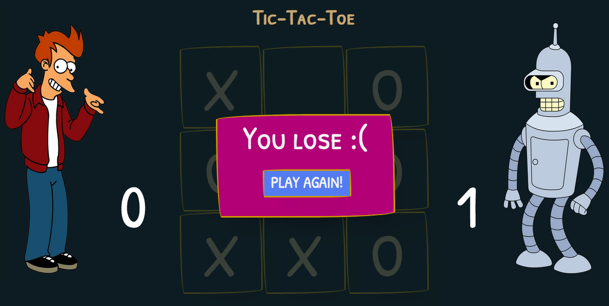

</p>

  

Tic-Tac-Toe is a simple Nodejs web application that contains an example of a Broken Access Control vulnerability and its main goal is to describe how a malicious user could exploit it.

  

## Index

  

-  [Definition](#what-is-broken-access-control)

-  [Setup](#setup)

-  [Attack narrative](#attack-narrative)

-  [Objectives](#secure-this-app)

-  [Solutions](#pr-solutions)

-  [Contributing](#contributing)

  

## What is Broken Access Control?

  

Restrictions on what authenticated users are allowed to do are often not properly enforced. Attackers can exploit these flaws to access unauthorized functionality and/or data, such as access to other users' accounts, view sensitive files, modify other users’ data, change access rights, etc.

  

The main goal of this app is to discuss how **Broken Access Control** vulnerabilities can be exploited and to encourage developers to send secDevLabs Pull Requests on how they would mitigate these flaws.

  

## Setup

  

To start this intentionally **insecure application**, you will need [Docker][Docker Install] and [Docker Compose][Docker Compose Install]. After forking [secDevLabs](https://github.com/globocom/secDevLabs), you must type the following commands to start:

  

```sh

cd secDevLabs/owasp-top10-2017-apps/a5/tictactoe

```

  

```sh

make install

```

  

Then simply visit [localhost:10005][App] ! 😆

  

## Get to know the app 🕹

  

To properly understand how this application works, you can follow this step:

  

- Try registering a user
- Sign in
- Play the game 
- See your statistics

  

## Attack narrative

  

Now that you know the purpose of this app, what could go wrong? The following section describes how an attacker could identify and eventually find sensitive information about the app or its users. We encourage you to follow these steps and try to reproduce them on your own to better understand the attack vector! 😜

  

### 👀

  

In order to better understand how the attacks works, two users, `fry123` and `bender`, were created using the web interface by visiting [localhost:10005/create](localhost:10005/create) as shown below:

  
  

<p  align="center">

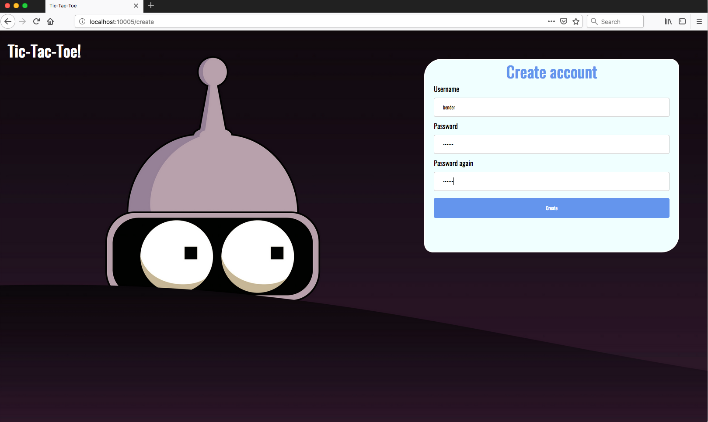

</p>


To perform the attacks we'll use the Burp Suite Tool. If you need any help setting up your proxy you should check this [guide](https://support.portswigger.net/customer/portal/articles/1783066-configuring-firefox-to-work-with-burp).


#### 👀 Lack of user cookie validation allows for an attacker to get other users' game statistics

  
  

After registering, the user `fry123` can sign in through the route /login, start playing the game:

  
  

<p  align="center">

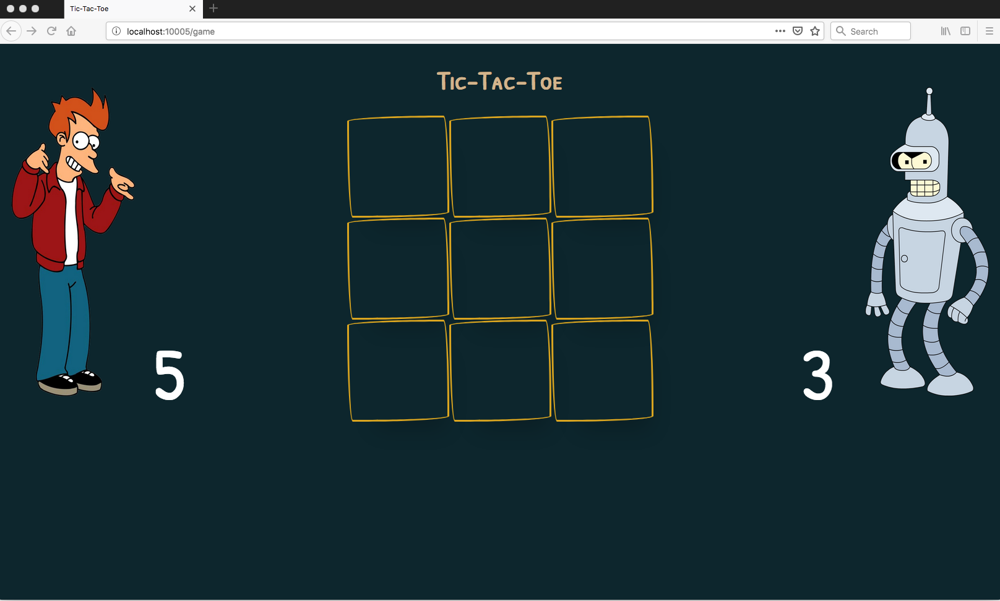

</p>

  

And see his private statistics:

  
<p  align="center">

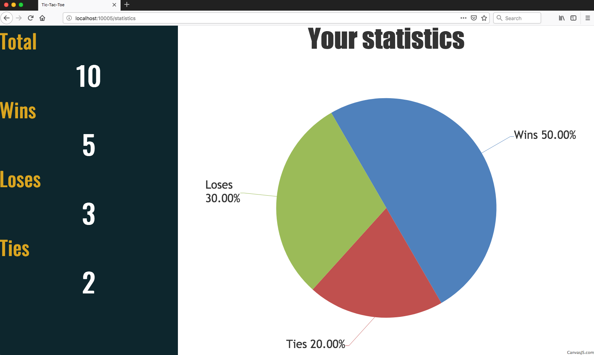

</p>

  

Using another user `bender` and the Burp Suite Tool, we can see the API request details when accessing [localhost:10005/statistics](localhost:10005/statistics). As seen below, to get the user statistics data, an AJAX request is made passing the username as a URL parameter:

  

<p  align="center">

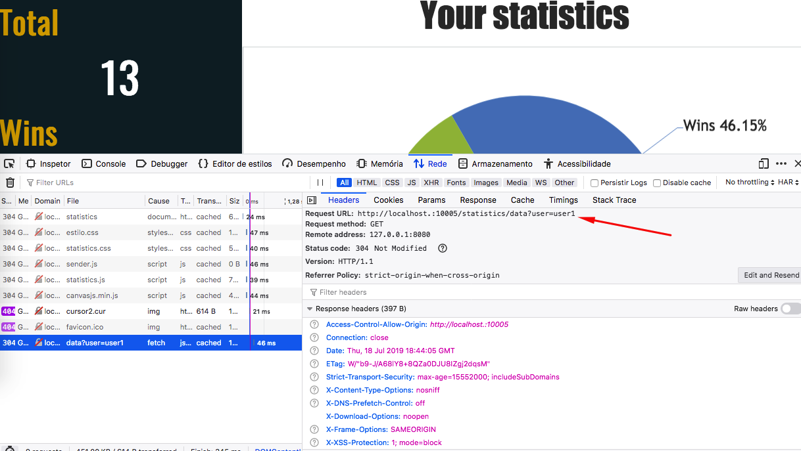

</p>


And the request returns the user's statistics data:

<p  align="center">

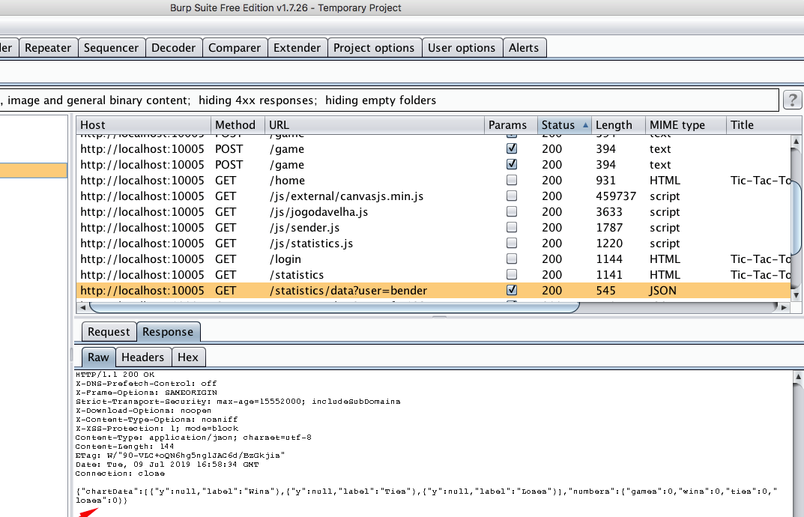

</p>

  

This may indicate that only this parameter is being used to verify the permission to get the data. So to check it, we will intercept the request and change the _user_ parameter by `fry123` using Burp Repeater. As we can see below, the data returned belongs to `fry123` user:

  

<p  align="center">

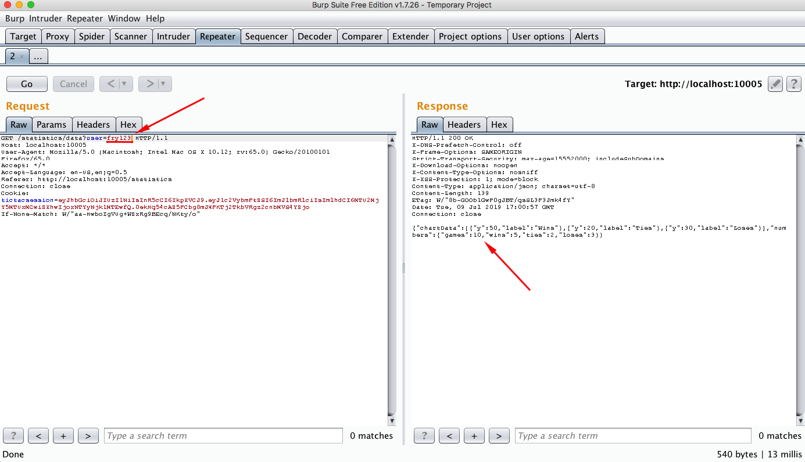

</p>

  

This allows an attacker to see every known user's private statistics.

  

#### 👀 Lack of user cookie validation allows for an attacker to manipulate user statistics

  
Analyzing the browser inspector we can see that every time a game ends, a request is made.

  

<p  align="center">

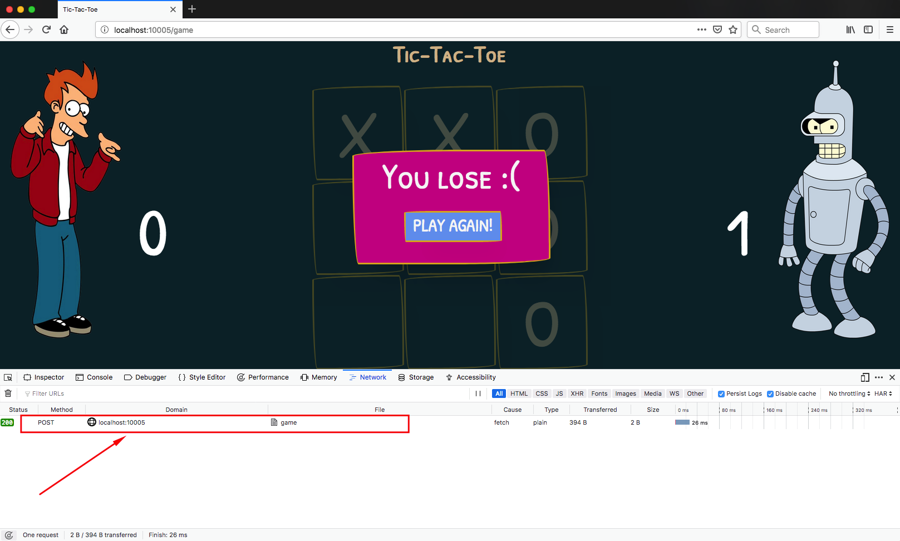

</p>

  

Using Burp Suite Tool, we can see the request details and notice that two parameters are sent, the `user` and the `result`:

  

<p  align="center">

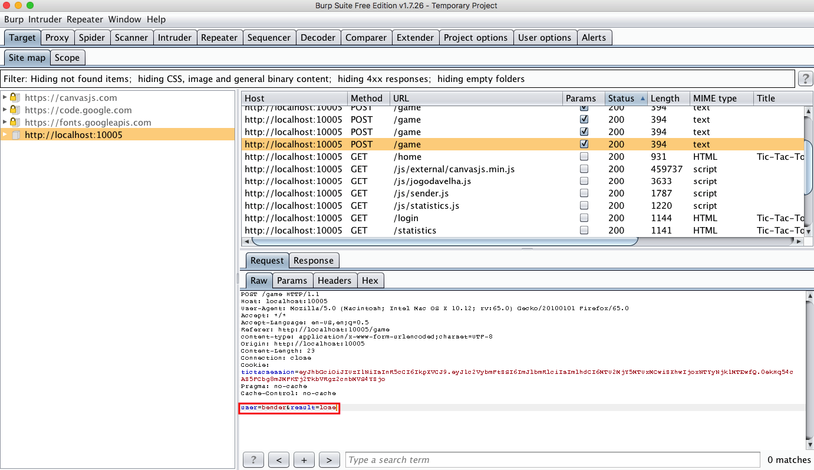

</p>

  

Sending this request to Burp Repeater and change the user parameter to another one, for example, `fry123`, an attacker could try to add a new result without the proper authorization, as can be seen in the following image:

  

<p  align="center">

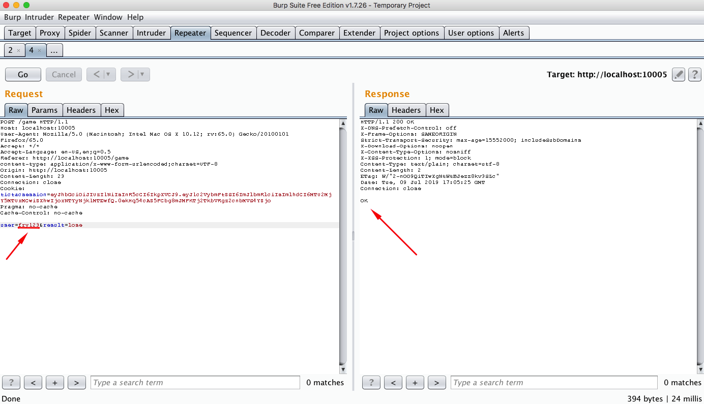

</p>

  

Now, when the user `fry123` tries to see his/her statistics using web interface, he/she will see the modified data:

  

<p  align="center">

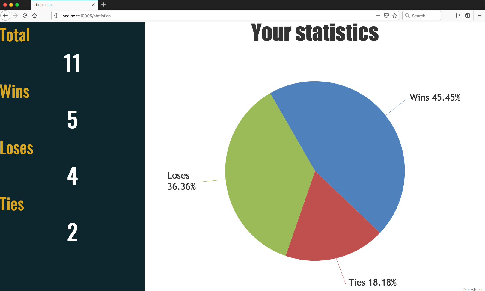

</p>

  
  
  

## Secure this app

  

How would you mitigate this vulnerability? After your changes, an attacker should not be able to:

  

* Access other users' private statistics.

* Modify other users' private statistics.

  
  

## PR solutions

  

[Spoiler alert 🚨 ] To understand how this vulnerability can be mitigated, check out [these pull requests](https://github.com/globocom/secDevLabs/pulls?utf8=%E2%9C%93&q=is%3Apr+label%3A%22mitigation+solution+%F0%9F%94%92%22+label%3A%22Tic-Tac-Toe%22+)!

  

## Contributing

  

We encourage you to contribute to SecDevLabs! Please check out the [Contributing to SecDevLabs](../../../docs/CONTRIBUTING.md) section for guidelines on how to proceed! 🎉

  

[Docker Install]: https://docs.docker.com/install/

[Docker Compose Install]: https://docs.docker.com/compose/install/

[App]: http://localhost:10005

[secDevLabs]: https://github.com/globocom/secDevLabs

[2]:https://github.com/globocom/secDevLabs/tree/master/owasp-top10-2017-apps/a5/tictactoe