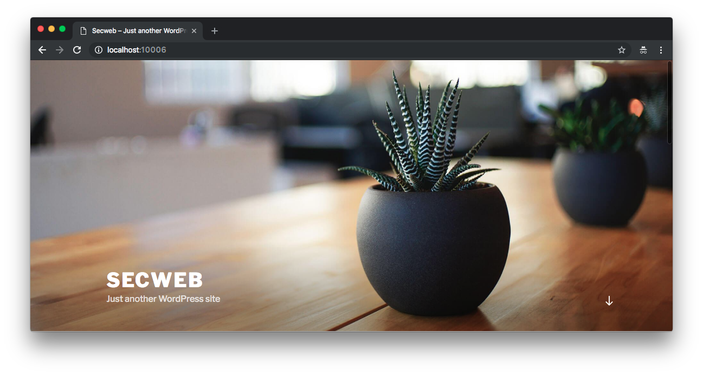
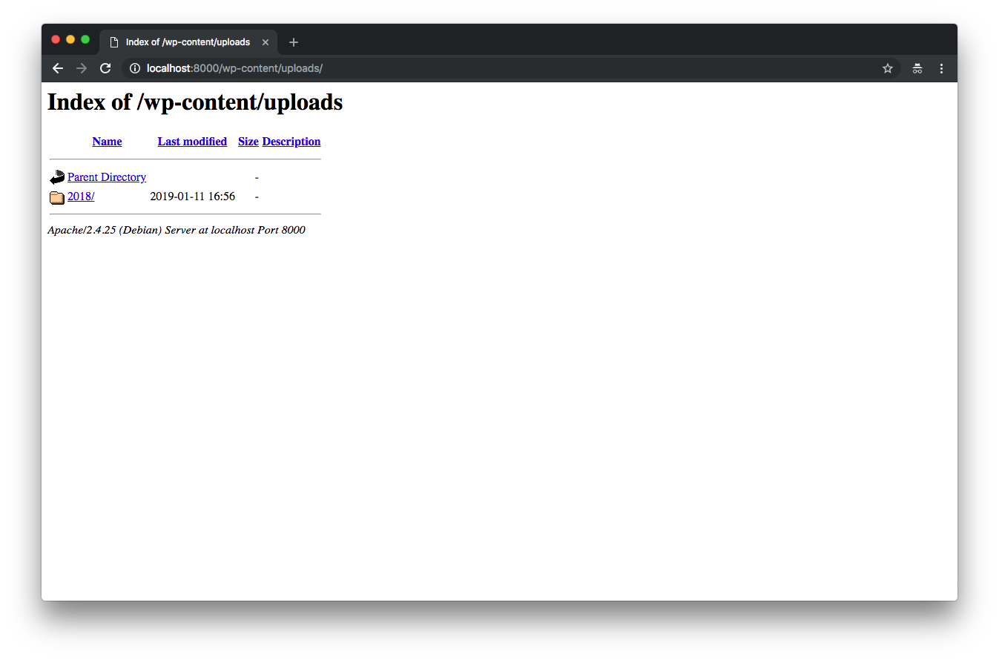

# Attack Narrative - SecWeb: A Vulnerable WordPress Site

The main goal of this documentation is to describe how a malicious user could exploit multiple Security Misconfiguration vulnerabilities intentionally installed on SecWeb, a vulnerable wordpress site, from secDevLabs.

If you don't know [secDevLabs](https://github.com/globocom/secDevLabs) or this [intended vulnerable web application](https://github.com/globocom/secDevLabs/tree/master/owasp-top10-2017-apps/a6/misconfig-wordpress) yet, you should check them before reading this narrative.

----

### Note: This narrative shows a few examples of security vulnerabilities found in this app, although there could be more. 🧐

## 👀

It's possible to reach the site through the HTTP port 8000, as shown by the image below:

    

Having a closer look at what's written bellow `SECWEB` we have a sign that the site might be using the WordPress CMS. We can confirm that suspicion by trying to access the `/wp-admin` page. As we can see from the image below, our suspicion is confirmed:

 

    

An attacker could try to log in with the username: `admin` and realize, through the error message, that `admin` is a valid user, as depicted by the image below:

 

    

## 🔥

Now, using Burp Suite to perform a brute force attack using this [wordlist], we were able to perform 200 requests to try and obtain a valid admin password. As we can see from the image below, the site redirected us when the password `password` was used, thus giving us evidence that it might be the `admin` password. 

 

    

The suspicion was confirmed when trying to log in with these credentials. As shown below:

 

    

----

## 👀

Now that we know we're dealing with a WordPress, we can use the [WPScan] tool to perform a sweep in the app in search for known vulnerabilities:

 

    

## 🔥

As seen from the image above, the tool found out that the CMS version is outdated and vulnerable to an Authenticated Arbitrary File Deletion. By using [searchsploit] tool, as shown in the following picture, an attacker could find a [malicious code] to exploit this vulnerability.

 

    

----

## 👀

By having another look at the results from [WPScan], it's possible to see that the tool found a browseable directory in the app: `/wp-content/uploads/`, as we can see from the image below:

 

    

## 🔥

We can confirm that the directory is browseable by accessing it through a web browser, as confirmed by the following image:

 

    

----

## 👀

Using [Nikto] tool to perform a security check scan, it's possible to see that there are multiple points of attention regarging security headers, as we can see from the image below:

 

    

Now, by doing the following curl command to check the HTTP headers of the application, we can see that it exposes the PHP version installed, as shown by the image below:

 

    

[wordlist]: https://github.com/danielmiessler/SecLists/blob/master/Passwords/UserPassCombo-Jay.txt
[wpscan]:https://wpscan.org/
[malicious code]: https://www.exploit-db.com/exploits/44949
[nikto]: https://cirt.net/Nikto2
[searchsploit]: https://www.exploit-db.com/searchsploit

