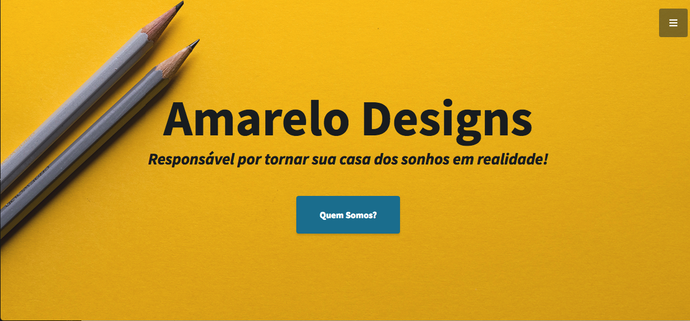

# Amarelo Designs
 > This is a simple web application built with Flask that contains an example of an Insecure Deserialization vulnerability.



## What is Insecure Deserialization?

Definition from [OWASP](https://www.owasp.org/images/7/72/OWASP_Top_10-2017_%28en%29.pdf.pdf):

Insecure deserialization often leads to remote code execution. Even if deserialization flaws do not result in remote code execution, they can be used to perform attacks, including replay attacks, injection attacks, and privilege escalation attacks.

## Requirements

To build this lab you will need [Docker][Docker Install] and [Docker Compose][Docker Compose Install].

## Deploy and Run

After cloning this repository, you can type the following command to start the vulnerable application:

```sh
make install
```

Then simply visit [localhost:5000][App] !

## Attack Narrative

To understand how this vulnerability can be exploited, check [this section]!

## Mitigating the vulnerability

(Spoiler alert 🧐) To understand how this vulnerability can be mitigated, check [this other section](https://github.com/globocom/secDevLabs/pulls?q=is%3Apr+label%3A%22mitigation+solution+%F0%9F%94%92%22+label%3A%22Amarelo+Designs%22)!
## Contributing

Yes, please. :zap:

[Docker Install]:  https://docs.docker.com/install/
[Docker Compose Install]: https://docs.docker.com/compose/install/
[App]: http://127.0.0.1:5000
[this section]: https://github.com/globocom/secDevLabs/blob/master/owasp-top10-2017-apps/a8/amarelo-designs/docs/ATTACK.md
