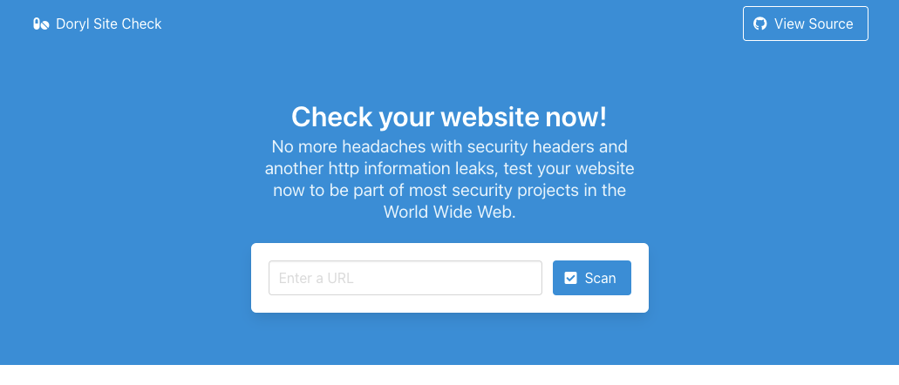

# Doryl site-check

This is a simple Golang webapp that contains an example of a SSRF(Server Side Request Forgery) vulnerability and its main goal is to describe how a malicious user could exploit it.

## What is SSRF?
*from .*

Server-side request forgery (also known as SSRF) is a web security vulnerability that allows an attacker to induce the server-side application to make requests to an unintended location.

In a typical SSRF attack, the attacker might cause the server to make a connection to internal-only services within the organization's infrastructure. In other cases, they may be able to force the server to connect to arbitrary external systems, potentially leaking sensitive data such as authorization credentials. 

## What is the impact of SSRF attacks?

A successful SSRF attack can often result in unauthorized actions or access to data within the organization, either in the vulnerable application itself or on other back-end systems that the application can communicate with. In some situations, the SSRF vulnerability might allow an attacker to perform arbitrary command execution.

An SSRF exploit that causes connections to external third-party systems might result in malicious onward attacks that appear to originate from the organization hosting the vulnerable application.
