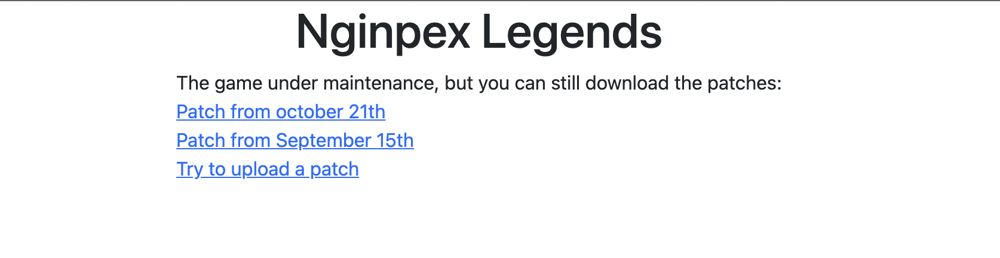
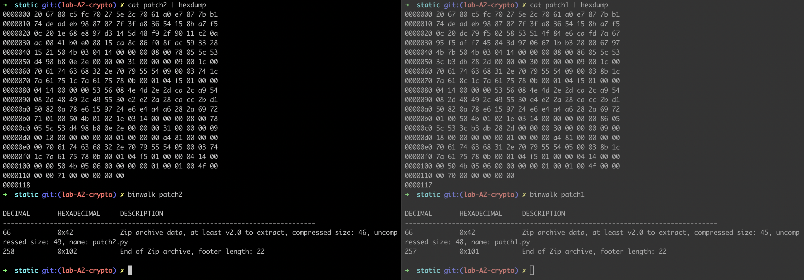

<!-- This is a README Template for secDevLabs apps -->
# Nginpex Legends

<p align="center">
    
</p>

This app is about a new game that has came out this year! On the website page you can download the game updates but only administrators can upload a new patch.

## Index

- [Definition](#definition)
- [Setup](#setup)
- [Attack narrative](#attack-narrative)
- [Objectives](#secure-this-app)
- [Solutions](#pr-solutions)
- [Contributing](#contributing)


## <a name="definition"></a> What does it mean to have Cryptographic Failures?

Previously known as #2 Sensitive Data Exposure, in owasp top 10 2021 its up to #2. This class of vulnerability is pretty wide and often developers don't really mind about it.

The first thing we learn about cryptography is that we can't make schemes. The second is that it is very likely to us be using the cryptographic scheme wrong. The third is that even using libs that deal with the primitives, we are using the wrong parameters. The main point of this vulnerability is to use wrong cryptographic schemes leading to sensitive data exposure or system compromise most of the time.

The main goal of this app is to discuss how using wrong cryptographic schemes can be exploited and to encourage developers to send secDevLabs Pull Requests on how they would mitigate these flaws.

## Setup

To run the app:

```
cd secDevLabs/owasp-top10-2021-apps/a2/nginpex-legends
make install
```

## Get to know the app 🕹️

To properly understand how this application works, you can follow these simple steps:

* Visit the homepage.
* Some links to download game patches are available.
* You can also upload a patch to see if it is valid.

## Attack narrative

Now that you know the purpose of this app, what could possibly go wrong? The following section describes how an attacker could execute arbitrary commands on the server. We encourage you to follow these steps and try to reproduce them on your own to better understand the attack vector! 😜

### 👀

#### Use of wrong cryptographic primitives allow malicious files to be uploaded

First time acessing the app on port 10002:

<p align="center">
    
</p>

We can see two patches were released and are available to download. If we see any patch structure with hexdump and binwalk we are able to notice that it is 66 bytes of something and then a zip file.

<p align="center">
    
</p>

As both files have the same 33 first bits, this can be some sort of signature that is being used reusing nonces. Since people that make video games like a lot of DSA based schemes (ref. PS3), then we can try a nonce reuse exploit with those files.

On file `exploit.py` we can see a full exploit to this failure. The explanation is that if we reuse a nonce `k` with the same private key, we will produce, for two messages `z1` and `z2` two signatures `sig(z1) = (r, s1)` and `sig(z2) = (r, s2)` and then we can do some math tricks to recover the secret from the private key. Where n is the order of the elliptic curve:

```
s1 = k^-1 (z1+r*secret) mod n
s2 = k^-1 (z2+r*secret) mod n

s1*k = z1+r*secret mod n
s2*k = z2+r*secret mod n

# subtracting the equations

k*(s1 - s2) = z1+r*secret - (z2+r*secret) mod n
k = (z1-z2)/(s1-s2) mod n

# Recovering private key

secret = (s1*k-z1)/k mod n
```

This secret we discovered is the secret multiplier from the private key!

Since we know that the signature is 32 bytes, the elliptic curve modulus is 256 bits, since we don't know much elliptic curves considered safe with this number of bits, it is crucial to try NIST-P256 as our curve. Trying this we can build the file `exploit/exploit.py`, paste both patches on the same directory, create a file named `exec.py` and zip this to `malware.zip`. Then we run the exploit and we can upload a file that will execute `exec.py` on the server!

## Secure this app

How would you migitate this vulnerability? After your changes, an attacker should not be able to:

- Upload malicious patches

## PR solutions

[Spoiler alert 🚨 ] To understand how this vulnerability can be mitigated, check out [these pull requests]!

## Contributing

We encourage you to contribute to SecDevLabs! Please check out the [Contributing to SecDevLabs](../../../docs/CONTRIBUTING.md) section for guidelines on how to proceed! 🎉

[secDevLabs]: https://github.com/globocom/secDevLabs