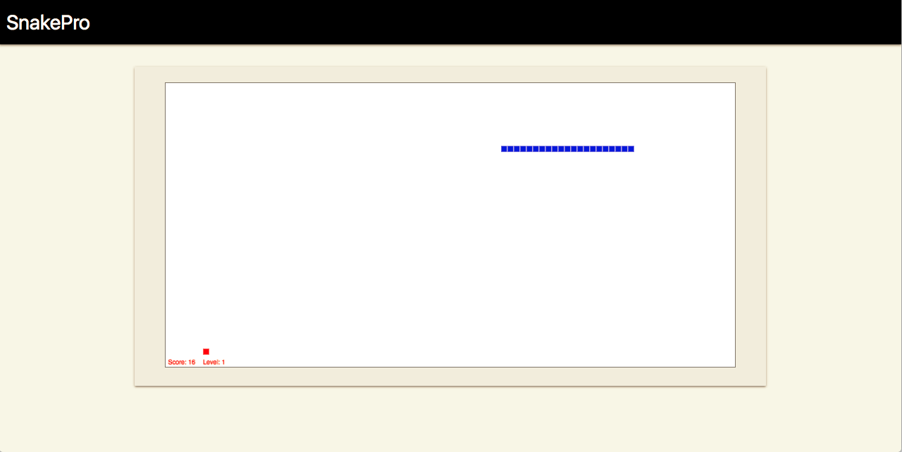
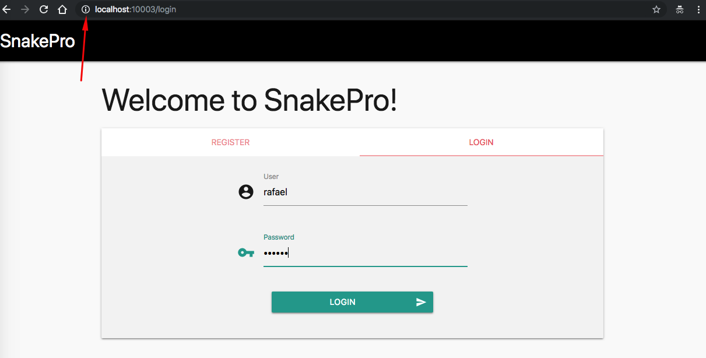
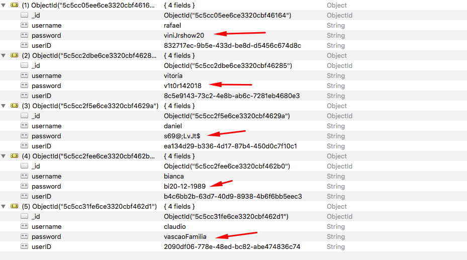
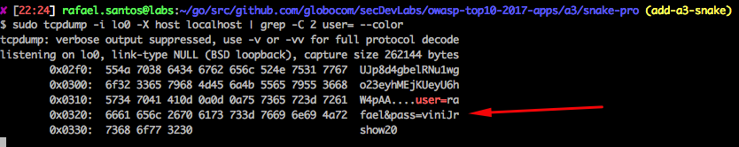

# Snake Pro

<p align="center">
    
</p>

Snake Pro is a simple Golang Web App that contains an example of a Cryptographic Failure vulnerability, and its main goal is to illustrate how an attacker could explore it.

## Index

- [Definition](#what-is-cryptographic-failure)
- [Setup](#setup)
- [Attack narrative](#attack-narrative)
- [Objectives](#secure-this-app)
- [Solutions](#pr-solutions)
- [Contributing](#contributing)

## What is Cryptographic Failure?

Many web applications and APIs do not properly protect sensitive data, such as financial, healthcare, and PII. Attackers may steal or modify such weakly protected data to conduct credit card fraud, identity theft, or other crimes. Sensitive data may be compromised without extra protection, such as encryption at rest or in transit, and requires special precautions when exchanged with the browser.

The main goal of this app is to discuss how **Cryptographic Failure** vulnerabilities can be exploited and to encourage developers to send secDevLabs Pull Requests on how they would mitigate these flaws.

## Setup

To start this intentionally **insecure application**, you will need [Docker][docker install] and [Docker Compose][docker compose install]. After forking [secDevLabs](https://github.com/globocom/secDevLabs), you must type the following commands to start:

```sh
cd secDevLabs/owasp-top10-2021-apps/a2/snake-pro
```

```sh
make install
```

Then simply visit [localhost:10003][app] ! 😆

## Get to know the app 🐍

To properly understand how this application works, you can follow these simple steps:

- Try beating our high-score! 😝
- Register yourself as a new user!

## Attack narrative

Now that you know the purpose of this app, what could go wrong? The following section describes how an attacker could identify and eventually find sensitive information about the app or its users. We encourage you to follow these steps and try to reproduce them on your own to better understand the attack vector! 😜

### 👀

#### Lack of encryption when transmitting clear text passwords allows for a man-in-the-middle attack

After reviewing how application stores users' passwords in MongoDB, it was possibile to see that sensitive data is being stored in clear text, as can be seen in `Register()` (routes.go) function and in `UserData` (types.go) struct:

<p align="center">
    
</p>

<p align="center">
    
</p>

Additionally, the channel is being used by users to send their sensitive data is unsafe (HTTP), as shown below:

<p align="center">
    
</p>

### 🔥

If the database is somehow exposed, all users' passwords will be leaked, as shown on these MongoDB documents. To view them, you can locally install [Robo 3T](https://robomongo.org/download) and use default credentials used in `config.yml`:

```
Database: snake_pro
User name: u_snake_pro
Password: svGX8SViufvYYNu6m3Kv
Address: localhost:27017
```

<p align="center">
    
</p>

Also, as login pages use HTTP to transmit users' credentials, an attacker on the same network as the victim (same wifi, for example) can use `tcpdump` to perform a man-in-the-middle attack.

To install tcpdump on Mac, use the following command:

```sh
brew install tcpdump
```

To start sniffing for passwords from SnakePro, an attacker can use the following command:

```sh
sudo tcpdump -i lo0 -X host localhost | grep -C 2 pass --color
```

<p align="center">
    
</p>

## Secure this app

How would you mitigate this vulnerability? After your changes, an attacker should not be able to:

- Capture sensitive information by sniffing on network packages.
- Bonus: What about using HTTPS?

## PR solutions

[Spoiler alert 🚨] To understand how this vulnerability can be mitigated, check out [these pull requests](https://github.com/globocom/secDevLabs/pulls?q=is%3Apr+label%3A%22mitigation+solution+%F0%9F%94%92%22+label%3ASnakePro)!

## Contributing

We encourage you to contribute to SecDevLabs! Please check out the [Contributing to SecDevLabs](../../../docs/CONTRIBUTING.md) section for guidelines on how to proceed! 🎉

[docker install]: https://docs.docker.com/install/
[docker compose install]: https://docs.docker.com/compose/install/
[app]: http://localhost:10003
[dirb]: https://tools.kali.org/web-applications/dirb
