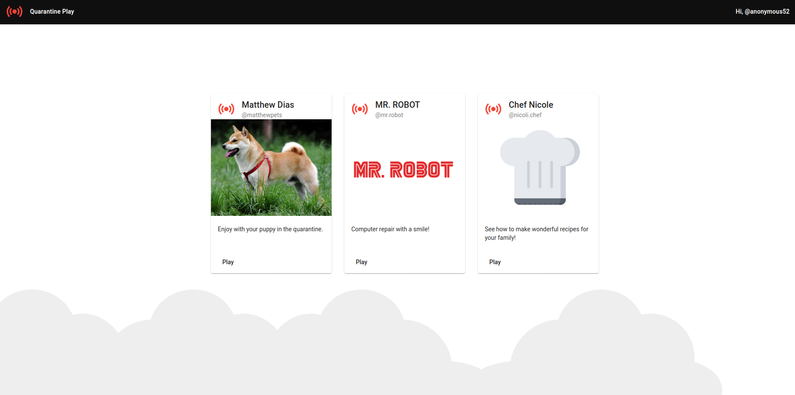
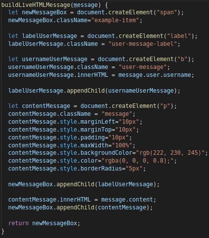
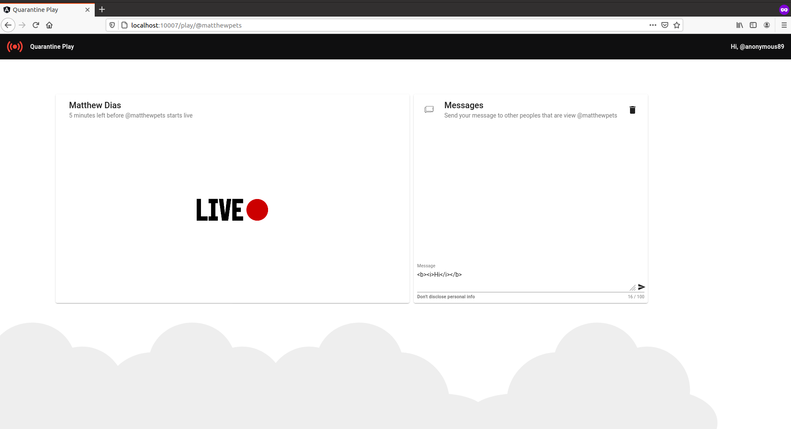

# Streaming

<p align="center">
    
</p>

Streaming is a Angular/Spring Boot app that contains an example of multiple Injection (XSS) vulnerabilities and its main goal is to describe how a malicious user could exploit them on this purposefully vulnerable app.

## Index

- [Definition](#what-is-cross-site-scripting)
- [Setup](#setup)
- [Attack narrative](#attack-narrative)
- [Objectives](#secure-this-app)
- [Solutions](#pr-solutions)
- [Contributing](#contributing)

## What is Cross-Site Scripting?

XSS flaws occur whenever an application includes untrusted data in a new web page without proper validation or escaping, or updates an existing web page with user-supplied data using a browser API that can create HTML or JavaScript. XSS allows attackers to execute scripts in the victim’s browser which can hijack user sessions, deface web sites, or redirect the user to malicious sites.

The main goal of this app is to discuss how **Cross-Site Scripting** vulnerabilities can be exploited and to encourage developers to send secDevLabs Pull Requests on how they would mitigate these flaws.

## Setup

To start this intentionally **insecure application**, you will need [Docker][docker install] and [Docker Compose][docker compose install]. After forking [secDevLabs](https://github.com/globocom/secDevLabs), you must type the following commands to start:

```sh
cd secDevLabs/owasp-top10-2021-apps/a3/streaming
```

```sh
make install
```

Then simply visit [localhost:10007][app] ! 😆

## Get to know the app

When accessing the Streaming application, you will be identified as an anonymous user to watch a stream on registered users channels and interact with other users (or the master channel) through messages in the chat.

## Attack narrative

Now that you know the purpose of this app, what could go wrong? The following section describes how an attacker could identify and eventually find sensitive information about the app or its users. We encourage you to follow these steps and try to reproduce them on your own to better understand the attack vector! 😜

#### Non-sanitization of user input allows for cross-site scripting

After reviewing `buildLiveHTMLMessage(message)` from [`play.component.ts`](<(https://github.com/globocom/secDevLabs/blob/master/owasp-top10-2021-apps/a3/streaming/app/frontend/src/app/lives/play/play.component.ts#)>) file, it was possible to identify that loaded messages and username are not sanitized and can be executed on a web browser (as shown in the message bellow).

<p align="center">
    
</p>

The following images show this behavior when the following text is used as an input on these fields:

```
<b><i>Hi</i></b>
```

Adding a new message on chat:

   <p align="center">
     
   </p>

   <p align="center">
     
   </p>

The missing message validation (that will be loaded by another users) allows a malicious user to insert some scripts that will persist in the server and be executed on the victims' browser every time they access the routes that contain these scripts.

### 🔥

An attacker may abuse these flaws by generating a malicious HTML/JS code and sending it to other users. To demonstrate this, the following code example will redirect all users that are watching the channel to another channel.

```html

```

This code redirect all users to another page, in this case is to **/play/@mr.robot** route.

When the message is loaded by the victim, the browser will read it and try to load the image, however, the path is invalid. Subsequently, the JavaScript function `window.location.href` will be executed.

The following gif shows the attacker sending the malicious code to redirect victims (that are watching **@matthewpets** live) to **/play/@mr.robot** route:

<p align="center">
  
</p>

## Secure this app

How would you mitigate this vulnerability? After your changes, an attacker should not be able to:

- Execute scripts through input fields

## PR solutions

[Spoiler alert 🚨] To understand how this vulnerability can be mitigated, check out [these pull requests](https://github.com/globocom/secDevLabs/pulls?q=is%3Apr+label%3A%22mitigation+solution+%F0%9F%94%92%22+label%3A%22Streaming%22)!

## Contributing

We encourage you to contribute to SecDevLabs! Please check out the [Contributing to SecDevLabs](../../../docs/CONTRIBUTING.md) section for guidelines on how to proceed! 🎉

[docker install]: https://docs.docker.com/install/
[docker compose install]: https://docs.docker.com/compose/install/
[app]: http://localhost:10007
