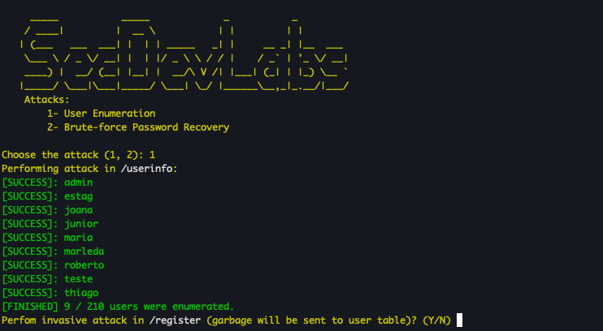
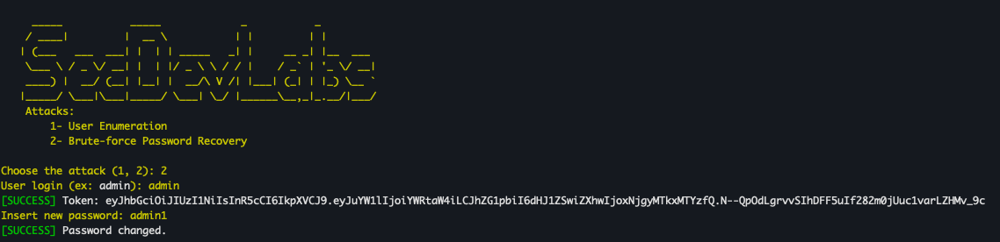
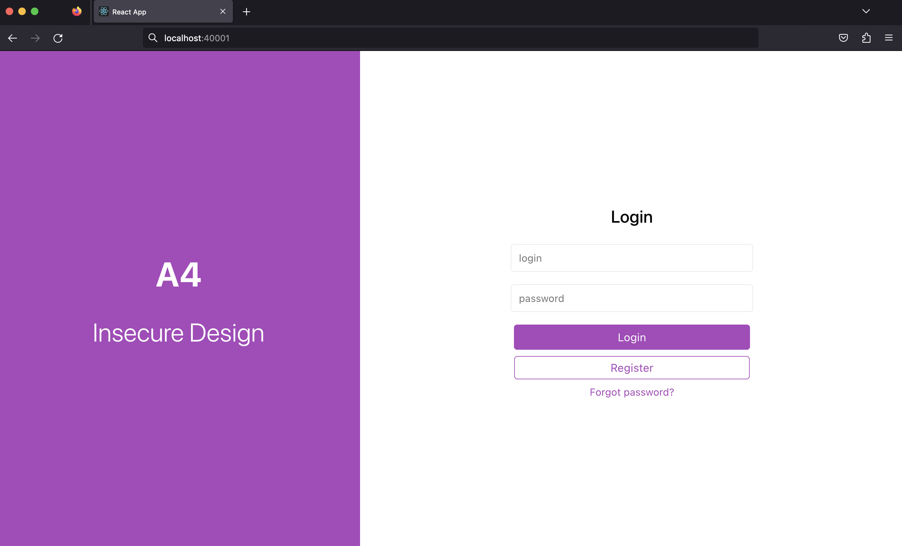
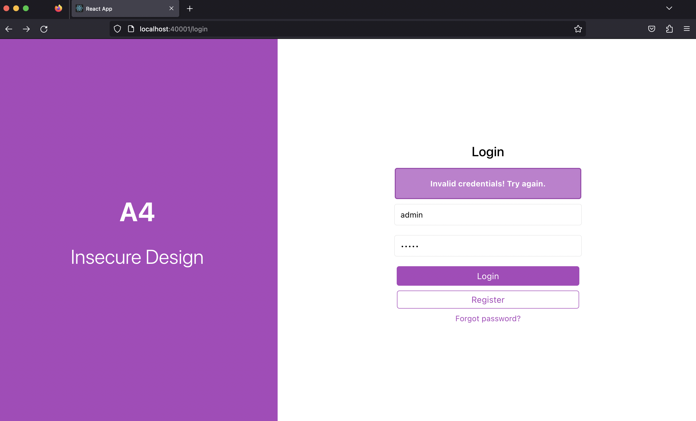
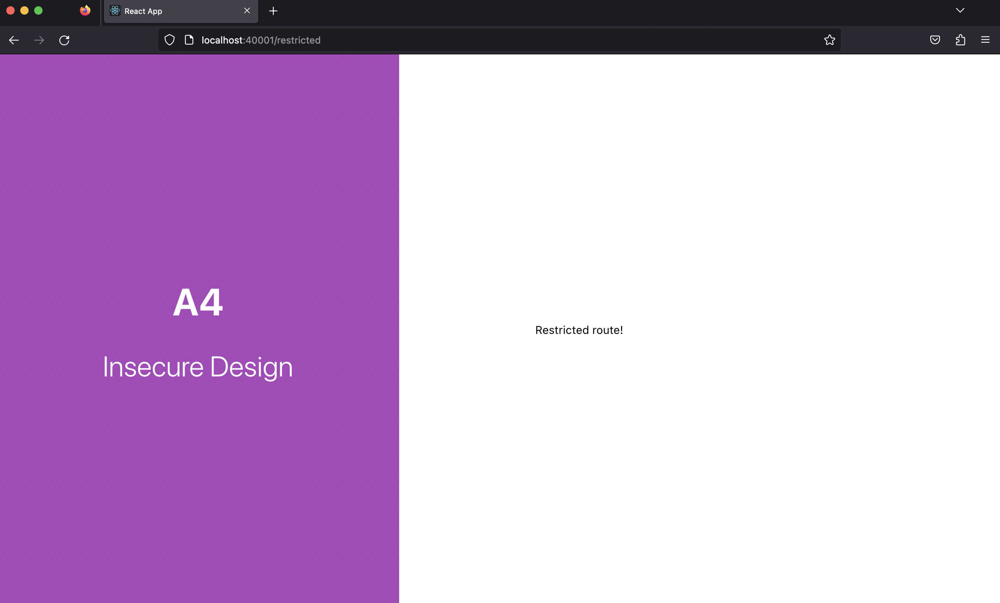

# Super Recovery Password App

<b>Super Recovery Password App</b> is a simple Golang Web App that contains an example of a Insecure Design vulnerability, and its main goal is to illustrate how an attacker could explore it.

## Index

- [Definition](#what-is-insecure-design)
- [Setup](#setup)
- [Attack narrative](#attack-narrative)
- [Objectives](#secure-this-app)
- [Solutions](#pr-solutions)
- [Contributing](#contributing)

## What is Insecure Design?

Insecure design is a broad category representing different weaknesses, expressed as “missing or ineffective control design.” An insecure design cannot be fixed by a perfect implementation as by definition, needed security controls were never created to defend against specific attacks. Therefore, this security risk is focused on the potentials for damage associated with flaws in design and architecture.

The main goal of this app is to discuss how **Insecure Design** vulnerabilities can be exploited and to encourage developers to send secDevLabs Pull Requests on how they would mitigate these flaws.

## Setup

To start this intentionally **insecure application**, you will need [Docker][docker install] and [Docker Compose][docker compose install]. After forking [secDevLabs](https://github.com/globocom/secDevLabs), you must type the following commands to start:

```sh
cd secDevLabs/owasp-top10-2021-apps/a4/super-recovery-password
```

```sh
make install
```

Then simply visit [http://localhost:40001][app] ! 😆

## Get to know the app

To properly understand how this application works, you can follow these simple steps:

- Register an user and make log in;
- Click in `Forgot Password?` buttom and recovery your password.

## Attack narrative

Now that you know the purpose of this app, what could go wrong? The following section describes how an attacker could identify and eventually find sensitive information about the app or its users. We encourage you to follow these steps and try to reproduce them on your own to better understand the attack vector!

### Enumeration Users

- In terminal, execute the following command to run `brute force` script.

```sh
make bruteforce
```

- Select the second option and wait until the script lists the users of the application.



### Change user password

- In terminal, execute the following command to run `brute force` script.

```sh
make bruteforce
```

- Select the second option and enter a login discovered in the first step. The script will use word lists with answers to all password recovery questions to change the user’s password.



### Testing a user’s new password

- Access `http://localhost:40001/login`



### Enter the admin credentials (use old password and new password)

- Old admin password



- New admin passowrd


- Restricted route



## Secure this app

How would you mitigate this vulnerability? After your changes, an attacker should not be able to:

- Enumerate Users
- Brute Force Passwords
- Know password recovery questions of a user
- Change a user’s password without a strong password recovery method

## PR solutions

[Spoiler alert 🚨] To understand how this vulnerability can be mitigated, check out [these pull requests](https://github.com/globocom/secDevLabs/pulls?q=is%3Apr+label%3A%22mitigation+solution+%F0%9F%94%92%22+label%3ASuper-Recovery-Password)!

## Contributing

We encourage you to contribute to SecDevLabs! Please check out the [Contributing to SecDevLabs](../../../docs/CONTRIBUTING.md) section for guidelines on how to proceed! 🎉

[docker install]: https://docs.docker.com/install/
[docker compose install]: https://docs.docker.com/compose/install/
[app]: http://localhost:40001
