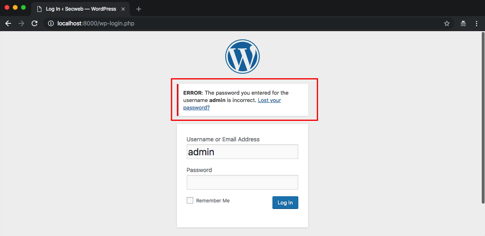
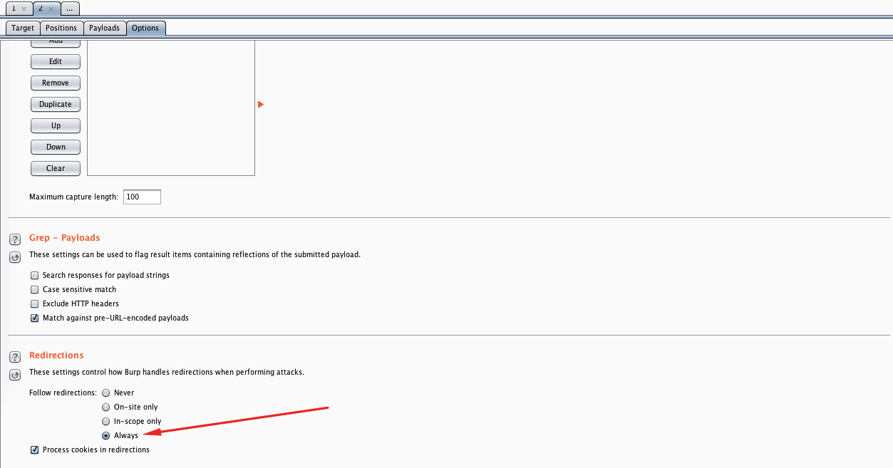
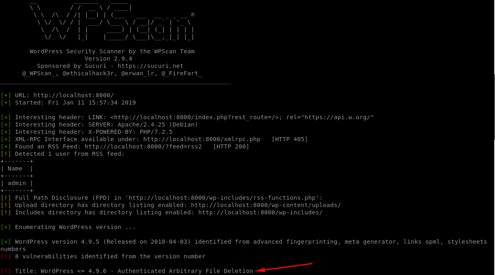
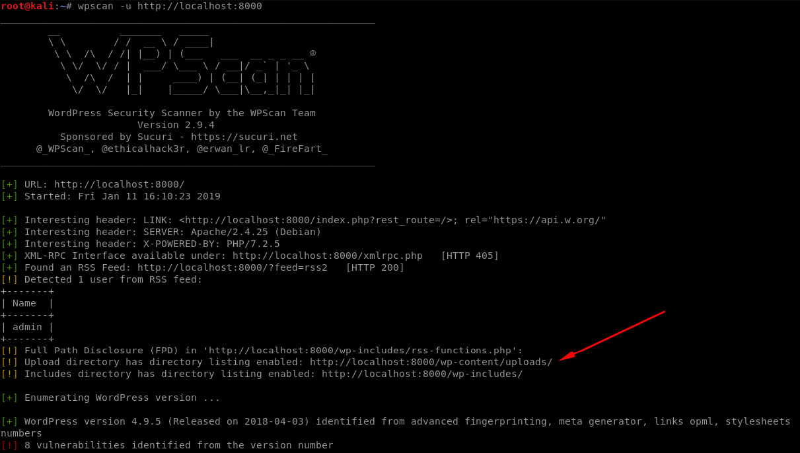
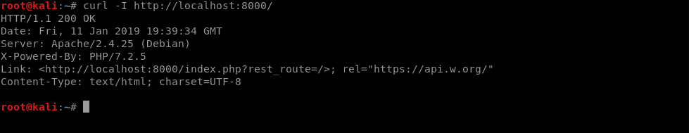

# Vulnerable Wordpress Misconfig

[Acessar conteúdo em Português](README_PT_BR.md)

<p align="center">
    
</p>

This is a simple Wordpress web application that contains an example of a Security Misconfiguration vulnerability and its main goal is to describe how a malicious user could exploit multiple Security Misconfiguration vulnerabilities intentionally installed on SecWeb.

## Index

- [Definition](#what-is-security-misconfiguration)
- [Setup](#setup)
- [Attack narrative](#attack-narrative)
- [Objectives](#secure-this-app)
- [Solutions](#pr-solutions)
- [Contributing](#contributing)

## What is Security Misconfiguration?

Security misconfiguration can happen at any level of an application stack, including the network services, platform, web server, application server, database, frameworks, custom code, and pre-installed virtual machines, containers, or storage. Automated scanners are useful for detecting misconfigurations, use of default accounts or configurations, unnecessary services, legacy options, etc.

The main goal of this app is to discuss how **Security Misconfiguration** vulnerabilities can be exploited and to encourage developers to send secDevLabs Pull Requests on how they would mitigate these flaws.

## Setup

To start this intentionally **insecure application**, you will need [Docker][docker install] and [Docker Compose][docker compose install]. After forking [secDevLabs](https://github.com/globocom/secDevLabs), you must type the following commands to start:

```sh
cd secDevLabs/owasp-top10-2021-apps/a5/misconfig-wordpress
```

```sh
make install
```

Then simply visit [localhost:8000][app] ! 😆

## Get to know the app 📄

To properly understand how this application works, you can try to:

- Visit its homepage!

## Attack narrative

Now that you know the purpose of this app, what could go wrong? The following section describes how an attacker could identify and eventually find sensitive information about the app or its users. We encourage you to follow these steps and try to reproduce them on your own to better understand the attack vector! 😜

### 👀

#### Verbose error message allows for username enumeration

It's possible to reach the site through the HTTP port 8000, as shown by the image below:

<p align="center">
    
</p>

Having a closer look at what's written bellow `SECWEB` we have a sign that the site might be using the WordPress CMS. We can confirm that suspicion by trying to access the `/wp-admin` page. As we can see from the image below, our suspicion is confirmed:

 <p align="center">
    
</p>

An attacker could try to log in with the username: `admin` and realize, through the error message, that `admin` is a valid user, as depicted by the image below:

 <p align="center">
    
</p>

### 🔥

At this moment, an attacker could use [Burp Suite](https://portswigger.net/burp) to perform a brute force attack using this [wordlist] (if you need any help setting up your proxy you should check this [guide](https://support.portswigger.net/customer/portal/articles/1783066-configuring-firefox-to-work-with-burp)). To do so, after finding the login POST request, right click and send to Intruder, as shown below:

 <p align="center">
    
</p>

In the `Positions` tab, all fields must be cleared first via the `Clear §` button. To set `pwd` to change according to each password from our dictionary wordlist, simply click on `Add §` button after selecting it:

 <p align="center">
    
</p>

If a valid password is found, the application may process new cookies and eventually redirect the flow to other pages. To guarantee that the brute force attack follows this behavior, set `Always` into `Follow Redirections` options in the `Options` tab, as shown below:

<p align="center">
    
</p>

In `Payloads` tab, simply choose the wordlist from `Load...` option and then the attack may be performed via the `Start attack` button:

 <p align="center">
    
</p>

After sending at around 200 requests to try and obtain a valid admin password, it is possible to see from the image below that the app redirected us when the password `password` was used, thus giving us evidence that it might be the `admin` password.

 <p align="center">
    
</p>

The suspicion was confirmed when trying to log in with these credentials. As shown below:

 <p align="center">
    
</p>

---

### 👀

#### Outdated WordPress is vulnerable to an authenticated arbitrary file deletion

Now that we know we're dealing with a WordPress, we can use the [WPScan] tool to perform a sweep in the app in search for known vulnerabilities. The following command can be used to install it:

```sh
brew install wpscan
```

And then use this command to start a new simple scan:

```sh
wpscan -u localhost:8000
```

 <p align="center">
    
</p>

### 🔥

As seen from the image above, the tool found out that the CMS version is outdated and vulnerable to an Authenticated Arbitrary File Deletion. By using [searchsploit] tool an attacker could find a [malicious code] to exploit this vulnerability.

To install this tool, simply type the following in your OSX terminal:

```sh
⚠️ 'The next command will install several exploit codes in your system and many of them may trigger antiviruses alerts'

brew install exploitdb
```

Then simply search for the version of the CMS found:

```sh
searchsploit wordpress 4.9.6
```

 <p align="center">
    
</p>

---

## 👀

#### Security misconfiguration allows for a browseable directory on the server

By having another look at the results from [WPScan], it's possible to see that the tool found a browseable directory in the app: `/wp-content/uploads/`, as we can see from the image below:

 <p align="center">
    
</p>

## 🔥

We can confirm that the directory is browseable by accessing it through a web browser, as shown by the following image:

 <p align="center">
    
</p>

---

## 👀

#### Misconfigured headers give away unnecessary information about the server

Using [Nikto] tool to perform a security check scan, it's possible to see that there are multiple points of attention regarding security headers.

To install it, you can use the following command in your OSX terminal:

```sh
brew install nikto
```

Then scan the web app using:

```sh
nikto -h http://localhost:8000/
```

 <p align="center">
    
</p>

Now, by doing the following curl command to check the HTTP headers of the application, we can confirm that it indeed exposes the PHP version installed, as shown by the image below:

 <p align="center">
    
</p>

---

## Secure this app

How would you mitigate this vulnerability? After your changes, an attacker should not be able to:

- See verbose error messages
- Sign in with default credentials
- See verbose tokens
- Find an outdated CMS version

Note: In this particular app, due to how it works, you can simply write down the changes you would make to mitigate those vulnerabilities and submit it as a pull request.

## PR solutions

[Spoiler alert 🚨] To understand how this vulnerability can be mitigated, check out [these pull requests](https://github.com/globocom/secDevLabs/pulls?q=is%3Apr+label%3A%22mitigation+solution+%F0%9F%94%92%22+label%3A%22Vuln+Wordpress+Misconfig%22)!

## Contributing

We encourage you to contribute to SecDevLabs! Please check out the [Contributing to SecDevLabs](../../../docs/CONTRIBUTING.md) section for guidelines on how to proceed! 🎉

[docker install]: https://docs.docker.com/install/
[docker compose install]: https://docs.docker.com/compose/install/
[app]: http://localhost:8000
[wordlist]: https://github.com/danielmiessler/SecLists/blob/master/Passwords/UserPassCombo-Jay.txt
[wpscan]: https://wpscan.org/
[malicious code]: https://www.exploit-db.com/exploits/44949
[nikto]: https://cirt.net/Nikto2
[searchsploit]: https://www.exploit-db.com/searchsploit
