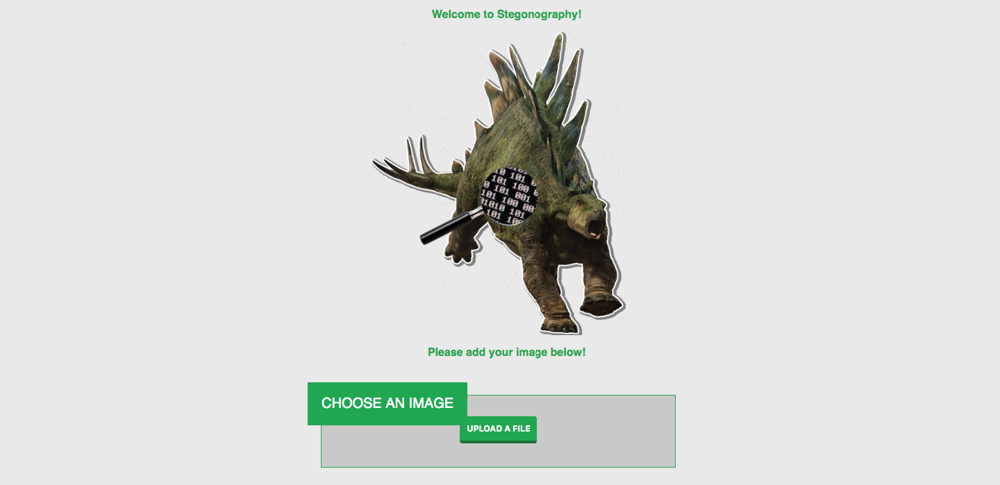
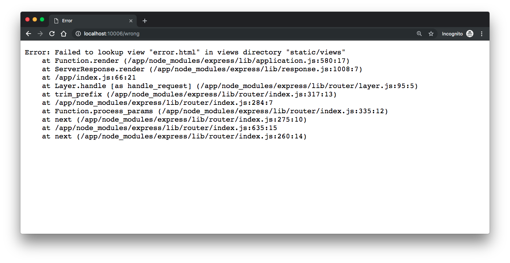
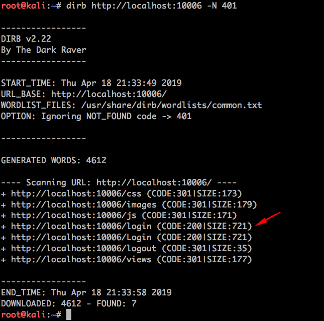
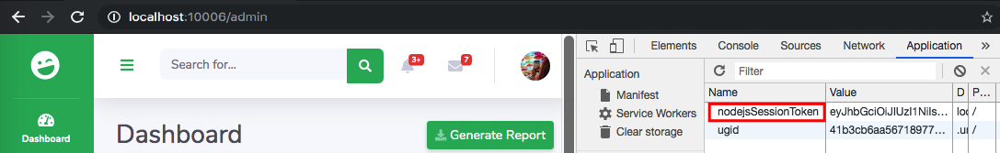
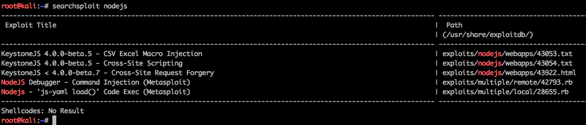

# Stegonography

<p align="center">
    
</p>

Stegonography is a Node.js web application that uses an API and a simple front end to simulate a real steganography application. It is built with two main routes, it's home( `/` ) and (`/login`), where the admin can log in to make changes to the page.

## Index

- [Definition](#what-is-security-misconfiguration)
- [Setup](#setup)
- [Attack narrative](#attack-narrative)
- [Objectives](#secure-this-app)
- [Solutions](#pr-solutions)
- [Contributing](#contributing)

## What is Security Misconfiguration?

Security misconfiguration can happen at any level of an application stack, including the network services, platform, web server, application server, database, frameworks, custom code, and pre-installed virtual machines, containers, or storage. Automated scanners are useful for detecting misconfigurations, use of default accounts or configurations, unnecessary services, legacy options, etc.

The main goal of this app is to discuss how **Security Misconfiguration** vulnerabilities can be exploited and to encourage developers to send secDevLabs Pull Requests on how they would mitigate these flaws.

## Setup

To start this intentionally **insecure application**, you will need [Docker][Docker Install] and [Docker Compose][Docker Compose Install]. After forking [secDevLabs](https://github.com/globocom/secDevLabs), you must type the following commands to start:

```sh
cd secDevLabs/owasp-top10-2017-apps/a6/stegonography
```

```sh
make install
```

Then simply visit [localhost:10006][App] ! 😆

## Get to know the app 🦕

To properly understand how this application works, you can follow these simple steps:

- Hide a message into an image.
- Decrypt the message from this image.
- Try using a password to better protect your image!

## Attack narrative

Now that you know the purpose of this app, what could go wrong? The following section describes how an attacker could identify and eventually find sensitive information about the app or its users. We encourage you to follow these steps and try to reproduce them on your own to better understand the attack vector! 😜

### 👀

#### Verbose error stack traces are output to end users

An attacker, when trying to enumerate available pages on the application, could come across a verbose error stack trace with potentially sensitive information that could compromise the app. An example of a verbose error stack trace is as shown by the image below:

<p align="center">
    
</p>

### 👀

#### Default username and passwords are being used

Using [Dirb] with its default wordlist, `common.txt`, to enumerate existing pages on the application and hide the "Not Found" with the `-N 401` flag, it's possible to find what seems to be a login page, as pointed in the image below:

```sh
dirb http://localhost:10006 -N 401
```

<p align="center">
    
</p>

By visiting `http://localhost:10006/login` we get to the following screen:

<p align="center">
    
</p>

### 🔥

A quick `admin:admin` guess revealed that we can successfully log in to the application and get to the admin's control panel, as shown by the image below:

<p align="center">
    
</p>

### 👀

#### Verbose session token gives away unnecessary information

After logging in to the application, it's possible to see it sets a session token: `nodejsSessionToken`. As shown by the following image:

<p align="center">
    
</p>

### 🔥

Having a look at the token's name, we get a strong indication that the app might be running NodeJS. By using `searchsploit` an attacker could find a malicious code to exploit a NodeJS vulnerability.

To install this tool, simply type the following in your OSX terminal:

```sh
⚠️ 'The next command will install several exploit codes in your system and many of them may trigger antiviruses alerts'

brew install exploitdb
```

Then, simply search for "NodeJS":

```sh
searchsploit nodejs
```

<p align="center">
    
</p>

Even though we still don't know which NodeJS version is currently running, we've gained valuable information for our enumeration phase. The more an attacker knows about the app being analyzed, the bigger the chances of exploiting it.

## Secure this app

How would you mitigate this vulnerability? After your changes, an attacker should not be able to:

* See error stack traces
* Sign in with default credentials
* See verbose token names

## PR solutions

[Spoiler alert 🚨] To understand how this vulnerability can be mitigated, check out [these pull requests](https://github.com/globocom/secDevLabs/pulls?utf8=%E2%9C%93&q=is%3Aclosed+is%3Apr+label%3AA6-OWASP-2017+label%3AStegonography)!

## Contributing

We encourage you to contribute to SecDevLabs! Please check out the [Contributing to SecDevLabs](../../../docs/CONTRIBUTING.md) section for guidelines on how to proceed! 🎉

[Docker Install]:  https://docs.docker.com/install/
[Docker Compose Install]: https://docs.docker.com/compose/install/
[App]: http://localhost:10006
[Dirb]: https://tools.kali.org/web-applications/dirb