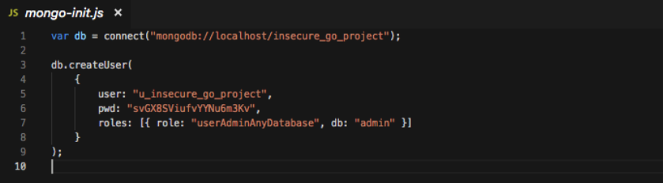

# Insecure Go Project

<p align="center">
    </br>
    <a href="README.md"></a>
</p>

O Insecure Go Project é uma API Golang simples que contém um exemplo de uma vulnerabilidade de falha de identidade e autenticação.

## Index

- [Insecure Go Project](#insecure-go-project)
  - [Index](#index)
  - [O que é falha de identidade e autenticação?](#o-que-é-falha-de-identidade-e-autenticação)
  - [Como inicializar o aplicativo?](#como-inicializar-o-aplicativo)
  - [Conheça o app ⚽️](#conheça-o-app-️)
  - [Narrativa de ataque](#narrativa-de-ataque)
    - [👀](#)
      - [Credenciais codificadas confidenciais permitem que um invasor acesse o banco de dados](#credenciais-codificadas-confidenciais-permitem-que-um-invasor-acesse-o-banco-de-dados)
    - [🔥](#-1)
  - [Proteger este aplicativo](#proteger-este-aplicativo)
  - [PR Soluções](#pr-soluções)
  - [Contribuição](#contribuição)

## O que é falha de identidade e autenticação?

As funções do aplicativo relacionadas à autenticação e ao gerenciamento de sessão geralmente são implementadas incorretamente, permitindo que invasores comprometam senhas, chaves ou tokens de sessão ou explorem outras falhas de implementação para assumir a identidade de outros usuários temporária ou permanentemente.

O principal objetivo deste aplicativo é discutir como as vulnerabilidades de **falha de identidade e autenticação** podem ser exploradas e incentivar os desenvolvedores a enviar solicitações de pull do secDevLabs sobre como mitigar essas falhas.

## Como inicializar o aplicativo?

Para iniciar este **aplicativo inseguro** intencionalmente, você precisará do [Docker][Docker Install] e do [Docker Compose][Docker Compose Install]. Depois de clonar o repositório [secDevLabs](https://github.com/globocom/secDevLabs), no seu computador, você deve digitar os seguintes comandos para iniciar o aplicativo:

```sh
cd secDevLabs/owasp-top10-2021-apps/a7/insecure-go-project
```

```sh
make install
```

Depois é só visitar [localhost:10002][app] ! 😆

## Conheça o app ⚽️

Para entender corretamente como esse aplicativo funciona, você pode:

- Reserve um momento para ler o código-fonte do aplicativo e ver como ele funciona.

## Narrativa de ataque

Agora que você conhece o propósito deste aplicativo, o que pode dar errado? A seção a seguir descreve como um invasor pode identificar e, eventualmente, encontrar informações confidenciais sobre o aplicativo ou seus usuários. Recomendamos que você siga estas etapas e tente reproduzi-las por conta própria para entender melhor o ataque! 😜

### 👀

#### Credenciais codificadas confidenciais permitem que um invasor acesse o banco de dados

Após inspecionar o código-fonte do aplicativo, é possível identificar que alguns dados confidenciais do MongoDB estão codificados no [`config.yml`](../app/config.yml), conforme mostrado na figura abaixo: 


Esse problema também pode ser encontrado no arquivo [`mongo-init.js`](../deployments/mongo-init.js), conforme mostrado abaixo:



### 🔥

Usando essas credenciais para acessar o MongoDB local, foi possível verificar se elas são realmente válidas:


## Proteger este aplicativo

Como você arrumaria essa vulnerabilidade? Após suas alterações, um invasor não poderá:

- Encontre informações confidenciais (como senhas ou nomes de usuário) codificadas.

## PR Soluções

[Alerta de spoiler 🚨 ] Para entender como essa vulnerabilidade pode ser resolvida, confira [these pull requests](https://github.com/globocom/secDevLabs/pulls?q=is%3Apr+label%3A%22mitigation+solution+%F0%9F%94%92%22+label%3A%22Insecure+Go+project%22)!

## Contribuição

Nós encorajamos você a contribuir com o SecDevLabs! Por favor, confira a seção [Contribuição no SecDevLabs](../../../docs/CONTRIBUTING.md) de como fazer a sua contribuição!🎉 🎉

[docker install]: https://docs.docker.com/install/
[docker compose install]: https://docs.docker.com/compose/install/
[app]: http://localhost:10002
[dirb]: https://tools.kali.org/web-applications/dirb
[secdevlabs]: https://github.com/globocom/secDevLabs
