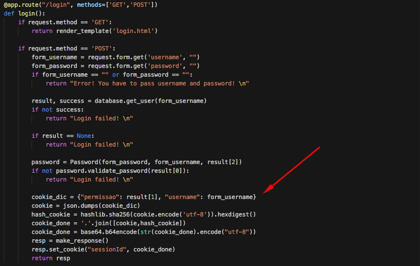
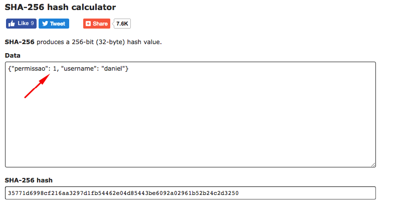
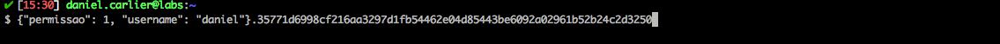
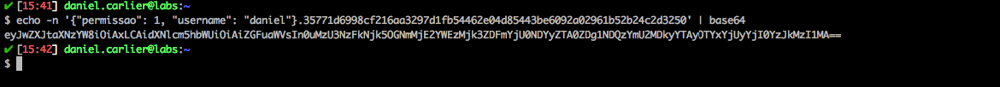

# Saidajaula Monster Fit

<p align="center">
    
</p>

Saidajaula Monstro Fit is a Flask API built to demonstrate how a malicious user could exploit an Identity and Authentication Failure vulnerability and escalate his privileges.

## Index

- [Definition](#what-is-identity-&-authentication-failure?)
- [Setup](#setup)
- [Attack narrative](#attack-narrative)
- [Objectives](#secure-this-app)
- [Solutions](#pr-solutions)
- [Contributing](#contributing)

## What is Identity and Authentication Failure?

Application functions related to authentication and session management are often implemented incorrectly, allowing attackers to compromise passwords, keys, or session tokens, or to exploit other implementation flaws to assume other users’ identities temporarily or permanently.

The main goal of this app is to discuss how **Identity and Authentication Failure** vulnerabilities can be exploited and to encourage developers to send secDevLabs Pull Requests on how they would mitigate these flaws.

## Setup

To start this intentionally **insecure application**, you will need [Docker][docker install] and [Docker Compose][docker compose install]. After forking [secDevLabs][secDevLabs], you must type the following commands to start:

```sh
cd secDevLabs/owasp-top10-2021-apps/a7/saidajaula-monster
```

```sh
make install
```

Then simply visit [localhost:10002][app] ! 😆

## Get to know the app 🏋️‍

To properly understand how this application works, you can follow these simple steps:

- Visit its homepage!
- Try registering yourself as a new user.

## Attack narrative

Now that you know the purpose of this app, what could go wrong? The following section describes how an attacker could identify and eventually find sensitive information about the app or its users. We encourage you to follow these steps and try to reproduce them on your own to better understand the attack vector! 😜

### 👀

#### Insecure session cookie validation allows for privilege escalation

It's possible to reach the server's web application through the HTTP port 10002, as we can see from the image below:

<p align="center">
    
</p>

We can sign-up for a new account by clicking the `SIGN UP` button on the top right corner. Then, we are redirected to the `/register` page. As shown by the image below:

<p align="center">
    
</p>

After creating an account, we are redirected to the `/login` page and, to better understand how the application is handling the requests, we will perform login using the following `curl` command. As shown by the image:

```sh
curl -i -L localhost:10002/login -F "username=daniel" -F "password=daniel" -X POST
```

<p align="center">
    
</p>

As we can see from the image above, the application sets a cookie for the user, `sessionId`. By having a better look at this cookie, we find out that it is base64 encoded, and it's content are as follows:

<p align="center">
    
</p>

Now, by having a look at the app's code, it's possible to see that all the information to generate this cookie is known to any user, as shown by the following image:

<p align="center">
    
</p>

### 🔥

Knowing how the cookie is being generated, a malicious user could create his own to gain access to pages he shouldn't have. An attacker could obtain admin privileges by changing the cookie's `permission` field, as depicted by the image below:

<p align="center">
    
</p>

It is also possible to generate this cookie from terminal using `shasum` command:

```sh
echo -n '{"permissao": 1, "username": "daniel"}' | shasum -a 256
```

After that, the attacker needs to concatenate the cookie's fields and the hash, separated by a dot. As shown by the following image:

<p align="center">
    
</p>

The server expects the cookie to be in base64 format, so the attacker needs to encode his cookie. As we can see from the image below using the command:

```sh
echo -n '{"permissao": 1, "username": "daniel"}.35771d6998cf216aa3297d1fb54462e04d85443be6092a02961b52b24c2d3250' | base64
```

<p align="center">
    
</p>

Now, all an attacker needs to do is try to access the `/admin` only page. As shown by the image below:

```sh
curl -v --cookie "sessionId=eyJwZXJtaXNzYW8iOiAxLCAidXNlcm5hbWUiOiAiZGFuaWVsIn0uMzU3NzFkNjk5OGNmMjE2YWEzMjk3ZDFmYjU0NDYyZTA0ZDg1NDQzYmU2MDkyYTAyOTYxYjUyYjI0YzJkMzI1MA==" http://localhost:10002/admin
```

<p align="center">
    
</p>

## Secure this app

How would you mitigate this vulnerability? After your changes, an attacker should not be able to:

- Log in as admin or any other user, rather than himself, by modifying the session cookie.

## PR solutions

[Spoiler alert 🚨 ] To understand how this vulnerability can be mitigated, check out [these pull requests](https://github.com/globocom/secDevLabs/pulls?q=is%3Apr+label%3A%22mitigation+solution+%F0%9F%94%92%22+label%3A%22Saidajaula+Monster+Fit%22)!

## Contributing

We encourage you to contribute to SecDevLabs! Please check out the [Contributing to SecDevLabs](../../../docs/CONTRIBUTING.md) section for guidelines on how to proceed! 🎉

[docker install]: https://docs.docker.com/install/
[docker compose install]: https://docs.docker.com/compose/install/
[secDevLabs]: https://github.com/globocom/secDevLabs
[app]: http://localhost:10002
[dirb]: https://tools.kali.org/web-applications/dirb
